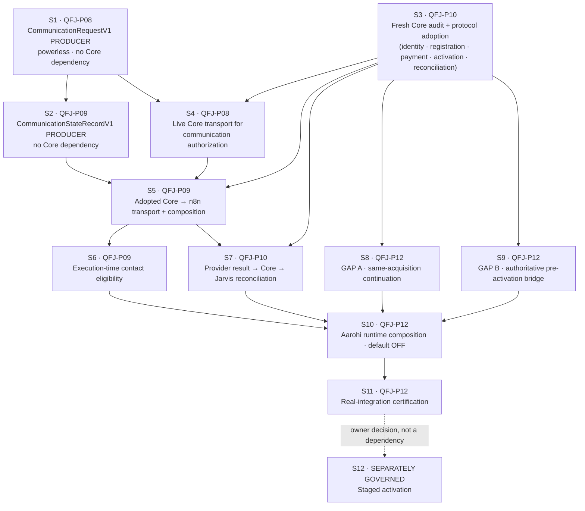
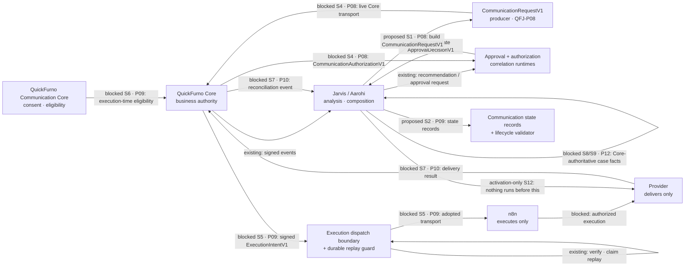

# Aarohi real execution integration — plan and sequencing

**Document status:** Canonical planning document. Adopted under
[ADR-0132](../decisions/ADR-0132-aarohi-real-execution-integration-planning.md). Read with
[qf-jarvis-roadmap-v3.md](./qf-jarvis-roadmap-v3.md),
[communication-model.md](./communication-model.md),
[execution-governance.md](./execution-governance.md),
[aarohi-vendor-growth-roadmap-overlay.md](./aarohi-vendor-growth-roadmap-overlay.md),
[agent-constitution.md](../governance/agent-constitution.md) and
[authority-routing-data-access-matrix.md](../governance/authority-routing-data-access-matrix.md).

**This is a plan.** Its first slice, **S1**, is now implemented on a feature branch / PR under
[ADR-0133](../decisions/ADR-0133-qfj-p08-powerless-communication-request-producer.md) and is **not
merged**; nothing else here is implemented, adopted, connected or activated. Aarohi's runtime is
**PLANNED / DISABLED** and production rollout is **OFF**. Every edge marked *proposed* or *blocked*
below does not exist, and S1 composes with nothing.

---

## 1. Where the repository actually is

Aarohi AVG-0…AVG-12 is implemented and certified offline
([ADR-0131](../decisions/ADR-0131-qfj-p12-aarohi-full-offline-certification-closeout.md)).

**The real-integration path spans four existing phases — QFJ-P08, QFJ-P09, QFJ-P10 and QFJ-P12.** No
new phase is created. The execution chain has accumulated validators without a path:

| Merged capability | Owner slice | What it does | Composed by an app? |
| --- | --- | --- | --- |
| `approval-runtime` | QFJ-P08 | validates and correlates Core's `ApprovalDecisionV1` | yes |
| `approval-core-adapter` | ADR-0082 | submits human approval intent over an **injected** transport | no transport adopted |
| `communication-authorization-runtime` | ADR-0083 | correlates a `CommunicationRequestV1` with Core's `CommunicationAuthorizationV1` | **no** |
| `execution-intent-runtime` | ADR-0084 | proves a Core `ExecutionIntentV1` names the approved action | **no** (one offline JAO-7 use) |
| `execution-dispatch-runtime` | ADR-0090 | Core → n8n dispatch verification: signature, domain separation, freshness, expiry, replay claim | **no** |
| `postgres-execution-replay-store` | ADR-0091 | the durable replay guard (migration `0010`) | **no** |
| `execution-dispatch-composition` | ADR-0109 | binds the verifier to the durable store | **no importer at all** |
| `communication-lifecycle-runtime` | ADR-0110 | validates 18-state transitions against the approved graph | **no importer at all** |
| `aarohi-agent` | ADR-0085…0131 | the certified offline domain | **no importer at all**, asserted |

**Still absent.** The roadmap lists outstanding work under **two** phases and both matter here.

**QFJ-P08 remains INCOMPLETE**, with three items outstanding verbatim:

1. the **live Core transport** for communication authorization;
2. a **producer** for `CommunicationRequestV1` — **now implemented on a feature branch / PR
   (ADR-0133), not merged, and composed by nothing**;
3. the operator surface's HTTP, UI and authentication provider.

**QFJ-P09 remains INCOMPLETE**, confirmed against the import graph:

1. an **adopted** Core → n8n transport and its composition — the B4 wire protocol is **PROPOSED**;
2. execution-time communications **eligibility** integration;
3. a **producer** of `CommunicationStateRecordV1`;
4. provider dispatch, provider results and **reconciliation** to Core and back to Jarvis;
5. production rollout.

### The two producers are different concerns

An earlier revision of this plan named only the P09 state-record producer and treated the P08
request producer as a "sibling responsibility" — leaving a canonical outstanding item unowned and
unscheduled. An owner review caught it, and this section exists so the distinction cannot blur again.

| | `CommunicationRequestV1` | `CommunicationStateRecordV1` |
| --- | --- | --- |
| Phase | **QFJ-P08** | **QFJ-P09** |
| What it is | what Jarvis **asks Core for** | where a communication **got to** |
| Powerless? | yes — asking is not permission | yes — describing is not permission |
| Consumed by | `communication-authorization-runtime` (merged, uncomposed) | `communication-lifecycle-runtime` (merged, uncomposed) |

**The dependency runs one way, and the contracts show it.** `CommunicationRequestV1` carries
`communicationId`, `recipient` and `purposeCode` — three of the five identity fields
`CommunicationStateRecordV1` requires for continuity. The fourth, `channel`, is settled only by
Core's authorization, which may lawfully name a channel Jarvis did not propose (ADR-0083). So the
request precedes the authorization, which precedes the intent, which precedes the state record's
later states.

## 2. The Core facts this plan may use

**A new read-only Core audit was not possible: no QuickFurno Core checkout exists in the working
environment.** No Core fact has been invented to fill the space.

The source below is the read-only audit already recorded in this repository by ADR-0125, ADR-0126
and ADR-0127, taken at `quickfurno-maker/quickfurno-marketplace` commit
`06b1e22cfa866cd3840c7ecb065b9d0c4acb8bca`. **It is retained as HISTORICAL EVIDENCE and is not a
current certification.**

**Core has moved since.** Owner review observed current marketplace `main` at
`c70ae7da8f59f03cbb099ae390e9aec98d2c3b06`. **None of the findings below has been re-certified
against that commit here**, and none has been carried forward as though it had been. Any of them may
have changed.

| Question | Recorded finding | Classification |
| --- | --- | --- |
| Prospect → vendor continuity | **No correlation contract.** Every per-party read is keyed by a Core **vendor id**, which Aarohi structurally does not hold | **absent** |
| Registration completion | `vendorService.registerVendor(...)` only — a mutation. No registration-process, requirements, step or status read for an unregistered party | **authoritative WRITE**; read **absent** |
| Payment context | `listVendorPackageOrders(vendorId)`, `getVendorCurrentPackageSummary(vendorId)` — vendor-id keyed. `payment_status` / `order_status` / `activation_status` are unconstrained `text` with no CHECK; the only writer sets `created` / `not_started` / `not_activated` over `payment_provider: "not_connected"` | **authoritative READ, not prospect-addressable, not a lifecycle** |
| Activation truth | **Core has no ACTIVE vendor status.** `vendors.status` ∈ `('Pending','Approved','Rejected','Suspended')`; "active" is a separate boolean `is_active`; `package_status` uses lowercase `active` | **absent as an enum**; Jarvis `ACTIVE` is an abstraction over *"Core says this party is live"* |
| Commercial truth | available-package read service, seven fields, mirrored by AVG-8 | **authoritative READ, adopted** |
| Execution-time eligibility | authority is the **QuickFurno Communication Core**; the **QF Communications Runtime** re-validates at execution time, outside this repository, reached only by n8n | **authoritative, no Jarvis-facing protocol adopted** |
| Execution authorization | `ApprovalDecisionV1`, `CommunicationAuthorizationV1`, `ExecutionIntentV1` exist as canonical contracts in `@qf-jarvis/contracts`; the inter-system wire protocol is **PROPOSED** | **proposed protocol**, not adopted |
| Result reconciliation | no versioned Core → Jarvis reconciliation event or contract | **absent** |

> **Hard prerequisite for every Core-dependent slice below: run a FRESH read-only audit at a current
> PINNED marketplace commit and record the result.** Any finding that has changed re-opens the design
> of the slice that depends on it. Nothing in this plan may proceed on the historical audit alone,
> and no protocol, endpoint, header, signature or key format may be invented to work around a finding
> that turns out to be absent.

## 3. The dependency-ordered sequence

**S1 — `CommunicationRequestV1` producer (QFJ-P08). IMPLEMENTED ON A FEATURE BRANCH / PR under
[ADR-0133](../decisions/ADR-0133-qfj-p08-powerless-communication-request-producer.md); NOT MERGED.**
`@qf-jarvis/communication-request-runtime` constructs a canonical `CommunicationRequestV1` from
already-governed communication action context. It is
**POWERLESS**: it establishes no consent, no contact eligibility and no authorization; it creates no
`ExecutionIntentV1`; it sends and executes nothing; it persists no consent, STOP, opt-out, DNC,
suppression or eligibility cache; and it does not let founder or human approval override Core
communication authority. It **feeds** the later Core communication-authorization interaction rather
than replacing it. **An approval is not permission to contact anyone, and a prior communication
authorization is not a reusable future permission slip** — execution-time eligibility revalidation
stays with Core and the QF Communications Runtime. **No Core dependency:** producing a request is
asking, and the merged `communication-authorization-runtime` already consumes one and currently has
nothing to consume.

**S2 — `CommunicationStateRecordV1` producer (QFJ-P09).** Build the producer of communication state
records and validate every movement through the merged `communication-lifecycle-runtime`, which stays
a validator and never becomes authoritative. **No Core dependency:** the early states are
constructible from Jarvis-side evidence, and the later ones are structurally blocked by the existing
schema, which requires Core-issued `approvalDecisionId`, `executionIntentId` and `executionResultId`.
That is the point — the Core dependency becomes visible in code rather than assumed in prose. Its
identity fields originate in the S1 request, which is why S1 precedes it.

**S3 — fresh Core audit and protocol adoption (QFJ-P10).** The bilateral step, and it begins with a
**fresh read-only audit at a current pinned commit**. Then adopt the minimum versioned read/event
protocol for: a prospect ↔ vendor correlation fact, a registration-completion fact, a
prospect-addressable payment fact if one can exist, an authoritative "this party is live" fact, and a
Core → Jarvis reconciliation event. **Requires QuickFurno Core work. Nothing in qf-jarvis can
substitute for it, and no endpoint, header, signature or key format may be invented to proceed.**

**S4 — live Core transport for communication authorization (QFJ-P08).** P08's other outstanding
item: carry an S1 request to Core and receive Core's `CommunicationAuthorizationV1`, correlated
through the merged `communication-authorization-runtime`. **A Core refusal is an ordinary
authoritative observation, never retried, reinterpreted or downgraded.**

**S5 — adopted Core → n8n transport and composition (QFJ-P09).** Move the PROPOSED B4 envelope to
adopted, then compose `execution-dispatch-composition` behind it. Preserves Core-issued signed
`ExecutionIntentV1`, domain separation, signature freshness, intent expiry with no grace period, and
the durable replay claim. **No Jarvis → n8n shortcut is created.**

**S6 — execution-time contact eligibility (QFJ-P09).** Consent, STOP, opt-out, DNC, suppression,
quiet hours and attempt limits are revalidated immediately before dispatch by Core and the QF
Communications Runtime. **Jarvis caches nothing and stores no eligibility answer.**

**S7 — provider result → Core → Jarvis reconciliation (QFJ-P10).** Provider and n8n outcomes reach
Core first. Only Core's recorded result returns to Jarvis, as an authoritative event. **A provider
success never becomes Jarvis business truth directly.**

**S8 — GAP A, same-acquisition continuation (QFJ-P12).** A new fail-closed boundary proving from a
Core-authoritative fact that a registered vendor is the same party as an existing acquisition case,
permitting only the bounded acquisition-completion workflow. **`ELIGIBLE_CORE_STATUSES` is not
touched.** **Blocked on S3.**

**S9 — GAP B, authoritative pre-activation bridge (QFJ-P12).** The only lawful route into
`AWAITING_CORE_ACTIVATION`, driven by an adopted Core fact that actually justifies entry.
`completeCoreActiveHandoff(...)` remains the only route into `HANDED_OFF_TO_ANISHA`. **Blocked on
S3.**

**S10 — Aarohi runtime composition (QFJ-P12).** Compose the certified pure domains with the approved
Core and execution interfaces. **Default OFF. No production recipient. No silent fallback. No
provider credential in Aarohi.**

**S11 — real-integration certification (QFJ-P12).** Prove the live-capable composition preserves every
boundary the offline certification established, using the same cross-stage adversarial method.

**S12 — staged activation.** **Out of scope for this plan and for the implementation work above.** A
separate owner decision with its own ADR.

## 4. Gap and authority matrix

| # | Capability | Owner | Today | Authority | Missing dependency | Proposed artifact | Jarvis-only? | Core change? | n8n/provider? | Migration? | Activation impact | Fail-closed behaviour |
| --- | --- | --- | --- | --- | --- | --- | --- | --- | --- | --- | --- | --- |
| S1 | `CommunicationRequestV1` producer | **P08** | contract + consumer, **no producer** | Jarvis asks; Core decides | none | producer package | **yes** | no | no | none justified here | none | cannot express consent, eligibility or authorization |
| S2 | `CommunicationStateRecordV1` producer | **P09** | contract + validator, **no producer** | Jarvis coordination; Core owns the cited artifacts | S1 identity fields | producer package | **yes** | no | no | none justified here | none | later states unconstructible without Core ids |
| S3 | Fresh Core audit + protocol adoption | **P10** | historical audit only | Core | Core-side publication | versioned read/event contracts | no | **yes** | no | none justified here | none | absent fact ⇒ no downstream slice proceeds |
| S4 | Live Core transport for communication authorization | **P08** | correlation runtime merged, **no transport** | Core | S1, S3 | adopted transport | no | **yes** | no | none justified here | none | refusal is an ordinary observation |
| S5 | Core → n8n transport | **P09** | PROPOSED envelope, verifier merged | Core issues, n8n executes | S3, S4 | adopted transport + composition | no | **yes** | **yes** | none justified here | none | unverified/expired/replayed ⇒ refuse |
| S6 | Execution-time eligibility | **P09** | absent | QuickFurno Communication Core | S5 | integration at dispatch | no | **yes** | **yes** | none justified here | none | unknown ⇒ refuse; never cached |
| S7 | Result reconciliation | **P10** | absent | Core | S3, S5 | Core → Jarvis event | no | **yes** | **yes** | **must be proved by the slice** | none | provider truth alone ⇒ not business truth |
| S8 | GAP A continuation | **P12** | **open** | Core | prospect ↔ vendor fact | continuation boundary | no | **yes** | no | **must be proved by the slice** | none | no fact ⇒ refuse; gate never widened |
| S9 | GAP B bridge | **P12** | **open** | Core | authoritative live fact | pre-activation bridge | no | **yes** | no | **must be proved by the slice** | none | no fact ⇒ boundary stays unreachable |
| S10 | Aarohi composition | **P12** | none | Core for every business fact | S6, S7, S8, S9 | composition, default OFF | no | depends | depends | **must be proved by the slice** | **OFF by default** | disabled ⇒ nothing runs |
| S11 | Real-integration certification | **P12** | offline only | evidence, never authority | S10 | adversarial suite + ADR | **yes** | no | no | none justified here | none | a failure blocks activation |
| S12 | Staged activation | separate | **OFF** | owner | S11 | activation ADR | no | — | — | — | **the activation** | remains OFF until decided |

### Migration governance

**This planning PR allocates no migration and justifies none.** It also does **not** pre-decide the
persistence needs of slices that have not been designed — an adopted Core protocol, a reconciliation
path or a runtime composition may each reveal one, which is why the matrix says *must be proved by
the slice* rather than *none*.

- **Every implementation slice must independently prove whether persistence or schema work is
  required.**
- A migration may be allocated **only** under the canonical
  [migration ledger](../governance/migration-ledger.md) policy: approved owning design, proven
  necessity, reviewed scope, confirmed inventory, documented managed-rollout impact and separate
  authorization.
- **No number is pre-allocated here — not `0013`, not any later one.**
- **Governance debt, recorded not fixed:** migrations `0010`, `0011` and `0012` exist on disk while
  the ledger's prose still says no number after `0009` is pre-reserved and carries no rows for them.
  **That drift must be reconciled before any new allocation.** Reconciling it is outside this
  planning PR's scope and is not permission to allocate a number.

## 5. Intended data flow

Every edge is labelled. **Only `existing` edges exist.**

## 6. Threat and negative-proof matrix

Every row must be a **test** in the slice that introduces the capability, not a paragraph.

| # | Attempt | Must be refused by | Refusal |
| --- | --- | --- | --- |
| 1 | Widen cold acquisition to `REGISTERED` | AVG-1 gate; certification suite | `ELIGIBLE_CORE_STATUSES` stays exactly `NOT_REGISTERED` |
| 2 | Continue a _different_ registered vendor under an existing case | S8 continuation boundary | identity binding fails ⇒ refuse |
| 3 | Forge a prospect ↔ vendor correlation | S8 | correlation must be a Core fact, not a caller claim |
| 4 | Infer ACTIVE from paid | AVG-10; S9 | payment is not activation |
| 5 | Infer ACTIVE from a provider receipt | AVG-1 handoff | `AUTHORITY_NOT_CORE` |
| 6 | Infer ACTIVE from conversation text | AVG-1 handoff | `AUTHORITY_NOT_CORE` |
| 7 | Infer ACTIVE from model output | AVG-1 handoff | `AUTHORITY_NOT_CORE` |
| 8 | Infer ACTIVE from Aarohi case state | AVG-1 handoff | `AUTHORITY_NOT_CORE` |
| 9 | Enter `AWAITING_CORE_ACTIVATION` by generic transition | AVG-1 transition table | no edge exists |
| 10 | Bypass `completeCoreActiveHandoff` | AVG-1 | it is the only public route |
| 11 | Reuse a stale communication authorization | S6; S1 producer states it | authorization records a past decision, never a future permission |
| 12 | Send after opt-out | S6, Core | Core refuses; the refusal is an ordinary outcome |
| 13 | Dispatch an expired `ExecutionIntentV1` | ADR-0090 verifier | `now >= expiresAt`, no grace period |
| 14 | Dispatch a forged Core intent | ADR-0090 verifier | signature under a distinct domain separator and key purpose |
| 15 | Replay with a conflicting idempotency/digest | ADR-0091 guard | `conflict`, fail closed |
| 16 | Treat an n8n/provider result as business truth | S7 | truth returns through Core first |
| 17 | Treat offline certification as activation authority | ADR-0131, ADR-0132 | certification is evidence, not a credential |
| 18 | Treat autonomy `L2` as contact or send authority | AVG-12 | same zero-authority posture at every level |
| 19 | Treat a produced `CommunicationRequestV1` as permission to contact | S1 | producing a request is asking; Core answers |
| 20 | Let founder approval override Core communication authority | S1, S4 | approval is not a communication authorization |

## 7. Recommended implementation PR sequence

Each PR is separately reviewable, separately gated and separately revertible. **No PR bundles two
slices.**

| PR | Owner | Purpose | Prerequisites | Code vs docs | Migration | External systems | Live send | Owner gate | Disable posture |
| --- | --- | --- | --- | --- | --- | --- | --- | --- | --- |
| **1** | **QFJ-P08** | **`CommunicationRequestV1` producer** — POWERLESS — **open as a PR (ADR-0133), not merged** | none | production code + tests | **proved: NONE required** | none | no | design review | not composed by any app |
| **2** | QFJ-P09 | `CommunicationStateRecordV1` producer | PR 1 | production code + tests | must be proved; none foreseen | none | no | design review | not composed by any app |
| **3** | QFJ-P10 | **Fresh read-only Core audit** at a current pinned commit | none | docs | none | read-only inspection | no | owner sign-off on findings | n/a |
| **4** | QFJ-P10 | Core protocol **adoption** — identity, registration, payment, activation, reconciliation | PR 3 + Core-side work | contracts + docs | must be proved | **Core change required** | no | bilateral adoption | contracts unused until composed |
| **5** | **QFJ-P08** | **Live Core transport for communication authorization** | PRs 1, 4 | production code | must be proved | Core | no | transport adoption | not composed |
| **6** | QFJ-P09 | Adopted Core → n8n transport + composition | PRs 2, 4, 5 | production code | must be proved | Core + n8n | no | transport adoption | composition not wired |
| **7** | QFJ-P09 | Execution-time eligibility integration | PR 6 | production code | must be proved | Core + QF Communications Runtime | no | Core sign-off | refuse when unknown |
| **8** | QFJ-P10 | Provider result → Core → Jarvis reconciliation | PR 6 | production code | **must be proved** | Core + n8n + provider | no | Core sign-off | no event ⇒ no truth |
| **9** | QFJ-P12 | GAP A continuation boundary | PR 4 | production code | must be proved | none | no | owner review | refuse without the fact |
| **10** | QFJ-P12 | GAP B pre-activation bridge | PR 4 | production code | must be proved | none | no | owner review | boundary stays unreachable |
| **11** | QFJ-P12 | Aarohi runtime composition, **default OFF** | PRs 7–10 | production code | must be proved | none until enabled | no | owner review | disabled by default |
| **12** | QFJ-P12 | Real-integration certification | PR 11 | tests + ADR | none | none | no | owner review | failure blocks activation |
| **13** | separate | **Staged activation** | PR 12 | activation ADR | n/a | yes | **yes** | **separate owner decision** | kill switch required |

**"Must be proved" is not "will be needed".** No slice above is authorized to add a migration; each
must independently demonstrate the need under migration-ledger governance, and the `0010`–`0012`
ledger drift must be reconciled before any allocation.

## 8. The twenty design questions, answered

1. **First implementation PR?** The **QFJ-P08 `CommunicationRequestV1` producer**. An earlier
   revision of this plan named the P09 state-record producer; both are implementable entirely inside
   qf-jarvis, and the tie is broken by dependency direction — the state record's identity fields
   originate in the request, and the merged `communication-authorization-runtime` already consumes a
   request and currently has nothing to consume.
2. **Implementable inside qf-jarvis?** Yes — PRs 1 and 2 entirely. Everything from PR 4 onward needs
   Core work first.
3. **What proves same-acquisition continuation?** A Core-authoritative prospect ↔ vendor correlation
   fact. **It does not exist at the historically audited commit**, and it has not been re-checked at
   a current one, so the gap stays open.
4. **What justifies `AWAITING_CORE_ACTIVATION`?** An adopted Core fact that a party is live. **Core
   had no ACTIVE status at the historically audited commit**, not re-checked since, so the gap stays
   open.
5. **What proves ACTIVE?** Only a Core attestation with authority `QUICKFURNO_CORE` and
   `active: true`, for the same prospect, on a case already at the boundary.
6. **Where is contact eligibility revalidated?** In Core (QuickFurno Communication Core), and again
   by the QF Communications Runtime at execution time. Never in Jarvis, never cached.
7. **What component creates `CommunicationRequestV1`?** **Nothing today — and building it is a
   canonical outstanding QFJ-P08 item.** The plan gives it its own slice (S1 / PR 1): a bounded
   future **QFJ-P08 communication-request-producer slice**, POWERLESS, which builds a canonical
   request from already-governed communication action context. It establishes no consent, no contact
   eligibility and no authorization, creates no `ExecutionIntentV1`, sends and executes nothing,
   persists no consent/STOP/DNC/suppression/eligibility cache, and does not let founder or human
   approval override Core communication authority. It **feeds** the Core communication-authorization
   interaction rather than replacing it. **This is a distinct concern from the QFJ-P09
   `CommunicationStateRecordV1` producer (S2 / PR 2), and the two are not interchangeable.** Aarohi
   itself produces neither: it prepares inert candidates and pins `communicationRequestCreated:
   false`.
8. **What receives Core's `CommunicationAuthorizationV1`?** `communication-authorization-runtime`
   (merged, uncomposed), reached over the QFJ-P08 live Core transport that S4 adopts.
9. **What receives Core's `ExecutionIntentV1`?** `execution-intent-runtime` for correlation;
   `execution-dispatch-runtime` for dispatch-time verification.
10. **What claims replay before execution?** `postgres-execution-replay-store` through
    `execution-dispatch-composition` — durable by construction.
11. **Who produces lifecycle records?** Nobody yet; that is S2 (QFJ-P09), and it is a different
    producer from S1's.
12. **How do provider results reach Core?** Provider → n8n → Core. Not through Jarvis.
13. **How does Core truth return to Jarvis?** As an authoritative reconciliation event. **Contract
    absent — S3/S4 then S7.**
14. **What must Aarohi persist?** Nothing yet. Persistence is a separate governed decision, and each
    slice must prove any need of its own.
15. **What must Aarohi never persist?** Consent, opt-out, suppression, STOP/DNC, eligibility answers,
    contact destinations, message bodies, payment instruments, credentials, provider payloads, raw
    model output.
16. **Which package APIs are reusable unchanged?** All nine in §1. None needs modification to be
    composed.
17. **Which public APIs stay locked?** The Aarohi barrel (exact-set asserted), control-plane V1
    (frozen) and V2 (versioned successor).
18. **Which migration is required?** **None is allocated or justified by this planning PR.** Each
    implementation slice must separately prove any persistence need under migration governance, and
    the existing `0010`–`0012` ledger drift must be reconciled before a future allocation.
19. **What can be tested before any credential?** S1 and S2 entirely; the S5/S6/S7 boundaries against
    fakes and local fixtures, exactly as ADR-0090 and ADR-0091 already do.
20. **Final gate before activation?** A separate owner-authorized activation ADR after S11, with a
    kill switch. **Neither the offline certification nor the real-integration certification is that
    authority.**

---

**Production rollout remains OFF. Aarohi's runtime remains PLANNED / DISABLED. Staged activation is
a later, separately governed owner decision.**
