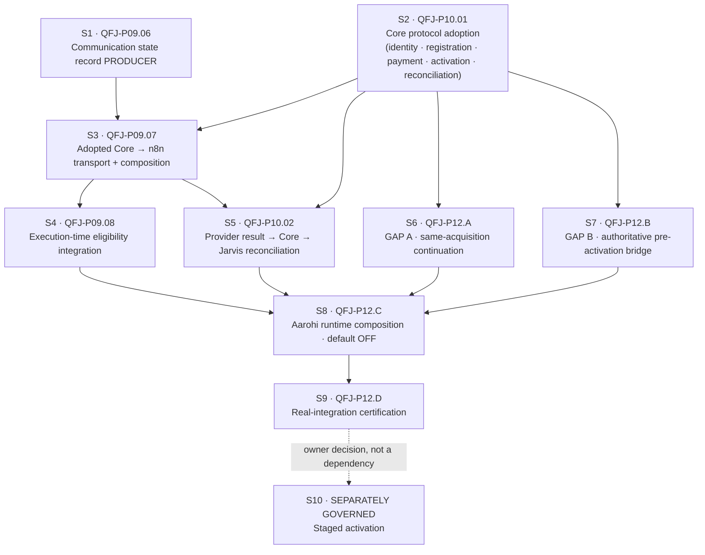
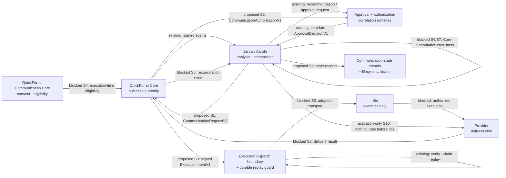

# Aarohi real execution integration — plan and sequencing

**Document status:** Canonical planning document. Adopted under
[ADR-0132](../decisions/ADR-0132-aarohi-real-execution-integration-planning.md). Read with
[qf-jarvis-roadmap-v3.md](./qf-jarvis-roadmap-v3.md),
[communication-model.md](./communication-model.md),
[execution-governance.md](./execution-governance.md),
[aarohi-vendor-growth-roadmap-overlay.md](./aarohi-vendor-growth-roadmap-overlay.md),
[agent-constitution.md](../governance/agent-constitution.md) and
[authority-routing-data-access-matrix.md](../governance/authority-routing-data-access-matrix.md).

**This is a plan. Nothing here is implemented, adopted, connected or activated.** Aarohi's runtime
is **PLANNED / DISABLED** and production rollout is **OFF**. Every edge marked *proposed* or
*blocked* below does not exist.

---

## 1. Where the repository actually is

Aarohi AVG-0…AVG-12 is implemented and certified offline
([ADR-0131](../decisions/ADR-0131-qfj-p12-aarohi-full-offline-certification-closeout.md)). The
execution chain has accumulated validators without a path:

| Merged capability | Owner slice | What it does | Composed by an app? |
| --- | --- | --- | --- |
| `approval-runtime` | QFJ-P08 | validates and correlates Core's `ApprovalDecisionV1` | yes |
| `approval-core-adapter` | ADR-0082 | submits human approval intent over an **injected** transport | no transport adopted |
| `communication-authorization-runtime` | ADR-0083 | correlates a `CommunicationRequestV1` with Core's `CommunicationAuthorizationV1` | **no** |
| `execution-intent-runtime` | ADR-0084 | proves a Core `ExecutionIntentV1` names the approved action | **no** (one offline JAO-7 use) |
| `execution-dispatch-runtime` | ADR-0090 | Core → n8n dispatch verification: signature, domain separation, freshness, expiry, replay claim | **no** |
| `postgres-execution-replay-store` | ADR-0091 | the durable replay guard (migration `0010`) | **no** |
| `execution-dispatch-composition` | ADR-0109 | binds the verifier to the durable store | **no importer at all** |
| `communication-lifecycle-runtime` | ADR-0110 | validates 18-state transitions against the approved graph | **no importer at all** |
| `aarohi-agent` | ADR-0085…0131 | the certified offline domain | **no importer at all**, asserted |

**Still absent**, confirmed against the import graph rather than taken from prose:

1. an **adopted** Core → n8n transport and its composition — the B4 wire protocol is **PROPOSED**;
2. execution-time communications **eligibility** integration;
3. a **producer** of `CommunicationStateRecordV1` — only the contract, its fixtures and the validator exist;
4. provider dispatch, provider results and **reconciliation** to Core and back to Jarvis;
5. production rollout.

## 2. The Core facts this plan may use

**A new read-only Core audit was not possible: no QuickFurno Core checkout exists in the working
environment.** No Core fact has been invented to fill the space.

The governed source is the read-only audit already recorded in this repository by ADR-0125,
ADR-0126 and ADR-0127, taken at `quickfurno-maker/quickfurno-marketplace` commit
`06b1e22cfa866cd3840c7ecb065b9d0c4acb8bca`.

| Question | Recorded finding | Classification |
| --- | --- | --- |
| Prospect → vendor continuity | **No correlation contract.** Every per-party read is keyed by a Core **vendor id**, which Aarohi structurally does not hold | **absent** |
| Registration completion | `vendorService.registerVendor(...)` only — a mutation. No registration-process, requirements, step or status read for an unregistered party | **authoritative WRITE**; read **absent** |
| Payment context | `listVendorPackageOrders(vendorId)`, `getVendorCurrentPackageSummary(vendorId)` — vendor-id keyed. `payment_status` / `order_status` / `activation_status` are unconstrained `text` with no CHECK; the only writer sets `created` / `not_started` / `not_activated` over `payment_provider: "not_connected"` | **authoritative READ, not prospect-addressable, not a lifecycle** |
| Activation truth | **Core has no ACTIVE vendor status.** `vendors.status` ∈ `('Pending','Approved','Rejected','Suspended')`; "active" is a separate boolean `is_active`; `package_status` uses lowercase `active` | **absent as an enum**; Jarvis `ACTIVE` is an abstraction over *"Core says this party is live"* |
| Commercial truth | available-package read service, seven fields, mirrored by AVG-8 | **authoritative READ, adopted** |
| Execution-time eligibility | authority is the **QuickFurno Communication Core**; the **QF Communications Runtime** re-validates at execution time, outside this repository, reached only by n8n | **authoritative, no Jarvis-facing protocol adopted** |
| Execution authorization | `ApprovalDecisionV1`, `CommunicationAuthorizationV1`, `ExecutionIntentV1` exist as canonical contracts in `@qf-jarvis/contracts`; the inter-system wire protocol is **PROPOSED** | **proposed protocol**, not adopted |
| Result reconciliation | no versioned Core → Jarvis reconciliation event or contract | **absent** |

> **Prerequisite for every Core-dependent slice below: re-run this read-only audit at a current
> marketplace commit and record the result.** Any finding that has changed re-opens the design of the
> slice that depends on it. Nothing in this plan may proceed on the 2026 audit alone.

## 3. The dependency-ordered sequence

**S1 — communication state record producer (QFJ-P09).** Build the missing producer of
`CommunicationStateRecordV1` and validate every movement through the merged
`communication-lifecycle-runtime`. The lifecycle runtime stays a validator and never becomes
authoritative. **No Core dependency:** the early states are constructible from Jarvis-side evidence,
and the later ones are structurally blocked by the existing schema, which requires Core-issued
`approvalDecisionId`, `executionIntentId` and `executionResultId`. That is the point — the Core
dependency becomes visible in code rather than assumed in prose.

**S2 — Core protocol adoption (QFJ-P10).** The bilateral step. Adopt the minimum versioned
read/event protocol for: a prospect ↔ vendor correlation fact, a registration-completion fact, a
prospect-addressable payment fact if one can exist, an authoritative "this party is live" fact, and
a Core → Jarvis reconciliation event. **Requires QuickFurno Core work. Nothing in qf-jarvis can
substitute for it, and no endpoint, header, signature or key format may be invented to proceed.**

**S3 — adopted Core → n8n transport and composition (QFJ-P09).** Move the PROPOSED B4 envelope to
adopted, then compose `execution-dispatch-composition` behind it. Preserves Core-issued signed
`ExecutionIntentV1`, domain separation, signature freshness, intent expiry with no grace period, and
the durable replay claim. **No Jarvis → n8n shortcut is created.**

**S4 — execution-time eligibility integration (QFJ-P09).** Consent, STOP, opt-out, DNC, suppression,
quiet hours and attempt limits are revalidated immediately before dispatch by Core and the QF
Communications Runtime. **Jarvis caches nothing and stores no eligibility answer.** A previous
approval is not a reusable permission slip.

**S5 — provider result → Core → Jarvis reconciliation (QFJ-P10).** Provider and n8n outcomes reach
Core first. Only Core's recorded result returns to Jarvis, as an authoritative event. **A provider
success never becomes Jarvis business truth directly.**

**S6 — GAP A, same-acquisition continuation (QFJ-P12).** A new fail-closed boundary proving from a
Core-authoritative fact that a registered vendor is the same party as an existing acquisition case,
permitting only the bounded acquisition-completion workflow. **`ELIGIBLE_CORE_STATUSES` is not
touched.** **Blocked on S2.**

**S7 — GAP B, authoritative pre-activation bridge (QFJ-P12).** The only lawful route into
`AWAITING_CORE_ACTIVATION`, driven by an adopted Core fact that actually justifies entry.
`completeCoreActiveHandoff(...)` remains the only route into `HANDED_OFF_TO_ANISHA`. **Blocked on
S2.**

**S8 — Aarohi runtime composition (QFJ-P12).** Compose the certified pure domains with the approved
Core and execution interfaces. **Default OFF. No production recipient. No silent fallback. No
provider credential in Aarohi.**

**S9 — real-integration certification (QFJ-P12).** Prove the live-capable composition preserves every
boundary the offline certification established, using the same cross-stage adversarial method.

**S10 — staged activation.** **Out of scope for this plan and for the implementation work above.**
A separate owner decision with its own ADR.

## 4. Gap and authority matrix

| # | Capability | Owner | Today | Authority | Missing dependency | Proposed artifact | Jarvis-only? | Core change? | n8n/provider? | Migration? | Activation impact | Fail-closed behaviour |
| --- | --- | --- | --- | --- | --- | --- | --- | --- | --- | --- | --- | --- |
| S1 | State record producer | P09 | contract + validator, no producer | Jarvis coordination; Core owns the artifacts it cites | none | producer package | **yes** | no | no | no | none | later states unconstructible without Core ids |
| S2 | Core protocol adoption | P10 | none | Core | Core-side publication | versioned read/event contracts | no | **yes** | no | no | none | absent fact ⇒ no slice proceeds |
| S3 | Core → n8n transport | P09 | PROPOSED envelope, verifier merged | Core issues, n8n executes | S2 adoption | adopted transport + composition | no | **yes** | **yes** | no | none | unverified/expired/replayed ⇒ refuse |
| S4 | Execution-time eligibility | P09 | absent | QuickFurno Communication Core | S3 | integration at dispatch | no | **yes** | **yes** | no | none | unknown ⇒ refuse; never cached |
| S5 | Result reconciliation | P10 | absent | Core | S2, S3 | Core → Jarvis event | no | **yes** | **yes** | possible projection | none | provider truth alone ⇒ not business truth |
| S6 | GAP A continuation | P12 | **open** | Core | prospect ↔ vendor fact | continuation boundary | no | **yes** | no | no | none | no fact ⇒ refuse; gate never widened |
| S7 | GAP B bridge | P12 | **open** | Core | authoritative live fact | pre-activation bridge | no | **yes** | no | no | none | no fact ⇒ boundary stays unreachable |
| S8 | Aarohi composition | P12 | none | Core for every business fact | S4, S5, S6, S7 | composition, default OFF | no | depends | depends | no | **OFF by default** | disabled ⇒ nothing runs |
| S9 | Real-integration certification | P12 | offline only | evidence, never authority | S8 | adversarial suite + ADR | **yes** | no | no | no | none | a failure blocks activation |
| S10 | Staged activation | separate | **OFF** | owner | S9 | activation ADR | no | — | — | — | **the activation** | remains OFF until decided |

**Migration reality check.** Migrations `0001`–`0012` exist on disk; the next free number is `0013`.
The managed database still carries `0001` and the later migrations are local/CI only. **No slice
above allocates a migration**, and none may, except under the migration-ledger policy: approved
owning design, proven necessity, reviewed scope, confirmed inventory, documented managed-rollout
impact and separate authorization. **Observed drift, reported not fixed here:** the ledger's prose
still says "no migration number after 0009 is pre-reserved" and carries no rows for `0010`, `0011`
or `0012`. That must be reconciled by the owning slices before any `0013` is considered.

## 5. Intended data flow

Every edge is labelled. **Only `existing` edges exist.**

## 6. Threat and negative-proof matrix

Every row must be a **test** in the slice that introduces the capability, not a paragraph.

| # | Attempt | Must be refused by | Refusal |
| --- | --- | --- | --- |
| 1 | Widen cold acquisition to `REGISTERED` | AVG-1 gate; certification suite | `ELIGIBLE_CORE_STATUSES` stays exactly `NOT_REGISTERED` |
| 2 | Continue a *different* registered vendor under an existing case | S6 continuation boundary | identity binding fails ⇒ refuse |
| 3 | Forge a prospect ↔ vendor correlation | S6 | correlation must be a Core fact, not a caller claim |
| 4 | Infer ACTIVE from paid | AVG-10; S7 | payment is not activation |
| 5 | Infer ACTIVE from a provider receipt | AVG-1 handoff | `AUTHORITY_NOT_CORE` |
| 6 | Infer ACTIVE from conversation text | AVG-1 handoff | `AUTHORITY_NOT_CORE` |
| 7 | Infer ACTIVE from model output | AVG-1 handoff | `AUTHORITY_NOT_CORE` |
| 8 | Infer ACTIVE from Aarohi case state | AVG-1 handoff | `AUTHORITY_NOT_CORE` |
| 9 | Enter `AWAITING_CORE_ACTIVATION` by generic transition | AVG-1 transition table | no edge exists |
| 10 | Bypass `completeCoreActiveHandoff` | AVG-1 | it is the only public route |
| 11 | Reuse a stale communication authorization | S4 | authorization records a past decision, never a future permission |
| 12 | Send after opt-out | S4, Core | Core refuses; the refusal is an ordinary outcome |
| 13 | Dispatch an expired `ExecutionIntentV1` | ADR-0090 verifier | `now >= expiresAt`, no grace period |
| 14 | Dispatch a forged Core intent | ADR-0090 verifier | signature under a distinct domain separator and key purpose |
| 15 | Replay with a conflicting idempotency/digest | ADR-0091 guard | `conflict`, fail closed |
| 16 | Treat an n8n/provider result as business truth | S5 | truth returns through Core first |
| 17 | Treat offline certification as activation authority | ADR-0131, ADR-0132 | certification is evidence, not a credential |
| 18 | Treat autonomy `L2` as contact or send authority | AVG-12 | same zero-authority posture at every level |

## 7. Recommended implementation PR sequence

Each PR is separately reviewable, separately gated and separately revertible. **No PR bundles two
slices.**

| PR | Owner | Purpose | Prerequisites | Code vs docs | Migration | External systems | Live send | Owner gate | Disable posture |
| --- | --- | --- | --- | --- | --- | --- | --- | --- | --- |
| **1** | QFJ-P09.06 | Communication state record **producer** | none | production code + tests | none | none | no | design review | not composed by any app |
| **2** | QFJ-P10 | **Re-run the read-only Core audit** and record findings | none | docs | none | read-only inspection | no | owner sign-off on findings | n/a |
| **3** | QFJ-P10.01 | Core protocol **adoption** for identity/registration/payment/activation/reconciliation | PR 2 + Core-side work | contracts + docs | none | **Core change required** | no | bilateral adoption | contracts unused until composed |
| **4** | QFJ-P09.07 | Adopted Core → n8n transport + composition | PR 3 | production code | none | Core + n8n | no | transport adoption | composition not wired |
| **5** | QFJ-P09.08 | Execution-time eligibility integration | PR 4 | production code | none | Core + QF Communications Runtime | no | Core sign-off | refuse when unknown |
| **6** | QFJ-P10.02 | Provider result → Core → Jarvis reconciliation | PR 4 | production code | possibly a projection | Core + n8n + provider | no | Core sign-off | no event ⇒ no truth |
| **7** | QFJ-P12.A | GAP A continuation boundary | PR 3 | production code | none | none | no | owner review | refuse without the fact |
| **8** | QFJ-P12.B | GAP B pre-activation bridge | PR 3 | production code | none | none | no | owner review | boundary stays unreachable |
| **9** | QFJ-P12.C | Aarohi runtime composition, **default OFF** | PRs 5–8 | production code | none | none until enabled | no | owner review | disabled by default |
| **10** | QFJ-P12.D | Real-integration certification | PR 9 | tests + ADR | none | none | no | owner review | failure blocks activation |
| **11** | separate | **Staged activation** | PR 10 | activation ADR | n/a | yes | **yes** | **separate owner decision** | kill switch required |

## 8. The twenty design questions, answered

1. **First implementation PR?** The `CommunicationStateRecordV1` producer (QFJ-P09.06).
2. **Implementable inside qf-jarvis?** Yes, entirely. Everything after it needs Core work first.
3. **What proves same-acquisition continuation?** A Core-authoritative prospect ↔ vendor correlation
   fact. **It does not exist at the audited commit**, so the gap stays open.
4. **What justifies `AWAITING_CORE_ACTIVATION`?** An adopted Core fact that a party is live. **Core
   has no ACTIVE status at the audited commit**, so the gap stays open.
5. **What proves ACTIVE?** Only a Core attestation with authority `QUICKFURNO_CORE` and
   `active: true`, for the same prospect, on a case already at the boundary.
6. **Where is contact eligibility revalidated?** In Core (QuickFurno Communication Core), and again
   by the QF Communications Runtime at execution time. Never in Jarvis, never cached.
7. **What creates `CommunicationRequestV1`?** Nothing today. The S1 producer's sibling responsibility;
   Aarohi only prepares inert candidates and pins `communicationRequestCreated: false`.
8. **What receives Core's `CommunicationAuthorizationV1`?** `communication-authorization-runtime`
   (merged, uncomposed).
9. **What receives Core's `ExecutionIntentV1`?** `execution-intent-runtime` for correlation;
   `execution-dispatch-runtime` for dispatch-time verification.
10. **What claims replay before execution?** `postgres-execution-replay-store` through
    `execution-dispatch-composition` — durable by construction.
11. **Who produces lifecycle records?** Nobody yet; that is S1.
12. **How do provider results reach Core?** Provider → n8n → Core. Not through Jarvis.
13. **How does Core truth return to Jarvis?** As an authoritative reconciliation event. **Contract
    absent — S2/S5.**
14. **What must Aarohi persist?** Nothing yet. Persistence is a separate governed decision.
15. **What must Aarohi never persist?** Consent, opt-out, suppression, STOP/DNC, eligibility answers,
    contact destinations, message bodies, payment instruments, credentials, provider payloads, raw
    model output.
16. **Which package APIs are reusable unchanged?** All nine in §1. None needs modification to be
    composed.
17. **Which public APIs stay locked?** The Aarohi barrel (exact-set asserted), control-plane V1
    (frozen) and V2 (versioned successor).
18. **Which migration is required?** **None**, for every slice through S9.
19. **What can be tested before any credential?** S1 entirely; the S3/S4/S5 boundaries against
    fakes and local fixtures, exactly as ADR-0090 and ADR-0091 already do.
20. **Final gate before activation?** A separate owner-authorized activation ADR after S9, with a
    kill switch. **Neither the offline certification nor the real-integration certification is that
    authority.**

---

**Production rollout remains OFF. Aarohi's runtime remains PLANNED / DISABLED. Staged activation is
a later, separately governed owner decision.**
