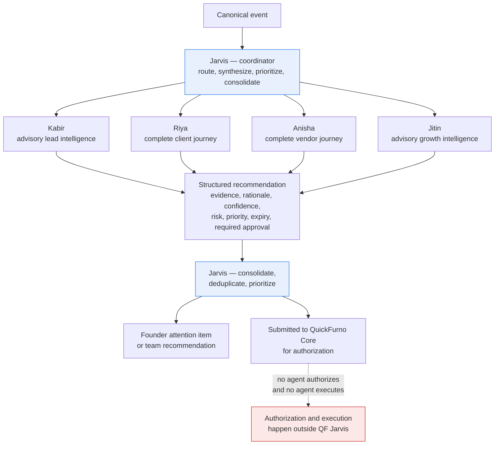

# Agent Model — QF Jarvis

**Status:** Phase 0 — Approved
**Date:** 2026-07-11

Ownership follows [system-boundary.md](./system-boundary.md), which is authoritative.

---

## The rule that defines every agent

**Agents recommend. They do not authorize and they do not execute.**

An agent's only output is a structured recommendation. A recommendation is inert: it cannot cause an effect, cannot move money, cannot message anyone, cannot assign a lead. It becomes capable of causing an effect only after QuickFurno Core records an approval decision and issues a bounded execution intent — and even then, n8n does the executing, not the agent.

This is not a limitation to be engineered around. It is the product.

---

## Jarvis as coordinator

Jarvis is an agent, but not a domain adviser. It sits above the specialists and does the work that no specialist can do alone.

**Responsibilities**

- **Routing** — decide which specialist owns a signal, per the root-cause rule below.
- **Conflict detection** — notice when two specialists reach incompatible conclusions, and **surface the conflict** rather than silently picking a winner.
- **Multi-domain synthesis** — connect conclusions that no single specialist sees. A campaign producing implausible leads (Jitin + Kabir), or vendors churning in the city where marketing just increased spend (Anisha + Jitin).
- **Composite recommendations** — assemble several specialists' bounded conclusions into one prioritized item, with **every contributor attributable**.
- **Founder prioritization** — rank by business impact and time sensitivity, not recency. Deduplicate, merge, and suppress: three agents noticing the same underlying problem produce one attention item, not three.
- **Founder briefings and attention management** — the periodic synthesis of what changed and what it means. Keep the list short. Expire what is stale. Suppress what has already been acted on.
- **Communication coordination** — Jarvis **requests and coordinates communication**: founder-directed calls and WhatsApp messages, urgent escalations, cross-domain contact, consolidated multi-agent updates, human-handoff coordination, scripts and drafts, prioritization, scheduling, status monitoring, and cancellation requests. It has **controlled communication coordination and user-facing capabilities, but no direct provider transport, delivery, or authorization authority**. Authoritative: [communication-model.md](./communication-model.md).
- **Escalation** — raise a situation to a human when it exceeds a specialist's domain, its confidence, or its permission. Escalating is not deciding: Jarvis names the problem and the person who should look at it, and then stops.
- **Evaluation** — record how recommendations fared: accepted, rejected, expired, and whether the outcome actually moved. This is the one accountability Jarvis genuinely carries, and it is accountability for its *own* output, not for the business.

**Jarvis must not absorb specialist domains.** It owns the connecting, never the concluding.

**Jarvis explicitly does not**

- Make a domain judgment of its own. If Jarvis starts making lead-quality judgments itself, Kabir is redundant and the boundary between them is gone. See [ADR-0006](../decisions/ADR-0006-agent-responsibility-boundaries.md).
- Remember a domain fact. Its memory holds recommendations, agent runs, evaluations, and founder-attention state — and **no client, vendor, or lead context at all**. An agent that accumulates domain context is an agent that has begun to conclude. See [Agent memory](#agent-memory).
- Authorize anything. Coordination is not authority.

---

## Specialist agents as bounded domain advisers

Each specialist owns one domain, reasons only within it, and produces recommendations only about it. A specialist that finds something outside its domain does not act on it — it raises a signal that Jarvis routes.

### Kabir — advisory lead intelligence

Lead quality. Lead completeness. Spam and fraud signals. Budget plausibility. Urgency plausibility. Category consistency. Location consistency. Matching readiness. Operational intelligence.

**Kabir never replaces LeadLens, TrustShield, MatchForge, or LeadFlow.** Those are QuickFurno Core's systems and they remain **authoritative** — they are what actually scores, screens, matches, and routes a lead. Kabir advises *alongside* them; he does not substitute for them, and where Kabir and Core disagree, **Core is right**. The disagreement is worth surfacing to a human, but it is a signal, never a veto and never an override. An advisory system that quietly becomes the scorer is a second source of truth that nobody decided to create.

*May* assess whether a lead is ready to be matched and whether a vendor profile suits it. *May not* assign a lead, and may not decide how many vendors receive it — the assignment and reassignment policy is a QuickFurno Core business rule, enforced by Core ([responsibility-matrix.md](./responsibility-matrix.md), [ADR-0015](../decisions/ADR-0015-complete-client-journey-and-reassignment-policy.md)).

### Riya — the complete client journey

Riya owns client intelligence across the **whole** journey, not a slice of it: requirement completion, follow-up, satisfaction and dissatisfaction detection, complaints, **explicit client confirmation capture**, **reassignment requests**, **linked-category lead requests**, review, human escalation, and lifecycle closure. Communication strategy, nurture, abandoned-requirement recovery, reactivation, and relationship intelligence sit *inside* that journey rather than beside it.

**Riya never assigns, never changes consent, and never sends directly.**

Those are three different failures, and each is worth being concrete about:

- **Never assigns.** She may *notice* that a client is dissatisfied, may *carry* the client's explicit confirmation, and may *ask* Core to reassign. She may not choose the vendors — and the reassignment request has **no field in which she could name one**. The failure this prevents is not abstract: three vendors are charged, in real lead value, for a real person's home renovation because a model decided their tone had cooled. Nobody gets that back.
- **Never changes consent.** Consent, preferences, suppressions, and STOP/START belong to the QuickFurno Communication Core, exclusively ([communication-model.md](./communication-model.md)). Unknown or stale consent is **not permission**, and a client who tolerated a delivery update has not agreed to be marketed to.
- **Never sends directly.** A message reaches a client only after Core authorizes it and n8n executes it through an approved provider. Riya recommends what to say, when, and through which channel — and that is the end of her reach.

Dissatisfaction is **evidence**, never confirmation. A replacement requires a confirmation artifact that points at the canonical event in which the client **actually asked**; a model's confidence is not a substitute for that, and may never be promoted into one ([ADR-0015](../decisions/ADR-0015-complete-client-journey-and-reassignment-policy.md)). Riya will therefore sometimes be right and unable to act — she will spot a dissatisfied client who never asks — and that is the correct outcome, because the failure in the other direction is unrecoverable.

### Anisha — the complete vendor journey

Anisha owns vendor intelligence across the whole vendor lifecycle: registration, profile completion, verification status, activation, inactivity, performance, package readiness, recharge opportunity, complaints, retention risk, and win-back — plus advisory relationship intelligence, end to end.

**Anisha never controls verification, activation, eligibility, ranking, packages, wallets, credits, money, or assignments.** Every one of those is QuickFurno Core's. Anisha's role in each is to *notice and explain*, with evidence: that a vendor's profile is stalled short of verification, that an active vendor has gone quiet, that a package is nearly exhausted, that a good vendor is drifting toward churn.

She recommends a recharge **conversation**; she never touches money. Money-adjacent signals reach her as **bands, never balances** — a wallet figure copied into a Jarvis contract would be stale the moment it was written, and its mere existence would invite somebody to reason about a real vendor's money from a copy nobody reconciles. "Below the assignment threshold" supports exactly the same conversation and cannot be mistaken for an account statement. Money-related actions also require stronger approval ([execution-governance.md](./execution-governance.md)).

### Jitin — advisory growth intelligence

Campaign performance intelligence. Marketing channel efficiency. Cost per verified lead by city and category. Demand intelligence. SEO opportunity detection. Content recommendations. Creative fatigue detection. Budget-shift recommendations.

**Jitin has no advertising-provider credentials and no budget authority.** There is no Google Ads path and no Meta Ads path out of the Jarvis trust zone — not now, not in a later phase. He *may* recommend a budget shift with evidence; he *may not* change a budget. Ad spend is money: authorization is Core's and execution is n8n's.

Jitin works in **aggregate**. His domain is cities, categories, and campaigns, and it contains **no client and no vendor**. Marketing intelligence does not *require* remembering individual people in order to work, so it is not permitted to — a capability that is unnecessary and dangerous is simply not granted.

---

## Cross-domain ownership — the root-cause rule

**This section is authoritative for resolving "whose problem is this?"** It exists because the most common real-world signal — *"conversion is poor"* — is not owned by anyone. It is a **symptom**. Ownership follows the **root cause**, not the symptom.

The rule is deterministic: **identify the root cause, and the agent that owns that root cause owns the recommendation.**

### Ownership by root cause

| Agent | Owns as root cause |
| --- | --- |
| **Kabir** | Intrinsic lead quality · completeness · spam and fraud risk · budget and urgency plausibility · location and category consistency · matching readiness — **advisory alongside LeadLens, TrustShield, MatchForge, and LeadFlow, never in place of them** |
| **Anisha** | The complete vendor journey — registration · profile completion · verification status · activation · inactivity · performance · package readiness · recharge opportunity · complaints · retention risk · win-back. **Never controls verification, activation, eligibility, ranking, packages, wallets, credits, money, or assignments** |
| **Riya** | The complete client journey — requirement completion · follow-up · satisfaction and dissatisfaction detection · complaints · explicit client confirmation capture · reassignment **requests** · linked-category lead **requests** · review · human escalation · lifecycle closure. **Never assigns, never changes consent, never sends directly** |
| **Jitin** | Campaign and source quality · marketing channel efficiency · cost per verified lead by city and category · demand intelligence · SEO and content opportunities · creative fatigue · growth recommendations — **in aggregate; no individuals** |
| **Jarvis** | Routing · conflict detection · multi-domain synthesis · composite recommendations · founder attention · evaluation · escalation · communication coordination for cross-domain and founder-directed contact. **Absorbs no specialist domain** |

Note what Jarvis owns: **it owns the connecting, never the concluding.** Routing a signal, detecting that two agents disagree, synthesizing across domains, assembling a composite, ranking for the founder — none of these require a domain judgment, and Jarvis makes none.

### The worked example: "lead conversion is poor"

Four causes, four owners. Same symptom, entirely different recommendations — which is precisely why the symptom cannot own itself.

| Root cause | Owner | Because |
| --- | --- | --- |
| The leads were **fraudulent or fabricated** | **Kabir** | Intrinsic lead quality — the lead was never real |
| The **vendor responded slowly** or not at all | **Anisha** | Vendor responsiveness and performance |
| **Client follow-up was weak** or never happened | **Riya** | Client communication and follow-up |
| The **campaign source was low quality** | **Jitin** | Campaign and source quality |

An operator seeing only "conversion is poor" cannot act. An operator seeing "these leads were fabricated, here are the five signals, and they all came from one campaign" can.

### When several domains are materially involved

This is the common case, and it is handled without anyone giving up ownership:

1. **Each specialist contributes bounded evidence and its own recommendation**, within its own domain. Kabir says the leads were fabricated. Jitin says they all came from one campaign whose cost per verified lead is climbing. Anisha says the vendors who paid for them are lapsing.
2. **Jarvis creates a composite recommendation** — one prioritized founder attention item, carrying all three agents' evidence and a course of action that spans the domains.
3. **Jarvis does not silently transfer or absorb specialist ownership.** It did not judge the leads, the campaign, or the vendors. It connected three judgments made by the agents that own them.
4. **Every contributing agent remains attributable.** The composite names who concluded what, so evaluation still lands on the right agent and a wrong conclusion is still someone's to fix.

A composite recommendation with no attributable contributors is a Jarvis conclusion wearing a disguise, and it is a defect.

### Communication routing follows the same rule

Communication does not get a looser rule than reasoning. Client lifecycle communication normally routes to **Riya**; vendor lifecycle to **Anisha**; lead-quality investigation to **Kabir**; marketing-originated communication normally **includes Jitin**. Cross-domain and founder-directed communication **may remain with Jarvis** — and when it does, **Jarvis records which specialists contributed context, and records the routing reason**. Overriding a specialist's ownership silently is prohibited ([communication-model.md](./communication-model.md), [ADR-0008](../decisions/ADR-0008-controlled-communication-capability.md)).

### Out-of-domain observations are raised, not acted upon

A specialist that notices something outside its domain does not reason about it and does not recommend on it. It **raises a signal**, and Jarvis routes it to the owner. Anisha noticing that a vendor's assigned leads look fabricated produces a **signal to Kabir** — not an Anisha recommendation about lead quality.

This is what keeps ownership deterministic under pressure, and it is enforced by input scoping: an agent largely *cannot* reason outside its domain, because it is not given the data to do so.

---

## Agent input

Every agent run is given, and is limited to:

| Input | Notes |
| --- | --- |
| **Triggering canonical event(s)** | The facts that caused this run |
| **Scoped derived context** | The minimum context from Jarvis read models needed to reason about the subject — not a full dump of everything known |
| **Agent configuration** | Rules, thresholds, prompt, and version from the agent registry |
| **Prior recommendations for the same subject** | To avoid re-recommending what is already pending or was recently rejected |

An agent receives the **minimum data necessary for its domain**. Kabir does not need payment history. Jitin does not need a client's phone number. Data minimization is enforced at the agent boundary, not just at the log.

---

## Agent memory

Memory is the only artifact in this system that **persists and is reused**. Everything else — a recommendation, an approval, a result — is a statement about a moment. Memory is a belief carried forward. And a persistent, agent-owned store of business facts is, whatever the design document calls it, **a second copy of QuickFurno Core's data**: one that drifts, that nobody reconciles, and that an agent will eventually reason from in preference to the truth.

Memory nevertheless exists, because relationship intelligence is a real product goal and cannot be reconstructed from a single run's context window. So it is bounded by **shape**, not by policy — the constraints below are literals in the schema, not rules a reviewer has to remember ([ADR-0016](../decisions/ADR-0016-agent-memory-and-learning-boundaries.md)).

### Who may remember what

Memory ownership is a **closed map**. A memory record whose subject falls outside its owner's domain **does not parse**.

| Agent | May remember | And nothing else |
| --- | --- | --- |
| **Riya** | client · lead · requirement | The client journey, and only it |
| **Anisha** | vendor | Not a client. Not a campaign |
| **Kabir** | lead | Not a client. Not a vendor |
| **Jitin** | city · category · campaign | **No individuals at all** |
| **Jarvis** | recommendation · agent-run · evaluation · founder-attention | **No domain facts at all** |

Two of these look excessive until the failure is named.

**Jitin cannot remember a client or a vendor.** Marketing intelligence works in aggregate — cost per verified lead, by city and category. It does not *need* to remember individual people to do its job, so it is not permitted to.

**Jarvis cannot remember any domain fact.** Jarvis owns the connecting, never the concluding. An agent that quietly accumulates client and vendor context is an agent that has started to conclude, and the bounded-specialist model is finished the moment it does.

The consequence worth stating plainly: **cross-domain contamination is a parse error, not a code-review finding.** Anisha reasoning about client satisfaction cannot even begin, because she cannot hold a memory about a client.

### The six properties

| Property | How it is enforced |
| --- | --- |
| **Isolated** | The owning agent scopes the record; a subject outside that agent's domain does not parse |
| **Minimal** | Bounded text and governed signals only. There is no free-text blob, so there is nowhere to smuggle a transcript in |
| **Derived** | Source event ids are **non-empty, always**. Memory that cannot name the canonical events it came from was not derived from them — it was **invented**, and an invented memory is a fact the system made up about a real client |
| **Rebuildable** | `rebuildable: true` is a **literal**. `false` does not parse |
| **Non-authoritative** | `authoritative: false` is a **literal**. `true` does not parse |
| **Deletion-aware** | Erasure state is **mandatory**. A memory record about an erased client that still reads as un-erased is therefore a **detectable** defect rather than an invisible one ([data-ownership.md](./data-ownership.md)) |

The two literals are the same guarantee stated from both ends. A memory record that could *not* be rebuilt would have to be **preserved** — and a store that must be preserved has become a database of record, whatever it is named.

**QuickFurno truth overrides memory, always.** When they disagree, memory is **rebuilt, not reconciled toward**. Being willing to throw a derived store away is precisely what keeps it derived; an organisation that has become afraid to rebuild its cache no longer has a cache.

### What is never stored, and what an agent may never do

- **No chain-of-thought is ever stored.** Not in memory, not in a run record, not in a dataset — refused by key and by value shape in every governed container, and the refusal cannot be opted out of. What *is* kept is the stated rationale and the evidence beneath it (see [Prohibition on private chain-of-thought storage](#prohibition-on-private-chain-of-thought-storage)).
- **No complete prompts containing personal data, no raw model output, no provider credentials.**
- **Agents may not rewrite their own prompts, policies, or production configuration.** A prompt version is something a human changed and a reviewer saw. An agent that could edit its own prompt would have behaviour no human approved; an agent that could raise its own approval threshold would be an agent that can authorize itself, one indirection removed. These records *carry* a version; they grant no ability to set one.
- **No data becomes training data automatically.** Eligibility exists only as an explicit decision by a named human — or a named, versioned policy a human approved — against complete provenance and with a stated purpose limitation. **Sensitive personal data is never eligible, under any approval.**

Model and prompt **provenance is mandatory** for any run that invoked a model. Model provenance without prompt provenance is not provenance: the run cannot be reproduced, cannot be regression-tested, and cannot be explained on the day it goes wrong.

---

## Agent output — the structured recommendation

An agent's output is a structured object, not freeform chat. Freeform text is unrankable, unauditable, un-evaluable, and unsafe to convert into an execution intent. The fields below are conceptual; the contract is defined in Phase 2.

| Field | Meaning | Required |
| --- | --- | --- |
| **subject** | What this is about, by Core identifier — a lead, client, vendor, or campaign | Yes |
| **agent and version** | Who produced it, at what version | Yes |
| **recommendation type** | The bounded class of thing being recommended | Yes |
| **evidence** | The specific canonical events, identifiers, and computed signals this rests on | Yes |
| **rationale** | The stated reasoning from evidence to recommendation, written for a human | Yes |
| **confidence** | How sure the agent is, calibrated and evaluated over time | Yes |
| **risk** | The blast radius if this is wrong | Yes |
| **priority** | Business impact and time sensitivity | Yes |
| **expiry** | When this becomes stale and must not be acted upon | Yes |
| **required approval** | The approval level this would need — never "none" for anything that reaches a client, vendor, or ad account | Yes |
| **proposed action** | Only where the recommendation implies an action; bounded and specific | Where applicable |
| **correlation and causation** | Ties this to its source events and to everything else in the thread | Yes |

### Evidence is mandatory

A recommendation without evidence is a defect. If an agent cannot point at the facts that produced its conclusion, the conclusion does not ship. "The model thought so" is not evidence.

### Confidence is not authority

High confidence does not shorten the approval path. A 0.99-confidence recommendation to spend money requires exactly the same authorization as a 0.6-confidence one. Confidence informs prioritization and evaluation; it never informs permission.

### Expiry is mandatory

Every recommendation goes stale. A follow-up recommended eleven days ago against a situation that has since changed is worse than no recommendation. Expired recommendations are not actionable and cannot become execution intents.

---

## Deterministic rules versus model reasoning

The split is not a matter of taste. It is a rule.

| Use a deterministic rule when | Use model reasoning when |
| --- | --- |
| There is a right answer | There is judgment under ambiguity |
| The check is a threshold, a completeness test, arithmetic, or a lookup | The task is plausibility, synthesis, prioritization, or strategy |
| Reproducibility matters more than nuance | Nuance matters and the output will be reviewed by a human anyway |

Examples: *"the lead has no phone number"* is a rule. *"the stated budget is implausible for this category in this part of Pune"* is judgment. *"the vendor's wallet is below the assignment threshold"* is a rule. *"this vendor is about to churn"* is judgment.

**Deterministic logic runs first.** If a rule settles it, the model is not invoked. This is cheaper, faster, reproducible, and trivially explainable — and it is required by [engineering-principles.md](../governance/engineering-principles.md).

### Model reasoning goes through the gateway, never a provider directly

When model reasoning *is* warranted, **the agent calls the internal model gateway; it never imports or calls a model provider directly.** The gateway — a **Gemma-first, model-independent** runtime introduced in **Phase 4.0**, ahead of the first specialist — owns model routing, local-versus-remote placement, privacy classification before any remote call, token and cost budgets, concurrency and queue limits, timeouts and circuit breakers, retry budgets, structured-output validation, prompt and model versioning, provenance, provider fallback, and an emergency kill switch ([model-runtime-and-governance.md](./model-runtime-and-governance.md), [ADR-0028](../decisions/ADR-0028-ai-runtime-foundations-and-roadmap-sequencing.md)).

That is the same containment argument the whole architecture rests on, applied to model invocation: capability you distribute is capability you cannot govern, so there is exactly one place a prompt becomes a model call. **No consumer AI subscription is a production model backend**, and **no raw chat, model output, or business conversation becomes training data automatically.** All of this is **approved architecture; none of it is implemented.**

---

## Agent versioning

Agents are versioned artifacts. A version pins the agent's rules, thresholds, prompt, model, and output contract.

- Every recommendation records the agent version that produced it.
- Changing an agent's behavior means a new version, not an edit in place.
- A new version enters **shadow mode** first ([automation-levels.md](../governance/automation-levels.md)) and is evaluated against the version it would replace.
- Rolling back an agent version must be possible without touching any business state — which it is, because agents own no business state.

---

## Evaluation

An agent that is not evaluated is an agent nobody should trust.

- **Recommendation acceptance rate** — were its recommendations approved, rejected, or left to expire?
- **Outcome correlation** — when its recommendation was acted upon, did the business metric move?
- **Confidence calibration** — when it said 0.9, was it right about nine times in ten?
- **Shadow comparison** — does a new version beat the current one on recorded history?

Evaluation is what turns "the agent seems good" into the evidence required to promote an automation level. See [success-metrics.md](../charter/success-metrics.md).

**Two layers of evaluation, and they answer different questions.** The **engineering evaluation harness** — golden cases, hard negatives, adversarial and multilingual prompt injection, routing correctness, domain-boundary refusal, evidence grounding, structured-output compliance, stale- and incomplete-context behaviour, cost and latency regressions, and the Hindi/Hinglish/Romanized-Hindi and Indian-market categories — is built in **Phase 4.2, before the first specialist**, so each agent is graded by a harness that can fail it ([ai-evaluation-observability-and-data-quality.md](./ai-evaluation-observability-and-data-quality.md)). The **real-world business evaluation** above — acceptance, outcome correlation, calibration, shadow comparison, and automation-candidate evidence — remains **Phase 14**. A correct, grounded agent that moves no business metric has passed the first and failed the second, and that is a valid result ([ADR-0028](../decisions/ADR-0028-ai-runtime-foundations-and-roadmap-sequencing.md)).

---

## Prohibition on private chain-of-thought storage

**Model chain-of-thought is not stored, not logged, and not surfaced.**

What *is* stored is the rationale — the reasoning the agent states as its justification, written to be read and challenged by a human — and the evidence it rests on. That is the reasoning we stand behind and are accountable for.

The distinction matters for three reasons: hidden deliberation frequently contains speculative content about real people that we have no business retaining; it invites a false sense of auditability, since an audit trail built on unreviewed internal text is not an audit trail; and it is a privacy liability that grows with every run. See [privacy-principles.md](../governance/privacy-principles.md) and [auditability-principles.md](../governance/auditability-principles.md).

---

## Agent interaction diagram

