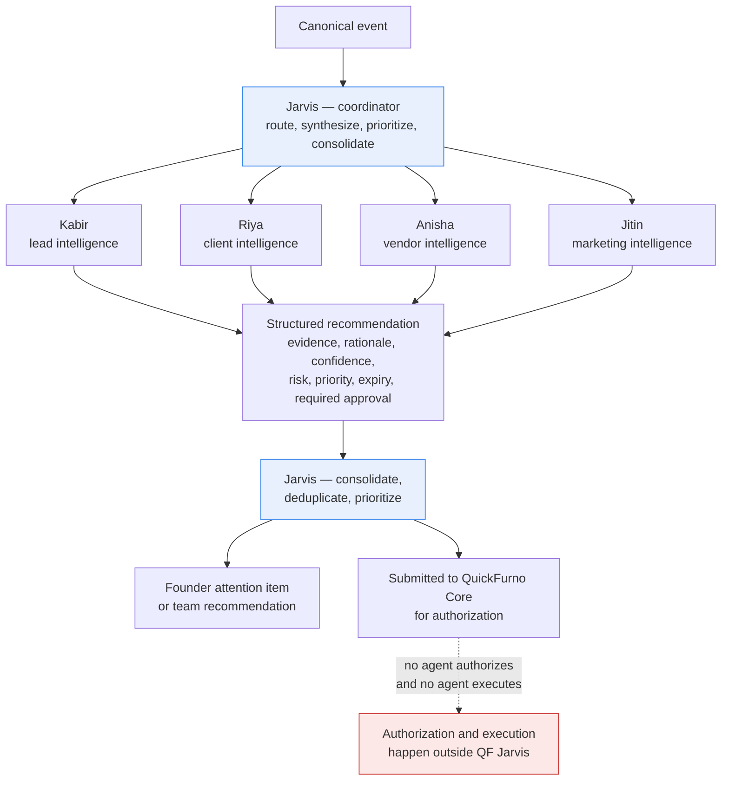

# Agent Model — QF Jarvis

**Status:** Phase 0 — Approved
**Date:** 2026-07-11

Ownership follows [system-boundary.md](./system-boundary.md), which is authoritative.

---

## The rule that defines every agent

**Agents recommend. They do not authorize and they do not execute.**

An agent's only output is a structured recommendation. A recommendation is inert: it cannot cause an effect, cannot move money, cannot message anyone, cannot assign a lead. It becomes capable of causing an effect only after QuickFurno Core records an approval decision and issues a bounded execution intent — and even then, n8n does the executing, not the agent.

This is not a limitation to be engineered around. It is the product.

---

## Jarvis as coordinator

Jarvis is an agent, but not a domain adviser. It sits above the specialists and does the work that no specialist can do alone.

**Responsibilities**

- **Routing** — decide which specialist owns a signal, per the root-cause rule below.
- **Conflict detection** — notice when two specialists reach incompatible conclusions, and **surface the conflict** rather than silently picking a winner.
- **Multi-domain synthesis** — connect conclusions that no single specialist sees. A campaign producing implausible leads (Jitin + Kabir), or vendors churning in the city where marketing just increased spend (Anisha + Jitin).
- **Composite recommendations** — assemble several specialists' bounded conclusions into one prioritized item, with **every contributor attributable**.
- **Founder prioritization** — rank by business impact and time sensitivity, not recency. Deduplicate, merge, and suppress: three agents noticing the same underlying problem produce one attention item, not three.
- **Founder briefings and attention management** — the periodic synthesis of what changed and what it means. Keep the list short. Expire what is stale. Suppress what has already been acted on.
- **Communication coordination** — Jarvis **requests and coordinates communication**: founder-directed calls and WhatsApp messages, urgent escalations, cross-domain contact, consolidated multi-agent updates, human-handoff coordination, scripts and drafts, prioritization, scheduling, status monitoring, and cancellation requests. It has **controlled communication coordination and user-facing capabilities, but no direct provider transport, delivery, or authorization authority**. Authoritative: [communication-model.md](./communication-model.md).

**Jarvis explicitly does not**

- Absorb the specialists' domains. If Jarvis starts making lead-quality judgments itself, Kabir is redundant and the boundary between them is gone. See [ADR-0006](../decisions/ADR-0006-agent-responsibility-boundaries.md).
- Authorize anything. Coordination is not authority.

---

## Specialist agents as bounded domain advisers

Each specialist owns one domain, reasons only within it, and produces recommendations only about it. A specialist that finds something outside its domain does not act on it — it raises a signal that Jarvis routes.

### Kabir — lead intelligence

Lead quality. Lead completeness. Spam and fraud signals. Budget plausibility. Urgency plausibility. Category consistency. Location consistency. Matching readiness. Operational intelligence.

*May* assess whether a lead is ready to be matched and whether a vendor profile suits it. *May not* assign a lead, and may not decide how many vendors receive it — the maximum of three suitable vendors per qualified lead is a QuickFurno Core business rule, enforced by Core.

### Riya — client intelligence

Client communication strategy. Client follow-up. Nurture recommendations. Abandoned-requirement recovery. Client reactivation. Relationship intelligence. Communication timing and channel recommendations.

*May* recommend what to say, when, and through which channel. *May not* send anything. The message reaches a client only after approval, and only through n8n and an approved provider.

### Anisha — vendor intelligence

Vendor acquisition. Vendor qualification. Onboarding. Profile completion. Activation. Package readiness. Recharge recommendations. Retention. Upgrade. Inactivity recovery. Vendor win-back.

*May* recommend that a vendor is a recharge candidate or a churn risk, with evidence. *May not* touch a wallet, a package, or a payment. Money is Core's, and money-related actions require stronger approval ([execution-governance.md](./execution-governance.md)).

### Jitin — marketing intelligence

Campaign performance intelligence. Marketing channel analysis. Cost-per-verified-lead analysis. City and category demand intelligence. SEO opportunity detection. Content recommendations. Creative fatigue detection. Budget-shift recommendations. Growth intelligence.

*May* recommend a budget shift with evidence. *May not* change a budget. Ad spend is money; authorization is Core's and execution is n8n's.

---

## Cross-domain ownership — the root-cause rule

**This section is authoritative for resolving "whose problem is this?"** It exists because the most common real-world signal — *"conversion is poor"* — is not owned by anyone. It is a **symptom**. Ownership follows the **root cause**, not the symptom.

The rule is deterministic: **identify the root cause, and the agent that owns that root cause owns the recommendation.**

### Ownership by root cause

| Agent | Owns as root cause |
| --- | --- |
| **Kabir** | Intrinsic lead quality · completeness · spam and fraud risk · budget and urgency plausibility · location and category consistency · matching readiness |
| **Anisha** | Vendor acquisition · onboarding · activation · responsiveness · package readiness · recharge · retention · vendor performance improvement · inactivity and win-back |
| **Riya** | Client communication · client follow-up · nurture · abandoned requirements · client reactivation · relationship strategy |
| **Jitin** | Campaign and source quality · marketing channel efficiency · cost per verified lead · SEO and content opportunities · creative fatigue · growth recommendations |
| **Jarvis** | Routing · conflict detection · multi-domain synthesis · composite recommendations · founder prioritization · communication coordination for cross-domain and founder-directed contact |

Note what Jarvis owns: **it owns the connecting, never the concluding.** Routing a signal, detecting that two agents disagree, synthesizing across domains, assembling a composite, ranking for the founder — none of these require a domain judgment, and Jarvis makes none.

### The worked example: "lead conversion is poor"

Four causes, four owners. Same symptom, entirely different recommendations — which is precisely why the symptom cannot own itself.

| Root cause | Owner | Because |
| --- | --- | --- |
| The leads were **fraudulent or fabricated** | **Kabir** | Intrinsic lead quality — the lead was never real |
| The **vendor responded slowly** or not at all | **Anisha** | Vendor responsiveness and performance |
| **Client follow-up was weak** or never happened | **Riya** | Client communication and follow-up |
| The **campaign source was low quality** | **Jitin** | Campaign and source quality |

An operator seeing only "conversion is poor" cannot act. An operator seeing "these leads were fabricated, here are the five signals, and they all came from one campaign" can.

### When several domains are materially involved

This is the common case, and it is handled without anyone giving up ownership:

1. **Each specialist contributes bounded evidence and its own recommendation**, within its own domain. Kabir says the leads were fabricated. Jitin says they all came from one campaign whose cost per verified lead is climbing. Anisha says the vendors who paid for them are lapsing.
2. **Jarvis creates a composite recommendation** — one prioritized founder attention item, carrying all three agents' evidence and a course of action that spans the domains.
3. **Jarvis does not silently transfer or absorb specialist ownership.** It did not judge the leads, the campaign, or the vendors. It connected three judgments made by the agents that own them.
4. **Every contributing agent remains attributable.** The composite names who concluded what, so evaluation still lands on the right agent and a wrong conclusion is still someone's to fix.

A composite recommendation with no attributable contributors is a Jarvis conclusion wearing a disguise, and it is a defect.

### Communication routing follows the same rule

Communication does not get a looser rule than reasoning. Client lifecycle communication normally routes to **Riya**; vendor lifecycle to **Anisha**; lead-quality investigation to **Kabir**; marketing-originated communication normally **includes Jitin**. Cross-domain and founder-directed communication **may remain with Jarvis** — and when it does, **Jarvis records which specialists contributed context, and records the routing reason**. Overriding a specialist's ownership silently is prohibited ([communication-model.md](./communication-model.md), [ADR-0008](../decisions/ADR-0008-controlled-communication-capability.md)).

### Out-of-domain observations are raised, not acted upon

A specialist that notices something outside its domain does not reason about it and does not recommend on it. It **raises a signal**, and Jarvis routes it to the owner. Anisha noticing that a vendor's assigned leads look fabricated produces a **signal to Kabir** — not an Anisha recommendation about lead quality.

This is what keeps ownership deterministic under pressure, and it is enforced by input scoping: an agent largely *cannot* reason outside its domain, because it is not given the data to do so.

---

## Agent input

Every agent run is given, and is limited to:

| Input | Notes |
| --- | --- |
| **Triggering canonical event(s)** | The facts that caused this run |
| **Scoped derived context** | The minimum context from Jarvis read models needed to reason about the subject — not a full dump of everything known |
| **Agent configuration** | Rules, thresholds, prompt, and version from the agent registry |
| **Prior recommendations for the same subject** | To avoid re-recommending what is already pending or was recently rejected |

An agent receives the **minimum data necessary for its domain**. Kabir does not need payment history. Jitin does not need a client's phone number. Data minimization is enforced at the agent boundary, not just at the log.

---

## Agent output — the structured recommendation

An agent's output is a structured object, not freeform chat. Freeform text is unrankable, unauditable, un-evaluable, and unsafe to convert into an execution intent. The fields below are conceptual; the contract is defined in Phase 2.

| Field | Meaning | Required |
| --- | --- | --- |
| **subject** | What this is about, by Core identifier — a lead, client, vendor, or campaign | Yes |
| **agent and version** | Who produced it, at what version | Yes |
| **recommendation type** | The bounded class of thing being recommended | Yes |
| **evidence** | The specific canonical events, identifiers, and computed signals this rests on | Yes |
| **rationale** | The stated reasoning from evidence to recommendation, written for a human | Yes |
| **confidence** | How sure the agent is, calibrated and evaluated over time | Yes |
| **risk** | The blast radius if this is wrong | Yes |
| **priority** | Business impact and time sensitivity | Yes |
| **expiry** | When this becomes stale and must not be acted upon | Yes |
| **required approval** | The approval level this would need — never "none" for anything that reaches a client, vendor, or ad account | Yes |
| **proposed action** | Only where the recommendation implies an action; bounded and specific | Where applicable |
| **correlation and causation** | Ties this to its source events and to everything else in the thread | Yes |

### Evidence is mandatory

A recommendation without evidence is a defect. If an agent cannot point at the facts that produced its conclusion, the conclusion does not ship. "The model thought so" is not evidence.

### Confidence is not authority

High confidence does not shorten the approval path. A 0.99-confidence recommendation to spend money requires exactly the same authorization as a 0.6-confidence one. Confidence informs prioritization and evaluation; it never informs permission.

### Expiry is mandatory

Every recommendation goes stale. A follow-up recommended eleven days ago against a situation that has since changed is worse than no recommendation. Expired recommendations are not actionable and cannot become execution intents.

---

## Deterministic rules versus model reasoning

The split is not a matter of taste. It is a rule.

| Use a deterministic rule when | Use model reasoning when |
| --- | --- |
| There is a right answer | There is judgment under ambiguity |
| The check is a threshold, a completeness test, arithmetic, or a lookup | The task is plausibility, synthesis, prioritization, or strategy |
| Reproducibility matters more than nuance | Nuance matters and the output will be reviewed by a human anyway |

Examples: *"the lead has no phone number"* is a rule. *"the stated budget is implausible for this category in this part of Pune"* is judgment. *"the vendor's wallet is below the assignment threshold"* is a rule. *"this vendor is about to churn"* is judgment.

**Deterministic logic runs first.** If a rule settles it, the model is not invoked. This is cheaper, faster, reproducible, and trivially explainable — and it is required by [engineering-principles.md](../governance/engineering-principles.md).

---

## Agent versioning

Agents are versioned artifacts. A version pins the agent's rules, thresholds, prompt, model, and output contract.

- Every recommendation records the agent version that produced it.
- Changing an agent's behavior means a new version, not an edit in place.
- A new version enters **shadow mode** first ([automation-levels.md](../governance/automation-levels.md)) and is evaluated against the version it would replace.
- Rolling back an agent version must be possible without touching any business state — which it is, because agents own no business state.

---

## Evaluation

An agent that is not evaluated is an agent nobody should trust.

- **Recommendation acceptance rate** — were its recommendations approved, rejected, or left to expire?
- **Outcome correlation** — when its recommendation was acted upon, did the business metric move?
- **Confidence calibration** — when it said 0.9, was it right about nine times in ten?
- **Shadow comparison** — does a new version beat the current one on recorded history?

Evaluation is what turns "the agent seems good" into the evidence required to promote an automation level. See [success-metrics.md](../charter/success-metrics.md).

---

## Prohibition on private chain-of-thought storage

**Model chain-of-thought is not stored, not logged, and not surfaced.**

What *is* stored is the rationale — the reasoning the agent states as its justification, written to be read and challenged by a human — and the evidence it rests on. That is the reasoning we stand behind and are accountable for.

The distinction matters for three reasons: hidden deliberation frequently contains speculative content about real people that we have no business retaining; it invites a false sense of auditability, since an audit trail built on unreviewed internal text is not an audit trail; and it is a privacy liability that grows with every run. See [privacy-principles.md](../governance/privacy-principles.md) and [auditability-principles.md](../governance/auditability-principles.md).

---

## Agent interaction diagram

