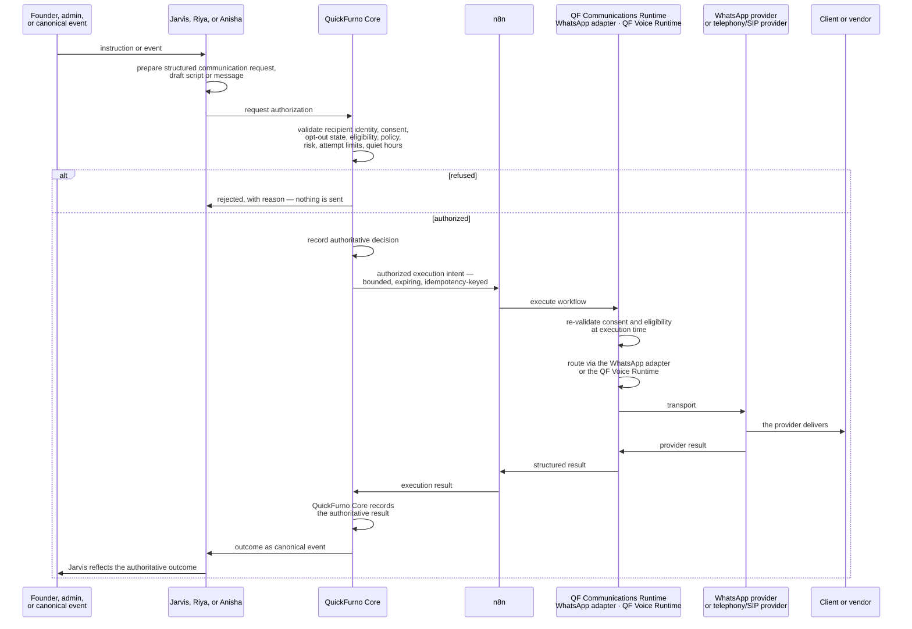
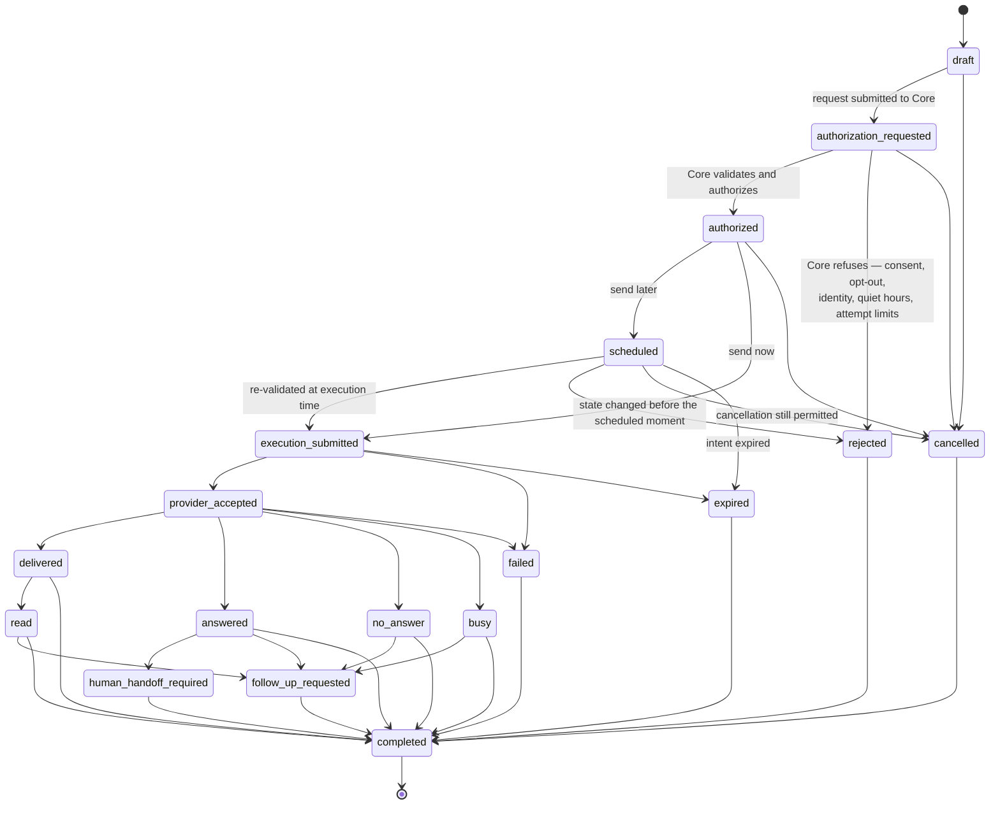

# Communication Model — QF Jarvis

**Status:** Phase 0 — Approved
**Date:** 2026-07-11

> **This document is authoritative** for how QF Jarvis supports calling and WhatsApp communication. Other documents cross-reference it rather than restating it. Ownership follows [system-boundary.md](./system-boundary.md); the decision is recorded in [ADR-0008](../decisions/ADR-0008-controlled-communication-capability.md).
>
> **Nothing here is implemented.** Phase 0 documents compatibility and governance only. No WhatsApp integration, telephony, speech-to-text, text-to-speech, provider API, n8n workflow, or UI exists or may be built in this phase.

---

## The governing statement

**QF Jarvis has controlled communication coordination and user-facing communication capabilities, but it has no direct provider transport, delivery, or authorization authority.**

Say it as a product capability and as an architecture in the same breath, because both are true:

> **Jarvis supports calling and WhatsApp through governed execution.**
> **QuickFurno Core authorizes.**
> **n8n and the communication runtime execute.**
> **Providers deliver.**
> **Results return to QuickFurno Core and are reflected by Jarvis.**

Jarvis is not a system that "cannot communicate." It has a Call button and a Send WhatsApp button, it drafts the message, it schedules the send, it tracks the outcome, and it tells the founder what happened. What it does not have is the **transport**, the **credentials**, and the **authority** — and it never claims a delivery it has not been told about.

Adding a phone call and a WhatsApp message to the system does not create an exception to the boundary. It creates the **highest-stakes test** of it. A misdirected recommendation wastes attention; a misdirected phone call reaches a real person, at a real hour, on a number they may have asked never to be called on.

---

## What Jarvis may do

Jarvis holds a **communication coordination** responsibility alongside the specialists, and a **user-facing communication capability** in the future Control Plane. It may:

- **Expose Call and Send WhatsApp actions** in the future Control Plane.
- **Receive founder communication instructions.**
- **Prepare structured call or WhatsApp requests.**
- **Generate approved scripts or message drafts.**
- **Request authorization** from QuickFurno Core.
- **Schedule authorized communication.**
- **Submit authorized execution intents through the approved architecture** — that is, through QuickFurno Core's dispatch, never around it.
- **Monitor status.**
- **Display authoritative outcomes.**
- **Coordinate cross-domain communication** — founder-directed contact, urgent escalations, consolidated multi-agent updates, critical alerts.
- **Route communication to Riya, Anisha, or a human operator**, recording the routing reason.
- **Request cancellation before execution**, where cancellation is still permitted.

A communication request is a **structured object**, like every other artifact Jarvis produces: subject, evidence, rationale, proposed channel, proposed timing, proposed template or script, confidence, risk, priority, expiry, and required approval ([agent-model.md](./agent-model.md)).

## What Jarvis must not do

- **Directly invoke WhatsApp APIs.**
- **Directly connect to telephony or SIP providers.**
- **Store provider credentials.**
- **Independently authorize communication.**
- **Bypass consent, opt-out, do-not-contact, quiet-hour, identity, risk, or attempt-limit controls.**
- **Claim delivery, call completion, or success before authoritative execution results return.**
- **Create parallel consent, preference, suppression, STOP/START, or delivery state.** Not a consent flag, not a suppression list, not a cached eligibility answer. All of it belongs to the **QuickFurno Communication Core** (below).

The first three are structural — there is no integration and no credential to misuse. The rest are rules, and they are review blockers ([change-management.md](../governance/change-management.md)).

---

## Communication execution flow



**Read the diagram for what is absent:** there is no edge from any agent to the runtime, to n8n, or to a provider. Jarvis requests and coordinates. Core authorizes. n8n and the runtime execute. **The provider delivers.** Core records.

### Runtime and provider are not the same thing

The distinction matters, and it is easy to blur:

| Component | Side of the boundary | Role |
| --- | --- | --- |
| **QF Communications Runtime** | Execution-side, ours | Shared runtime. Validates, routes, retries, reports |
| **WhatsApp adapter** | **Internal component of the runtime** | Routes a message toward the external WhatsApp provider |
| **QF Voice Runtime** | **Internal component of the runtime** | Routes a call toward an external telephony/SIP provider |
| **WhatsApp provider** | **External** | **Delivers** the message |
| **Telephony or SIP provider** | **External** | **Delivers** the call |
| **Client or vendor** | External | The recipient |

The transport chain is therefore:

> **n8n → QF Communications Runtime → WhatsApp adapter or QF Voice Runtime → external WhatsApp or telephony/SIP provider → recipient**

**The QF Voice Runtime is ours, and it is not a provider.** It does not deliver a call; it hands the call to an external telephony or SIP provider that does. It never becomes the authoritative provider, and it never becomes a source of truth — **QuickFurno Core records the authoritative result**, from what the external provider reported back through the runtime and n8n.

---

## Jarvis communication use cases

Each of these creates a **governed communication request**. None of them sends anything by itself.

| Use case | Notes |
| --- | --- |
| The founder instructs Jarvis to **call a specific client or vendor** | The instruction is an *input*, not an authorization. Core still validates identity, consent, opt-out, quiet hours, and attempt limits — and **may refuse** (see below) |
| Jarvis requests a **WhatsApp summary the founder asked for** | Template-bound. Core validates the recipient's WhatsApp eligibility |
| Jarvis raises an **urgent cross-domain escalation** | Urgency raises priority. It does not shorten the approval path ([execution-governance.md](./execution-governance.md)) |
| Jarvis **coordinates a callback** requiring both client and vendor context | The case where Jarvis, not a specialist, is the right originator: neither Riya nor Anisha owns both sides |
| Jarvis requests an **approved consolidated status update** | Assembled from several specialists' context; contributors remain attributable |
| Jarvis **schedules an authorized communication** for later execution | Scheduling is a Jarvis responsibility. **Authorization does not age well** — see below |
| Jarvis **requests cancellation** of a scheduled communication before execution | Permitted while the intent has not been executed. Cancellation is itself a request; Core records the outcome |
| Jarvis **hands a conversation to Riya, Anisha, or a human operator** | Where specialist or human ownership is required. The handoff and its reason are recorded |

### Scheduled communication does not carry stale authority

An authorized-and-scheduled communication is still bound by the **expiry** of its execution intent, and the world may change between authorization and the scheduled moment — the recipient may withdraw consent, the lead may close, quiet hours may apply. **Core re-validates, and the runtime re-validates at execution time.** A schedule is a request to act later, not a permission that ages well.

---

## Domain routing

Communication routing follows the **root-cause ownership rule** in [agent-model.md](./agent-model.md). Communication does not get its own, looser rule.

| Communication about | Normally routes to |
| --- | --- |
| Client lifecycle | **Riya** |
| Vendor lifecycle | **Anisha** |
| Lead-quality investigation | **Kabir** |
| Marketing-originated communication | Normally **includes Jitin** |
| Cross-domain, or founder-directed | **May remain with Jarvis** |

Two constraints hold this together.

**Jarvis records which specialists contributed context.** A consolidated update assembled from Kabir's, Riya's, and Anisha's context names all three — the composite-recommendation rule applied to communication.

**Jarvis may not override Riya's or Anisha's ownership silently.** Where Jarvis keeps a communication that would normally route to a specialist, **the routing reason is recorded**, and it is auditable. "The founder directed it" and "the callback needs both client and vendor context" are reasons. Convenience is not.

---

## Shared communication infrastructure

The **QF Communications Runtime** is shared infrastructure. It lives **outside QF Jarvis**, on the execution side of the boundary, reached only by n8n under an authorized execution intent.

```
QF Communications Runtime
├── WhatsApp adapter
├── QF Voice Runtime
├── consent and policy validation interface
├── template and script registry
├── scheduling
├── retry and idempotency controls
├── delivery and call status handling
├── transcript and summary processing
├── human handoff
└── structured result reporting
```

**Its consent and policy validation interface is a second line of defence, not the first.** QuickFurno Core validates before authorizing; the runtime validates again at the point of execution, because the world may have changed and because an execution fabric that trusts its input blindly is one bug away from calling someone who withdrew consent. Neither check replaces the other, and **neither belongs to Jarvis**.

### Shared infrastructure, separate agents

Jarvis, Riya, and Anisha may all use this runtime. Each nonetheless retains **separate**:

- permissions
- prompts
- policies
- communication purposes
- recipient eligibility
- templates
- memory boundaries
- evaluation datasets
- escalation rules

**Shared plumbing must not become a shared identity.** If Anisha's vendor win-back templates are reachable by Riya, or Jarvis inherits the union of every agent's recipient eligibility, then four bounded agents ([ADR-0006](../decisions/ADR-0006-agent-responsibility-boundaries.md)) have quietly become one unbounded agent with four names — and it now has a phone line.

---

## The QuickFurno Communication Core

**"QuickFurno Communication Core" is the communication authority *inside* QuickFurno Core.** It is not a separate system, and it is **not** the QF Communications Runtime described above.

The two are constantly confused, and the confusion is dangerous rather than merely untidy:

| | QuickFurno Communication Core | QF Communications Runtime |
| --- | --- | --- |
| **Where it lives** | **Inside QuickFurno Core** | **Execution side**, in n8n's trust zone |
| **What it does** | **Decides** | **Delivers what Core decided** |
| **Reached by** | An agent asking for authorization | n8n, under an authorized execution intent |
| **Its consent check is** | **The authority** | A **second line of defence** at execution time |

The moment "the communication system said it was fine" can mean either one, consent has been validated by whichever component happened to be nearest — which is exactly how a system ends up calling someone who asked it never to be called.

The Communication Core owns, exclusively:

| It owns | Which means Jarvis may not |
| --- | --- |
| Consent evidence | Hold a consent flag of its own |
| Preferences | Decide a channel is acceptable |
| Suppressions | Maintain a suppression list |
| STOP/START authority | Interpret a STOP itself |
| Communication decision authority | Authorize any communication |
| Reason-code versions | Invent a refusal reason |
| Current eligibility | Cache eligibility |
| Delivery and call truth | Claim a message was delivered |
| Authoritative communication history | Be the record of what was said |

**Jarvis must not create parallel consent, preference, suppression, STOP/START, or delivery state.** Not as a flag, not as a list, not as a cache, and not as a "courtesy" copy that a later feature will inevitably start trusting. This is enforced in the contracts rather than asked for in prose: `CommunicationRequestV1` has no consent field, and the schema is strict, so one cannot be added.

Two rules follow, and neither may ever be softened:

- **Unknown or stale consent is not permission.** A missing answer is a no. A system that reads "we hold no record of an opt-out" as an opt-in will, given time, contact everybody it once failed to ask.
- **Transactional no-objection is not marketing permission.** A client who accepted a delivery update has not agreed to be marketed to. The second may never be inferred from the first, and a purpose code is how the difference is made checkable rather than assumed.

---

## QuickFurno Core remains authoritative

Core owns all of the following. Jarvis may hold **derived, non-authoritative** views for reasoning and display, and must never treat them as truth or act on them as permission:

- contact identity
- phone number
- WhatsApp eligibility
- voice-call consent
- opt-in and opt-out status
- do-not-contact status
- communication authorization
- approved message or call purpose
- attempt limits
- quiet hours
- communication history
- authoritative delivery and call outcomes
- human-handoff state

---

## The communication contracts

Three contracts carry a communication from *asking* to *truth*. They are separate on purpose: each is a different actor making a different claim, and the separations are what make the rules above enforceable rather than merely stated ([communication-contract.md](../contracts/communication-contract.md), [ADR-0014](../decisions/ADR-0014-governed-lifecycle-contracts.md)).

| Contract | Produced by | What it claims |
| --- | --- | --- |
| **`CommunicationRequestV1`** | **QF Jarvis** or a specialist agent | *"I would like this to happen."* Nothing more |
| **`CommunicationAuthorizationV1`** | **The QuickFurno Communication Core** | *"Authorized"* — or *"rejected, for this reason."* The only artifact that can permit anything |
| **`CommunicationResultV1`** | **QuickFurno Core** | *"This is what actually happened."* Recorded, not reported |

### `CommunicationRequestV1` — Jarvis asks

A request is powerless by **shape**, not by convention:

- **No consent field.** No `hasConsent`, no `optedIn`, no `withinQuietHours`, no `suppressed` — and none can be added, because the schema is strict. Copying Core's consent state into a Jarvis artifact turns a *courtesy check* into an *apparent permission*, and a stale copy of a permission is the most dangerous field in any system that reaches real people.
- **No delivery claim.** No status, no `sentAt`, no `delivered`. A request is not a delivery, and it may not be made to look like one.
- **No destination.** The recipient is an **opaque Core entity reference** — never a phone number, never an email address; the identifier character set excludes `@` and `+`, so neither will parse. **The object cannot reach a person.** This is what degrades a prompt-injection attack from *"make the system call me"* to *"make the system suggest something odd to a human who can see the evidence."*
- **Content is a reference, never a body.** It names an approved **template** (messaging) or an approved **script** (voice), *with its version*. There is no message-body field, because a free-text body is where a careless or compromised agent writes something nobody approved, and where personal data arrives by accident. Template variables live in a governed container that refuses credentials, contact details, raw provider content, and model internals by key *and* by value shape — so the "just put it in the variables" escape hatch is closed too.
- **Expiry is mandatory**, and an unanswered request dies rather than ripening.
- **`requiredApproval` is never `none`** — a communication always reaches a person. On the **voice** channel it must be `stronger-approval` or `founder`: explicit human approval on **every** call ([ADR-0017](../decisions/ADR-0017-live-communication-sequencing.md)).

### `CommunicationAuthorizationV1` — the Communication Core decides

This is what makes "Core is the consent authority" operational rather than rhetorical. **Only this can authorize.**

A rejection is not a shrug. It carries a **machine-readable reason code**, so a refusal can be counted, alerted on, and never silently retried:

| Reason | Meaning |
| --- | --- |
| **`recipient-opted-out`** | They said no |
| **`consent-withdrawn`** | They had said yes, and have since said no |
| **`do-not-contact`** | Contact is barred |
| **`suppressed`** | The recipient is on a suppression list Core owns |
| **`stop-received`** | A STOP arrived, and **Core** interpreted it — not Jarvis |

Others exist — `purpose-not-approved`, `attempt-limit-reached`, `quiet-hours`, `identity-unverified`, `channel-not-eligible` — and Core owns its own reason taxonomy. **These five are the refusals that must never be retried, softened, or routed around.**

Note what is deliberately *absent*: there is **no `opted-out` communication state**. An opt-out is a **`rejected`** outcome carrying its reason. A nineteenth state would fork the lifecycle and let a consumer handle `rejected` while quietly ignoring the one refusal that must never be ignored.

An authorization also carries **no `validUntil` and no consent snapshot**. It says what Core decided *when it decided*; it is not a permission slip that travels forward in time. A consent snapshot with a future expiry is precisely the stale permission that lets a withdrawn consent be ignored.

### `CommunicationResultV1` — Core records

**Reporting is not authority.** n8n and the QF Communications Runtime *observe* a provider and *report*. **Core records**, and the recording is what makes it true.

Two collapses the contract refuses:

- **`provider accepted` is not `delivered`.** The provider taking a message off our hands tells us the provider has it. It does not tell us anybody received it — so a result in `provider accepted` **cannot** carry a `succeeded` outcome, and neither can `execution submitted`. This is the exact defect that shows a founder one confident tick and lets them believe a conversation happened.
- **`indeterminate` is not success**, and it is not failure either. When a call drops mid-dial or a webhook never arrives, the honest answer to *"did that connect?"* is **we do not know**. Recorded as failure, the system retries and somebody's phone rings twice. Recorded as success, a founder acts on a conversation that never happened. So ambiguity is a first-class outcome, and it is classified **requires-reconciliation**: go and find out; do not dial and see.

A result carries no message body, no transcript, no recording, and no raw provider payload — only an **opaque provider handle** a human can look up. Evidence, never content.

---

## Both gates, or nothing

**A communication needs two independent yeses, and it needs both.**

1. **A human approval** — a named person, or a named and versioned policy, agreed the action should happen. Recorded as an `ApprovalDecisionV1` ([execution-governance.md](./execution-governance.md) §2a, §2b).
2. **The Communication Core's eligibility check** — consent evidence, preferences, suppressions, STOP/START state, do-not-contact status, approved purpose, attempt limits, quiet hours. Recorded as a `CommunicationAuthorizationV1`.

These answer **different questions**, which is exactly why they are different contracts. Merge them and there is a single "approved" to check — at which point the following sentence becomes unenforceable:

> **A founder's approval does not override an opt-out.**

The founder may approve a message to a client who has opted out. **The message must still not be sent.** That is enforced in the shape, both ways: an **authorized** result must name the `approvalDecisionId` it rests on — an authorization resting on no approval is Core authorizing a message nobody agreed to send — and a **rejected** one must **not** name an approval decision, because Core refused it *whether or not a human had approved it*.

---

## Founder authority, and when QuickFurno Core must refuse

Founder authority is real, and it is bounded. The distinction is between **discretionary** questions and **mandatory** controls.

**Founder authority may resolve ordinary business prioritization and discretionary approval questions**, where policy permits: whether this vendor is worth a call today, whether this escalation outranks that one, whether to approve an action within an authority the policy already grants.

**Founder authority may not silently bypass mandatory consent, privacy, security, or legal controls.** QuickFurno Core **must refuse or block** a communication — from any originator, including the founder — when required by:

- **consent withdrawal**
- **opt-out or do-not-contact status**
- **invalid or unverified recipient identity**
- **prohibited quiet hours**
- **expired intent**
- **attempt limits**
- **security concerns**
- **legal or mandatory policy restrictions**

A refusal is recorded, attributable, and shown to the founder **with its reason**. This is not the system disobeying the founder; it is the system doing the job the founder built it to do. A control that yields to seniority is not a control — and the person most likely to be in a hurry, and most able to insist, is exactly the person these controls exist to protect from an irreversible mistake.

Where a control is genuinely discretionary and policy permits an override, the override is **explicit, attributable, and audited** — never silent.

---

## Communication state

Jarvis must expose communication state **accurately**: what Core and the execution result actually say, never what it hopes or expects.

| State | Meaning |
| --- | --- |
| **draft** | Being prepared. Nothing has been asked of anyone |
| **authorization requested** | A communication request has been submitted to Core |
| **rejected** | Core refused. Nothing is sent. The reason is recorded — including consent withdrawal, opt-out or do-not-contact, unverified identity, quiet hours, or attempt limits |
| **authorized** | Core validated and authorized it, and recorded the decision |
| **scheduled** | Authorized, held for a later execution time. Re-validated at execution |
| **execution submitted** | Core dispatched an authorized execution intent to n8n |
| **provider accepted** | The provider accepted it for transport. **This is not delivery** |
| **delivered** | The provider delivered it |
| **read** | The recipient read it, where the channel reports this |
| **answered** | A voice call was answered |
| **no answer** | A voice call was not answered |
| **busy** | A voice call reached a busy line |
| **failed** | Execution or delivery failed |
| **follow-up requested** | The outcome calls for a follow-up — which is a **new request**, not a retry |
| **human handoff required** | A human must take the conversation over |
| **completed** | The lifecycle is closed and the authoritative outcome recorded |
| **cancelled** | Cancelled before execution, while cancellation was still permitted |
| **expired** | The intent expired before execution. **Not sent, and not approved** |



### The states Jarvis may never originate

**`authorized`, `delivered`, and `completed` are not Jarvis's to write.** Authorization comes from Core. Delivery comes from the provider, is reported through n8n, and **QuickFurno Core records the authoritative result**. Jarvis *reflects* all three; it originates none of them.

Note that **`execution submitted` is not `provider accepted`, and `provider accepted` is not `delivered`.** Collapsing them in a UI would tell a founder a message arrived when it may not have — a false statement about the world, which is exactly what this architecture exists to prevent.

---

## The Control Plane experience

Future Jarvis buttons — **Call client**, **Call vendor**, **Send WhatsApp**, **Schedule communication**, **Request human callback** — **create governed communication requests.**

**A user-facing Send or Call action may initiate the governed flow. The action is not considered delivered or completed merely because the button was clicked.**

The UI shows the authoritative lifecycle states above. In flight renders as **authorization requested** or **execution submitted** — never as *sent*, never as *delivered*, never as a green tick. A refusal renders as **rejected**, with Core's reason. This is the communication instance of the general rule in [ADR-0007](../decisions/ADR-0007-founder-approval-interface-and-authority.md): a button click inside Jarvis initiates a governed request, not an authorization — and here, not a delivery either.

The failure mode is concrete and worth naming: the founder clicks **Call vendor**, the UI shows a confident tick, and Core refused because the vendor is on do-not-contact. The founder now believes a conversation happened. Nothing did — and every subsequent decision rests on a fiction the interface invented.

---

## At-most-once execution, and legitimate later attempts

These are different things, and the architecture must never confuse them.

### One intent, at most one call

- **One execution intent may produce at most one provider call initiation.**
- **Technical retries must use idempotency and must not create a duplicate call.** A retry re-attempts *the same* execution, under the same idempotency key; it does not dial again.
- **Ambiguous provider outcomes must be reconciled before another attempt.** If the runtime cannot tell whether a call connected, the answer is to **find out**, not to dial and see. On ambiguity, voice **fails rather than repeats**.

### A later attempt is a new request, not a retry

A **no answer**, a **busy** line, or a "call me later" outcome is not a failure to retry around. It is a **result** — and it may justify a **new recommendation** and a **new authorized execution intent**.

**Every new attempt has its own:**

- identity
- policy validation
- consent check
- attempt-limit check
- expiry
- audit trail

**The distinction is load-bearing.** A duplicate execution is a defect: the same authorization producing two calls, which means someone's phone rang twice for one decision. A legitimate later attempt is a **new decision**, freshly validated against consent and attempt limits that may have changed since. A system that cannot tell them apart will either double-dial (treating a new attempt as a retry) or never follow up (treating a retry as a new attempt). Both are wrong, and only one of them is visible from the outside — which is precisely why it must be settled in the architecture rather than in a retry handler.
