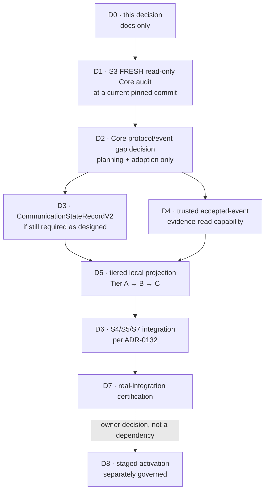

# Communication-state projection — Model 2 design

**Status:** Design. Adopted under
[ADR-0135](../decisions/ADR-0135-qfj-p09-s2-local-communication-state-projection-architecture.md).
**Nothing here is implemented, adopted, connected or activated.**
**Baseline:** `c6b21dcf921e350f33477d3b18fd4413b8a8aa00` (merge of PR #175 / S2 readiness audit)

Read with [ADR-0134](../decisions/ADR-0134-qfj-p09-s2-communication-state-evidence-alignment.md) (the
locked evidence findings), [ADR-0132](../decisions/ADR-0132-aarohi-real-execution-integration-planning.md),
[communication-model.md](./communication-model.md) and
[versioning-and-compatibility.md](../contracts/versioning-and-compatibility.md).

---

## 1. What is being decided, and what is not

ADR-0134 proved that the planned `CommunicationStateRecordV1` producer must not be built, and left
one question open: **who authors communication state?**

This document answers that question and designs the boundary the answer requires. It designs; it does
not build. **No production code, no `CommunicationStateRecordV2`, no `qf.communication.state-recorded@3`,
no event reader, no migration, no activation.** `projection-event-reader.ts`,
`create-event-ingestor.ts` and every contract are read-only references here.

---

## 2. The decision: Model 2

> **Jarvis maintains a LOCAL communication-state projection derived from authenticated primitive
> QuickFurno Core events, and authors only its own coordination facts.**

Concretely:

- **QuickFurno Core stays authoritative** for consent, eligibility, authorization, provider outcomes
  and every Tier-C fact.
- **Core publishes primitive facts** it already has — `qf.communication.authorization-recorded`,
  `qf.communication.result-recorded`, `qf.communication.human-handoff-recorded`,
  `qf.execution.intent-issued`, `qf.execution.result-recorded`.
- **Jarvis consumes only trusted, accepted evidence**, never an arbitrary shape-valid payload.
- **Jarvis derives a LOCAL lifecycle projection** for orchestration and observability, and **never
  presents it as QuickFurno Core's authoritative business history.**
- **Jarvis authors Tier A and Tier B facts only when their prerequisites are lawfully proven.**
- `communication-lifecycle-runtime` stays a **consistency validator, never an authority**. A
  transition gains no authority by being graph-valid.

### Why this is the smallest safe MVP

| | Model 1 (Core-authored state event) | **Model 2 (chosen)** |
| --- | --- | --- |
| New Core event type | **`qf.communication.state-recorded@3` required** | none required |
| Duplicated truth | state facts restated beside primitives Core already emits | primitives are the only Core statement |
| Jarvis coordination facts | Core must author or echo `draft`, `scheduled`, `follow-up-requested`, `human-handoff-required` — facts it does not own and must first be told | stay Jarvis's, where they belong |
| Core-side work | new event + adoption, on top of S3 | none beyond S3's existing scope |
| Incrementality | all-or-nothing | tier by tier |

**Model 1 is REJECTED for the current MVP.** It is not rejected on principle: if a future
external consumer genuinely needs Core to publish a single authoritative state fact, that is its own
adoption decision. It is rejected *now* because it costs Core work, duplicates existing primitives,
forces `@3`, and makes Core author facts that are Jarvis's.

**No canonical contradiction was found that blocks Model 2.** The one structural prerequisite it does
have — a way to see an accepted event's content — turns out to have an established repository pattern
(§5).

---

## 3. Identity, provenance, and what may be trusted

ADR-0134 locked these and this design does not re-open them. Restated as the table the implementation
will be held to:

| Capability / object | Proves | Does **not** prove | Who can construct it today | May S2 treat it as authority? |
| --- | --- | --- | --- | --- |
| A shape-valid communication artifact (`CommunicationAuthorizationV1`, …) | it satisfies its schema | that Core wrote it | **anyone** | **NO** |
| A shape-valid canonical event envelope | the envelope is well-formed | that it was signed, accepted or stored | **anyone** | **NO** |
| An `eventId` | an event has that identity | anything about origin | **anyone** — it is a UUID | **NO** |
| An event accepted by `createEventIngestor` (**verify → prepare → persist**) | Core signed the exact bytes, the contract validated behind the signature, and the row was committed | that any *later* copy of it is faithful | only the ingestion composition | **YES** — this is the trust anchor |
| An `EventPersistenceRecord` | the caller assembled a record | that it was verified — `storeValidatedEvent` verifies **nothing** | any caller holding the type | **NO** |
| A row in `qf_jarvis.event` | a row exists | that it arrived through ingestion (§6) | anything with the write role | **NO, by itself** |
| A `ProjectionEvent` metadata object | position, type, version, acceptedAt of an accepted event | nothing about payload, subject or identity — it carries none | the projection runner | metadata only |
| **A future communication accepted-event evidence object** (§5) | an allowlisted accepted event's re-parsed, minimised evidence | anything outside its allowlist | **only the designated reader** | **YES**, within its allowlist |
| A `sourceEventId` stored in a future V2 record | which accepted event was cited | that the citer ever saw that event | **anyone**, if accepted as naked input | **NO** — see §3.1 |

### 3.1 The invariants this design must never break

```
identity              !=  provenance
shape                 !=  origin
lifecycle consistency !=  truth
request               !=  submission
approval              !=  communication authorization
prior authorization   !=  execution-time permission
```

**A future S2 projector must never accept `{ sourceEventId, payload }` from a caller and treat it as
trusted.** It must receive **evidence objects produced by the governed reader**, and a `sourceEventId`
it stores is an audit and correlation pointer that came *out of* that evidence — never an input that
stood in for it.

---

## 4. The generic projection boundary stays metadata-only

`ProjectionEvent` exposes `position`, `eventType`, `eventVersion`, `acceptedAt` and nothing else. Its
own doc-comment states the rule:

> Adding a payload, subject reference, correlation id, or free-text field to this interface would
> silently widen what every projection can write into a read model, so it is a deliberate, ADR-gated
> decision — not a convenience edit.

**This design does not widen it, and recommends that it never be widened for this purpose.** Widening
the shared type to serve one projection would hand payload access to `event-type-activity`,
`daily-event-acceptance` and every future projection, permanently, to avoid writing one narrow module.
That trade is not worth making.

---

## 5. The evidence-read boundary — an existing pattern, not a new mechanism

**QFJ-P03.09 / ADR-0044 already solved the shape of this problem.** `projection-subject-reader.ts`
resolves *only* `subject_type` and `subject_id` for *one* projection, is **not** part of
`ProjectionEvent`, is **not** exported from the package root, and is restricted by a
`no-restricted-imports` rule in `eslint.config.mjs` so that **only the `subject-activity` reducer may
import it** — the other reducers stay subject-blind in code.

The communication evidence reader is the **second instance of that pattern**, not a new mechanism.

### 5.1 Required properties

| # | Property | How it is met |
| --- | --- | --- |
| A | **Not arbitrary caller input** | the reader resolves evidence **by projection position**, exactly as both existing readers do. A caller cannot hand it a payload. |
| B | **No raw event-store bypass** | there is no "read any event by id" entry point. Position-keyed only, through `projection_event_position`. |
| C | **Accepted-event only** | the join is `projection_event_position → qf_jarvis.event`; only accepted, positioned events are reachable. |
| D | **Identity is reference only** | `eventId` may be returned for audit and correlation. It authenticates nothing, and the projector must not accept one as a substitute for evidence. |
| E | **Allowlisted semantics** | the reader returns evidence **only** for the event types in §5.3; any other type yields "not applicable", never a raw payload. |
| F | **Narrow payload** | a re-parsed, minimised evidence object per §5.4 — never the whole canonical payload. |
| G | **Re-parse, fail closed** | stored `jsonb` is runtime-untrusted. It is parsed with the **canonical payload schema for that exact `event_type@event_version`** before anything is derived; a malformed row fails closed with a typed, fixed-message error carrying no stored value. This mirrors how both existing readers re-validate against the migration-0001 grammar. |
| H | **Replay order** | the reader is position-keyed, so the runner's gap-free `last_position + 1` traversal is the ordering, unchanged. No new ordering is introduced and none is needed. |
| I | **Trust assumption stated** | see §6. |

### 5.2 Where it should live

**`packages/event-backbone/src/projections/`, beside the two existing readers, internal and
root-unexported**, with a `no-restricted-imports` rule naming the one communication-state handler.

Rejected alternatives: a new package (a second event-reading capability outside the backbone's
boundary); `@qf-jarvis/contracts` (data-only, no I/O); a general query API (violates B).

The **derivation logic** — evidence → lifecycle state — belongs in a separate pure module or package
that takes evidence objects and returns state, so it is testable without a database and cannot reach
one. Only the thin handler binds the two.

### 5.3 Allowlisted event types

| Event type | States it can justify |
| --- | --- |
| `qf.communication.authorization-recorded` | `rejected`, `authorized` |
| `qf.communication.result-recorded` | `provider-accepted`, `delivered`, `read`, `answered`, `no-answer`, `busy`, `failed`, `completed` |
| `qf.execution.intent-issued` | `execution-submitted` |
| `qf.execution.result-recorded` | corroborates the provider outcomes above |
| `qf.communication.human-handoff-recorded` | records that a human took over — **not** `human-handoff-required`, which is Jarvis's request (ADR-0134) |
| *a future Core cancellation primitive* | `cancelled` — **does not exist**; S3 must find or adopt one |
| *a future Core expiry primitive* | `expired` — **unresolved**; S3 must settle it |

**No generic access to every event type.** Everything else is out of scope for this reader.

### 5.4 Field minimisation

Only what a state derivation actually needs crosses the boundary.

| Event | Minimal fields needed | Must **NOT** cross |
| --- | --- | --- |
| `authorization-recorded` | `communicationId`, `communicationRequestId`, `outcome`, `authorizedChannel?`, `reasonCode`, `decidedAt`, `correlationId` | **`explanation`** (free text), `policy` internals, `approvalDecisionId` (it is the human approval, not the communication decision — ADR-0134 §3.5) |
| `result-recorded` | `communicationId`, `communicationResultId`, `lifecycleState`, `outcome`, `recordedAt`, `reasonCode`, `failure.failureCode`, `failure.retryClassification` | **`explanation`**, **`providerEvidence.providerReference`** (a provider handle, not needed to derive a state), `providerOccurredAt` unless a spec proves it needed |
| `execution.intent-issued` | `executionIntentId`, `communicationId` linkage, `issuedAt`, `expiresAt` | **`parameters`** (governed action content), `idempotencyKey`, `approvedActionId`, `actionType` |
| `execution.result-recorded` | `executionResultId`, `executionIntentId`, `outcome`, `recordedByCoreAt`, `failure.failureCode` | **`metadata`** (governed container), **`providerReference`** |
| `human-handoff-recorded` | `communicationId`, `outcome`, `recordedAt`, `reasonCode` | **`handledBy`** (a named human operator), **`explanation`** |

**Categorically excluded, on every path:** free-text `explanation`; raw provider payloads; recipient
contact details; credentials; model output; template or message body content; a named human actor
unless a later slice proves a specific need and re-approves it.

The projection operates on **machine tokens, opaque references, canonical timestamps and structured
enumerations** — never prose.

### 5.5 Rebuild determinism and privacy

The existing rebuild proof (ADR-0043) — digest → destroy → rebuild → digest → compare — applies
unchanged, because the derivation is a pure function of the accepted event log traversed in position
order. Two constraints keep it true: the derivation reads **no clock and no external state**, and the
read model stores only canonicalisable values.

Erasure: because no free text, contact detail or provider payload crosses the boundary (§5.4), the
read model holds opaque references and machine tokens, and an erasure reaching the event log does not
leave prose behind in this projection.

---

## 6. Write-capability audit, and the trust assumption

**Finding: `storeValidatedEvent` is exported from `@qf-jarvis/event-backbone`'s root barrel, and nine
packages/apps declare a dependency on that package.**

| Question | Answer |
| --- | --- |
| Is `event-ingestion` the only repository caller today? | **Yes** — via the internal `persist-validated-event.ts` bridge. |
| Is it publicly exported? | **Yes**, from the root barrel. |
| Could another package call it directly? | **Yes.** `execution-dispatch-composition`, `postgres-approval-queue`, `postgres-conversation-state`, `postgres-execution-replay-store`, the two Riya stores, `apps/api` and `apps/worker` all already depend on the package. |
| Is there a containment test preventing it? | **No repository-wide rule.** Several packages assert *they* do not name it, which is per-package hygiene, not a global control. |
| Could direct SQL write `qf_jarvis.event` under the same runtime role? | **Yes**, if the role holds the grant. The subject-reader precedent already concedes the analogous point: the boundary is a module and lint rule, *"even though the shared projection DB role technically holds the column grant."* |

**So a row in `qf_jarvis.event` is evidence of the caller's discipline, not of Core's authorship.**
`event-store.ts` says so itself: *"This is a TRUSTED low-level primitive. It verifies nothing"*, and
that trust *"is a caller obligation, not a structural guarantee this package can enforce."*

### 6.1 Can a stored event be re-verified after the fact?

**Partially — and the limit must not be glossed over.**

The signature commits to a signing input of
`"qf-jarvis-event-v1" ‖ keyId ‖ signedAt ‖ hex(sha256(rawBody))`, and **every component is
persisted**: the domain prefix is a repository constant, `signature_key_id`, `signature_signed_at`
and `body_digest` are columns, and `signature` holds the verified bytes. So the Ed25519 check
**is** arithmetically re-runnable from a stored row given the public-key registry.

**But the exact raw signed bytes are NOT stored** — only their digest. So re-verification proves *"a
body whose SHA-256 is D was signed by that key"*. It does **not** prove that the stored `payload`
column and envelope columns are that body, because the body cannot be reconstructed from the row.
That link rests on `prepare-validated-event` having bound them at ingest time and on the row not
having been altered since. The `semantic_event_digest` column detects post-ingest row mutation, but
it is computed by Jarvis and is **not a Core attestation**.

**No cryptographic fact is invented here.** The honest statement is: post-hoc re-verification is
possible for the signature-over-digest, and is *not* a full re-derivation of the signed content.

### 6.2 Future hardening — recorded, not scheduled

If a later slice wants the projection's trust anchor to be structural rather than conventional, the
options the repository evidence supports are, cheapest first:

1. **Import-graph containment** — a repository test asserting only `event-ingestion` may name
   `storeValidatedEvent`, mirroring the existing per-package scans. Costs nothing, closes the
   accidental case.
2. **Narrow the export** — move it off the root barrel to an internal subpath, so a direct call is a
   deliberate act. A public-API change with its own review.
3. **A repository-owned accepted-event evidence type** constructible only by the ingestion
   composition, so "this came through ingestion" is carried in the type system.
4. **A durable provenance marker** — a schema change. **Not preferred**, and this document allocates
   no migration. Code-capability containment (1–3) preserves the invariant without one.

**None is scheduled here.** Whether any is a prerequisite for trusting the projection is an owner
decision, and options 1–3 need no migration.

---

## 7. `CommunicationStateRecordV2` — semantics only

Under Model 2, **V2 is a Jarvis-local projection/read-model contract**, not automatically a Core wire
payload. It is **not implemented here**, and no Zod or TypeScript is written.

### 7.1 Locked semantics

1. **V1 stays immutable and published.** No edit in place.
2. **`ApprovalDecisionV1` is never again used as generic "Core decided" evidence.**
3. V2 **structurally distinguishes** the three evidence kinds — Jarvis-local (Tier A), Jarvis
   coordination over a trusted prerequisite (Tier B), and Core/provider facts projected from trusted
   accepted evidence (Tier C).
4. **A caller-provided event id is never authority.** The runtime accepts **evidence objects from the
   governed reader**; a record may *retain* the source event identity for audit once it came from
   trusted evidence.
5. It carries **no** consent snapshot, DNC flag, suppression cache, `canSend`, `canExecute`,
   `authorizedUntil` or reusable permission.
6. `previousState` stays evidence and context, never authority. `reasonCode` stays an open Core
   machine token.
7. **No nineteenth state. No invented cancellation or expiry contract.**

### 7.2 Per-state requirements

| State | Tier | V2 requirement |
| --- | --- | --- |
| `draft` | A | Jarvis-local; may cite the S1 `CommunicationRequestV1` it was built from |
| `authorization-requested` | B | **actual submission**, not construction. The S4 receipt shape is **not defined** — left open |
| `rejected` | C | communication-**authorization** refusal evidence. **Never** a human approval id |
| `authorized` | C | Core communication-authorization evidence |
| `scheduled` | B | **both** a trusted `authorized` prerequisite **and** Jarvis's scheduling act and instant |
| `execution-submitted` | C | Core-issued execution-intent evidence |
| `provider-accepted` | C | **Core-recorded result** evidence. An intent is never sufficient |
| `delivered` / `read` / `answered` / `no-answer` / `busy` / `failed` | C | Core-recorded provider/result evidence |
| `follow-up-requested` | B | trusted prior outcome **plus** Jarvis's follow-up decision. The follow-up itself starts a **new** lifecycle at `draft` |
| `human-handoff-required` | B | the Jarvis handoff request **plus** its trusted prior outcome |
| `completed` | C | authoritative completion/result evidence |
| `cancelled` | C | **UNRESOLVED** — no Core cancellation fact exists (ADR-0134 §3.1) |
| `expired` | C | **UNRESOLVED** — the authoritative expiry fact is undetermined (ADR-0134 §7) |

### 7.3 `channel`, deliberately open

V1 makes `channel` mandatory, so a `rejected` record must name a channel Core never authorized. Three
candidate repairs — optional `channel`; an explicit *proposed* vs *authorized* distinction; or a
state-sensitive rule — are all defensible. **This is not guessed.** It is settled when S3 establishes
whether Core's authorization always names a channel.

### 7.4 Intentionally unresolved until S3

`cancelled` evidence · `expired` evidence · the S4 submission receipt · `channel` semantics · whether
any additional Core primitive must be adopted. **Freezing V2 before S3 would encode assumptions about
a system this repository has not re-audited.**

---

## 8. Versioning consequences

- **`qf.communication.state-recorded@3` is NOT required under Model 2, and is not scheduled.**
- **`qf.communication.state-recorded@2` stays as published compatibility and history.** It is **not**
  the source of truth for Model-2 work. It is **not retired here**: retirement or versioning is a
  separate compatibility decision. Its `@2` was a uniform privacy-hardening bump across all 41
  inherited events (ADR-0026 §5), not a communication-specific redesign.
- **`CommunicationAuthorizationV2` is NOT required.** An accepted event already gives the
  authorization a citable name; that argues against a redundant identifier, and is not a claim that a
  name authenticates anything.
- **V2 is not added to the canonical Core event registry** merely because it is a contract. If a
  future external interface must expose it, that is its own adoption decision.

---

## 9. Sequence



These are **architecture-step labels inside this decision**, not new QFJ phases. The canonical phase
and slice numbering in ADR-0132 is unchanged.

**D3 and D4 are independent of each other and both depend on D2**, so they may run in either order or
in parallel — D4 needs no contract, and D3 needs no reader. Neither is integration-ready before D1.

**S2a (`draft` alone) is deliberately not scheduled before D1.** It would be one state, unable to
advance to any successor, composed by nothing — ceremonial code that claims S2 has started while the
evidence model it must eventually satisfy is still open.

---

## 10. Posture

No production code. No contract. No event registry change. No projection-runtime or ingestion change.
No Core access, no n8n, no provider, no message sent. No persistence and **no migration** — `0013` is
not allocated, and the `0010`–`0012` ledger drift remains separate governance debt to be reconciled
before any future allocation.

**Production rollout remains OFF. Aarohi's runtime remains PLANNED / DISABLED. Staged activation
remains a later, separately governed owner decision.**
