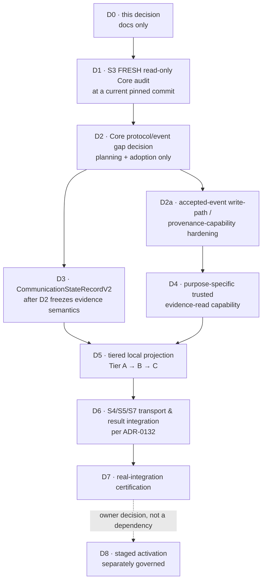

# Communication-state projection — Model 2 design

**Status:** **Proposed** design under
[ADR-0135](../decisions/ADR-0135-qfj-p09-s2-local-communication-state-projection-architecture.md);
**not merged.** **Nothing here is implemented, adopted, connected or activated.**
**Baseline:** `c6b21dcf921e350f33477d3b18fd4413b8a8aa00` (merge of PR #175 / S2 readiness audit)

Read with [ADR-0134](../decisions/ADR-0134-qfj-p09-s2-communication-state-evidence-alignment.md) (the
locked evidence findings), [ADR-0132](../decisions/ADR-0132-aarohi-real-execution-integration-planning.md),
[communication-model.md](./communication-model.md) and
[versioning-and-compatibility.md](../contracts/versioning-and-compatibility.md).

---

## 1. What is being decided, and what is not

ADR-0134 proved that the planned `CommunicationStateRecordV1` producer must not be built, and left
one question open: **who authors communication state?**

This document answers that question and designs the boundary the answer requires. It designs; it does
not build. **No production code, no `CommunicationStateRecordV2`, no `qf.communication.state-recorded@3`,
no event reader, no write-path hardening, no migration, no activation.**
`projection-event-reader.ts`, `event-store.ts`, `create-event-ingestor.ts` and every contract are
read-only references here.

---

## 2. The decision: Model 2

> **Jarvis maintains a LOCAL communication-state projection derived from authenticated, ADOPTED
> primitive QuickFurno Core events, and authors only its own coordination facts.**

Concretely:

- **QuickFurno Core stays authoritative** for consent, eligibility, authorization, provider outcomes
  and every Tier-C fact.
- **Jarvis consumes only trusted, accepted evidence**, never an arbitrary shape-valid payload.
- **Jarvis derives a LOCAL lifecycle projection** for orchestration and observability, and **never
  presents it as QuickFurno Core's authoritative business history.**
- **Jarvis authors Tier A and Tier B facts only when their prerequisites are lawfully proven.**
- `communication-lifecycle-runtime` stays a **consistency validator, never an authority**. A
  transition gains no authority by being graph-valid.

### 2.1 Candidate contracts are not adopted Core emissions

Three different things must not be conflated:

| | |
| --- | --- |
| **A. Repository-defined candidate canonical contracts** | `qf.communication.authorization-recorded`, `result-recorded`, `human-handoff-recorded`, `qf.execution.intent-issued`, `execution.result-recorded` — all defined **here**, in `@qf-jarvis/contracts` |
| **B. Live / adopted Core emission capability** | **Not established.** No fresh audit; no adopted transport |
| **C. Core protocol/event gaps** | To be discovered by **S3** |

**qf-jarvis already defines candidate canonical contracts for several required facts. S3 must verify
which of those facts the current pinned Core can actually expose or adopt before D2 freezes the
integration contract.** This document does not assert that Core emits any of them today — the whole
reason S3 is the next step is that this has not been re-audited.

### 2.2 Why this is the smallest safe MVP

| | Model 1 (Core-authored state event) | **Model 2 (chosen)** |
| --- | --- | --- |
| New Core **state** event | **`qf.communication.state-recorded@3` required** | **not required** |
| Duplicated truth | state facts restated beside the primitives | primitives are the only Core statement |
| Jarvis coordination facts | Core must author or echo `draft`, `scheduled`, `follow-up-requested`, `human-handoff-required` — facts it does not own and must first be told | stay Jarvis's, where they belong |
| Core-side work | a new state event **plus** whatever primitive adoption S3 finds missing | **avoids the mandatory new state event and the Tier A/B echo. It MAY still require targeted Core protocol/event adoption** for primitive facts S3 finds absent — cancellation, expiry, dispatch/submission, or candidate emissions not yet adopted |
| Incrementality | all-or-nothing | tier by tier |

**Model 1 is REJECTED for the current MVP** — not on principle, but because it is strictly larger:
every Core cost Model 2 may incur, Model 1 incurs too, plus a new state event and the Tier A/B echo.
If a future external consumer genuinely needs one authoritative Core-published state fact, that is its
own adoption decision, taken then.

**No canonical contradiction was found that blocks Model 2.**

---

## 3. Identity, provenance, and what may be trusted

ADR-0134 locked these and this design does not re-open them. Restated as the table the implementation
will be held to:

| Capability / object | Proves | Does **not** prove | Who can construct it today | May S2 treat it as authority? |
| --- | --- | --- | --- | --- |
| A shape-valid communication artifact | it satisfies its schema | that Core wrote it | **anyone** | **NO** |
| A shape-valid canonical event envelope | the envelope is well-formed | that it was signed, accepted or stored | **anyone** | **NO** |
| An `eventId` | an event has that identity | anything about origin | **anyone** — it is a UUID | **NO** |
| An event **actually carried through** `createEventIngestor` (**verify → prepare → persist**) | Core signed the exact bytes, the contract validated behind the signature, and the row was committed | that any *later* copy of it is faithful | only the ingestion composition | **YES** — this is the trust anchor |
| An `EventPersistenceRecord` | the caller assembled a record | that it was verified — `storeValidatedEvent` verifies **nothing** | **any caller holding the type** | **NO** |
| A row in `qf_jarvis.event` | a row exists | **that it arrived through ingestion** (§6) | anything with the write role, and today any package that imports the root-exported primitive | **NO, by itself** |
| A positioned row reached by a projection reader | a row exists at that position | that the row is Core-originated | as above | **NO, by itself** |
| Re-parsing a stored payload | **schema shape** | **origin** | anyone with the row | **NO** |
| A `ProjectionEvent` metadata object | position, type, version, acceptedAt | nothing about payload, subject or identity — it carries none | the projection runner | metadata only |
| **A future communication evidence object** (§5) | see the rule below | anything outside its allowlist | only the designated reader | **conditional — see below** |
| A `sourceEventId` stored in a future V2 record | which event was cited | that the citer ever saw that event | **anyone**, if accepted as naked input | **NO** |

### 3.1 The authority rule for a future evidence object

> A future evidence object **MAY** be treated as authoritative only after **BOTH**:
>
> 1. the source event is **bound to the governed accepted-event trust path** (which requires the
>    **D2a** hardening in §6); **AND**
> 2. the purpose-specific reader has **re-parsed and minimised** it.
>
> **The designated reader alone is not enough.**

### 3.2 The invariants this design must never break

```
identity              !=  provenance
shape                 !=  origin
data-access boundary  !=  authentication boundary
lifecycle consistency !=  truth
request               !=  submission
issuance              !=  dispatch
approval              !=  communication authorization
prior authorization   !=  execution-time permission
```

**A future S2 projector must never accept `{ sourceEventId, payload }` from a caller and treat it as
trusted.** It must receive evidence objects produced by the governed reader **over a hardened write
path**, and a `sourceEventId` it stores is an audit and correlation pointer that came *out of* that
evidence — never an input that stood in for it.

---

## 4. The generic projection boundary stays metadata-only

`ProjectionEvent` exposes `position`, `eventType`, `eventVersion`, `acceptedAt` and nothing else. Its
own doc-comment states the rule:

> Adding a payload, subject reference, correlation id, or free-text field to this interface would
> silently widen what every projection can write into a read model, so it is a deliberate, ADR-gated
> decision — not a convenience edit.

**This design does not widen it, and recommends that it never be widened for this purpose.** Widening
the shared type to serve one projection would hand payload access to `event-type-activity`,
`daily-event-acceptance` and every future projection, permanently, to avoid writing one narrow module.

---

## 5. The evidence-read boundary — a least-privilege ACCESS pattern

### 5.1 What ADR-0044 is, and is not, a precedent for

`projection-subject-reader.ts` (QFJ-P03.09, ADR-0044) resolves *only* `subject_type` and `subject_id`
for *one* projection, is **not** part of `ProjectionEvent`, is **not** exported from the package root,
and is restricted by a `no-restricted-imports` rule so that **only the `subject-activity` reducer may
import it**.

**It is a valid precedent for:** purpose-bounded read access · position-keyed lookup ·
a root-unexported module · restricted import · field minimisation.

**It is NOT a precedent for:** authenticating event origin · proving an event passed
`createEventIngestor` · granting authority to payload content.

> **A narrow projection reader is a least-privilege DATA ACCESS pattern, not an authentication
> boundary.** A designated reader cannot "upgrade" an unauthenticated row into provenance merely
> because only one handler imports it. Joining to `qf_jarvis.event` and re-parsing the payload proves
> **reachability and shape** — never origin.

### 5.2 Required properties

| # | Property | How it is met |
| --- | --- | --- |
| A | **Not arbitrary caller input** | the reader resolves evidence **by projection position**, as both existing readers do. A caller cannot hand it a payload. |
| B | **No raw event-store bypass** | no "read any event by id" entry point. Position-keyed only, through `projection_event_position`. |
| C | **Positioned rows only — and, after D2a, governed accepted-event evidence** | the join reaches **only positioned rows**. That alone does not make them authenticated. **After the §6 D2a hardening, those rows may be relied upon as governed accepted-event evidence within the application trust model** (§6.3 states the limit). |
| D | **Identity is reference only** | `eventId` may be returned for audit and correlation. It authenticates nothing. |
| E | **Allowlisted semantics** | evidence **only** for the event types in §5.3; any other type yields "not applicable", never a raw payload. |
| F | **Narrow payload** | a re-parsed, minimised evidence object per §5.4 — never the whole canonical payload. |
| G | **Re-parse, fail closed** | stored `jsonb` is runtime-untrusted. It is parsed with the canonical payload schema for that exact `event_type@event_version` before anything is derived; a malformed row fails closed with a typed, fixed-message error carrying no stored value. **This proves shape, not origin.** |
| H | **Replay order** | position-keyed, so the runner's gap-free `last_position + 1` traversal is the ordering, unchanged. |
| I | **Trust assumption stated** | §6. |

### 5.3 Allowlist — re-audited, each entry justified

Necessity must be proved before payload access is granted. **Nothing is carried "just in case."**

| Event type | State(s) it justifies | Status | Why |
| --- | --- | --- | --- |
| `qf.communication.authorization-recorded` | `rejected`, `authorized` | **LOCKED** | `CommunicationAuthorizationV1.outcome` **is** the fact. `rejected` needs exactly this artifact (ADR-0134 §2.1); `authorized` needs Core's communication authorization, not a human approval (§3.5). Nothing else carries either. |
| `qf.communication.result-recorded` | `provider-accepted`, `delivered`, `read`, `answered`, `no-answer`, `busy`, `failed`, `completed` | **LOCKED** | `CommunicationResultV1.lifecycleState` is the Core-recorded lifecycle outcome, and its `outcome` field already refuses `succeeded` for `provider-accepted`. This is the artifact ADR-0134 requires for every provider outcome and for `completed`. |
| `qf.execution.intent-issued` | ~~`execution-submitted`~~ | **CONDITIONAL — UNRESOLVED** | See §5.5. An issued intent is **not** proof of dispatch. Not in the pre-S3 allowlist. |
| `qf.execution.result-recorded` | — | **CONDITIONAL — removed pre-S3** | `CommunicationResultV1` already carries `lifecycleState`, `outcome`, `failure` **and** both execution ids, so no communication-state derivation needs the execution-side twin. Re-admit only if a concrete derivation is shown to need it. |
| `qf.communication.human-handoff-recorded` | — | **CONDITIONAL — removed pre-S3** | It records that a human took over. It does **not** justify `human-handoff-required` (that is Jarvis's *request*, ADR-0134 §4.5), and it does not justify `completed`, which requires a Core-recorded `CommunicationResultV1`. **No lifecycle state is currently derivable from it**, so it gets no payload access. Re-admit only if S3 identifies the exact fact it justifies. |
| *a Core cancellation primitive* | `cancelled` | **DOES NOT EXIST** | ADR-0134 §3.1. S3 must find or adopt one. |
| *a Core expiry primitive* | `expired` | **UNRESOLVED** | ADR-0134 §7. |
| *a dispatch/submission fact* | `execution-submitted` | **UNRESOLVED** | §5.5. |

**The pre-S3 allowlist is therefore exactly two event types.** Everything else is a conditional
candidate that must earn its place.

### 5.4 Field minimisation

For the two locked entries only. A conditional candidate gets a minimisation row when it is admitted.

| Event | Minimal fields needed | Why needed | Must **NOT** cross |
| --- | --- | --- | --- |
| `authorization-recorded` | `communicationId` (which lifecycle), `communicationRequestId` (which ask), `outcome` (the fact), `authorizedChannel?` (settles §7.3), `reasonCode` (countable refusal), `decidedAt` (ordering/audit), `correlationId` (thread) | each maps to a named derivation input | **`explanation`** (free text), `policy` internals, **`approvalDecisionId`** — the human approval, never the communication decision (ADR-0134 §3.5) |
| `result-recorded` | `communicationId`, `communicationResultId` (citation), `lifecycleState` (the fact), `outcome` (succeeded/failed/indeterminate), `recordedAt` (ordering), `reasonCode`, `failure.failureCode`, `failure.retryClassification` | the state, its qualification, and a countable reason | **`explanation`**, **`providerEvidence.providerReference`** (a provider handle; no derivation needs it), `providerOccurredAt` unless a later spec proves it needed |

**Categorically excluded, on every path:** free-text `explanation`; raw provider payloads and provider
references; recipient contact details; credentials; model output; template or message body content;
governed `parameters` / `metadata` containers; a named human actor unless a later slice proves a
specific need and re-approves it.

The projection operates on **machine tokens, opaque references, canonical timestamps and structured
enumerations** — never prose.

### 5.5 `execution-submitted` — evidence UNRESOLVED

`communication-model.md` defines the state as **"Core dispatched an authorized execution intent to
n8n."** `qf.execution.intent-issued` carries an `ExecutionIntentV1` and is documented as *"QuickFurno
Core issued a bounded, expiring execution intent to n8n."*

**Issuance is not dispatch.** The repository does not prove the event is emitted only after a
successful n8n submission:

- the event is named `intent-issued`, not `intent-dispatched`, and `event-catalog.ts` contains no
  dispatch vocabulary at all;
- `ExecutionIntentV1.executor` is a **literal naming n8n as the intended executor** — an address, not
  a delivery receipt;
- **`execution-dispatch-runtime` states the Core → n8n edge is not built:** *"The wire protocol is
  PROPOSED. Core does not sign this way yet and the execution side does not verify this way yet."*

This is the same correction already applied to `authorization-requested`: **construction/issuance ≠
submission.**

**Therefore:** `qf.execution.intent-issued` proves a Core-issued intent exists. `execution-submitted`
requires evidence that Core actually **dispatched** that intent to n8n. Whether the existing event is
emitted only after successful dispatch, or whether a distinct transport receipt or dispatch event is
needed, must be settled by **S3 / D2** and the **S5** transport design. **Until then the source
evidence for `execution-submitted` is UNRESOLVED**, and no dispatch event name, receipt schema, n8n
endpoint or delivery acknowledgement is invented here.

### 5.6 Where the boundary should live

**`packages/event-backbone/src/projections/`, beside the two existing readers, internal and
root-unexported**, with a `no-restricted-imports` rule naming the one communication-state handler.

Rejected alternatives: a new package (a second event-reading capability outside the backbone);
`@qf-jarvis/contracts` (data-only, no I/O); a general query API (violates B).

The **derivation logic** — evidence → lifecycle state — belongs in a separate pure module that takes
evidence objects and returns state, so it is testable without a database and cannot reach one. Only
the thin handler binds the two.

### 5.7 Rebuild determinism and privacy

The existing rebuild proof (ADR-0043) — digest → destroy → rebuild → digest → compare — applies
unchanged, because the derivation is a pure function of the accepted event log traversed in position
order. Two constraints keep it true: the derivation reads **no clock and no external state**, and the
read model stores only canonicalisable values.

Erasure: because no free text, contact detail or provider payload crosses the boundary (§5.4), the
read model holds opaque references and machine tokens, and an erasure reaching the event log does not
leave prose behind in this projection.

---

## 6. Write-path trust: D2a is a PREREQUISITE, not an option

### 6.1 What the repository currently proves

1. `storeValidatedEvent` is exported from `@qf-jarvis/event-backbone`'s **root barrel**.
2. `EventPersistenceRecord` is **caller-constructible**.
3. `storeValidatedEvent` performs **no signature verification and no contract parsing**.
4. `event-store.ts` states trust is a **caller obligation**: *"This is a TRUSTED low-level primitive.
   It verifies nothing."*
5. **No repository-wide containment rule** restricts it to `event-ingestion`. Nine packages/apps
   already depend on the package; only `event-ingestion` calls it, by convention.
6. Direct SQL writes under a role holding the grant are possible.
7. **A row in `qf_jarvis.event` therefore does not, by itself, prove Core origin.**
8. **Re-parsing a stored payload proves schema shape, not origin.**
9. **A narrow projection reader is a least-privilege data-access pattern, not an authentication
   boundary.**

### 6.2 The consequence, stated plainly

> **Joining to `qf_jarvis.event` and re-parsing ≠ trusted Core evidence.**

So **write-path/capability hardening is NOT optional if Model 2 will treat reader output as
authoritative Core evidence.** It is locked as a bounded prerequisite:

**D2a — accepted-event write-path / provenance-capability hardening.**

**D4 (the evidence reader) MUST depend on D2a**, and **D5 Tier B/C projection may not consume reader
output as authority before D2a + D4.**

The minimum repository-level invariant D2a must establish:

- **A.** Only the governed event-ingestion composition may use the supported event-write primitive.
- **B.** Repository code has **no supported bypass** around that primitive for `qf_jarvis.event`
  writes.
- **C.** The evidence reader's trusted type/capability is produced **only** from that governed path.
- **D.** **A direct database administrator or infrastructure actor remains OUTSIDE the
  application-code trust guarantee** unless a DB-level capability boundary is separately adopted.

### 6.3 What code containment can and cannot claim

**It can:** make the invariant **structural within the reviewed application code**.

**It cannot:** defend against an already-privileged database operator. The current database role and
grant posture may still permit a privileged direct SQL write. ADR-0044's own boundary already concedes
the analogous point — its control holds *"even though the shared projection DB role technically holds
the column grant."*

**Whether separate DB role/grant hardening is required must be proved by the future hardening slice
against the actual migration and grant model. This document allocates NO migration.** If grant
separation turns out to be required, that slice must justify it under migration governance — and the
`0010`–`0012` ledger drift remains separate governance debt to reconcile first.

### 6.4 The minimum D2a hardening to design (not implement)

1. **Repository-wide import/API containment** — only `event-ingestion` may call or name
   `storeValidatedEvent`.
2. **Narrow `storeValidatedEvent` off the root public barrel** if repository compatibility allows.
   This is a **public-API change**; if it is breaking, it needs its own slice and review.
3. **Repository-wide direct-write containment** — no other package or app may issue
   `INSERT`/`UPDATE`/`DELETE` against `qf_jarvis.event`. The existing `event-store` implementation is
   the one supported write location.
4. **A purpose-owned accepted-event evidence/read capability** whose construction is **not available
   to arbitrary projection code**.
5. **Negative containment tests** proving a sibling package cannot gain authority by: importing
   `storeValidatedEvent`; deep-importing it; writing `qf_jarvis.event` directly through normal
   repository code; or constructing a naked evidence object.

### 6.5 Post-hoc re-verification — the honest limit

The signature commits to `"qf-jarvis-event-v1" ‖ keyId ‖ signedAt ‖ hex(sha256(rawBody))`, and every
component is persisted (`signature`, `signature_key_id`, `signature_signed_at`, `body_digest`), so the
Ed25519 check **is** arithmetically re-runnable from a stored row given the public-key registry.

**But the exact raw signed bytes are not stored** — only their digest. Re-verification proves *"a body
whose SHA-256 is D was signed by that key"*; it does **not** prove the stored `payload` and envelope
columns are that body, because the body cannot be reconstructed from the row. That link rests on
`prepare-validated-event` at ingest time and on the row being unaltered. `semantic_event_digest`
detects post-ingest mutation but is computed by Jarvis and is **not a Core attestation**. **No
cryptographic fact is invented here.**

---

## 7. `CommunicationStateRecordV2` — semantics only

Under Model 2, **V2 is a Jarvis-local projection/read-model contract**, not automatically a Core wire
payload. It is **not implemented here**, and no Zod or TypeScript is written.

### 7.1 Locked semantics

1. **V1 stays immutable and published.** No edit in place.
2. **`ApprovalDecisionV1` is never again used as generic "Core decided" evidence.**
3. V2 **structurally distinguishes** Jarvis-local (Tier A), Jarvis coordination over a trusted
   prerequisite (Tier B), and Core/provider facts projected from trusted accepted evidence (Tier C).
4. **A caller-provided event id is never authority.** The runtime accepts **evidence objects from the
   governed reader over a D2a-hardened write path**; a record may *retain* the source event identity
   for audit once it came from trusted evidence.
5. It carries **no** consent snapshot, DNC flag, suppression cache, `canSend`, `canExecute`,
   `authorizedUntil` or reusable permission.
6. `previousState` stays evidence and context, never authority. `reasonCode` stays an open Core
   machine token.
7. **No nineteenth state. No invented cancellation, expiry or dispatch contract.**

### 7.2 Per-state requirements

| State | Tier | V2 requirement |
| --- | --- | --- |
| `draft` | A | Jarvis-local; may cite the S1 `CommunicationRequestV1` it was built from |
| `authorization-requested` | B | **actual submission**, not construction. The S4 receipt shape is **UNRESOLVED** |
| `rejected` | C | communication-**authorization** refusal evidence. **Never** a human approval id |
| `authorized` | C | Core communication-authorization evidence |
| `scheduled` | B | **both** a trusted `authorized` prerequisite **and** Jarvis's scheduling act and instant |
| `execution-submitted` | C | evidence that Core **dispatched** the intent to n8n. **UNRESOLVED** — an issued intent is not a dispatch (§5.5) |
| `provider-accepted` | C | **Core-recorded result** evidence. An intent is never sufficient |
| `delivered` / `read` / `answered` / `no-answer` / `busy` / `failed` | C | Core-recorded provider/result evidence |
| `follow-up-requested` | B | trusted prior outcome **plus** Jarvis's follow-up decision. The follow-up itself starts a **new** lifecycle at `draft` |
| `human-handoff-required` | B | the Jarvis handoff request **plus** its trusted prior outcome |
| `completed` | C | authoritative completion/result evidence |
| `cancelled` | C | **UNRESOLVED** — no Core cancellation fact exists (ADR-0134 §3.1) |
| `expired` | C | **UNRESOLVED** — the authoritative expiry fact is undetermined (ADR-0134 §7) |

### 7.3 `channel`, deliberately open

V1 makes `channel` mandatory, so a `rejected` record must name a channel Core never authorized. Three
candidate repairs — optional `channel`; an explicit *proposed* vs *authorized* distinction; or a
state-sensitive rule — are all defensible. **This is not guessed.** It is settled when S3 establishes
whether Core's authorization always names a channel.

### 7.4 Intentionally unresolved until S3 / D2

`cancelled` evidence · `expired` evidence · **`execution-submitted` dispatch evidence** · the S4
submission receipt · `channel` semantics · which candidate contracts the current Core can actually
expose or adopt · whether any additional Core primitive must be adopted. **Freezing V2 before S3
would encode assumptions about a system this repository has not re-audited.**

---

## 8. Versioning consequences

- **`qf.communication.state-recorded@3` is NOT required under Model 2, and is not scheduled.**
- **`qf.communication.state-recorded@2` stays as published compatibility and history.** It is **not**
  the source of truth for Model-2 work. It is **not retired here**: retirement or versioning is a
  separate compatibility decision. Its `@2` was a uniform privacy-hardening bump across all 41
  inherited events (ADR-0026 §5), not a communication-specific redesign.
- **`CommunicationAuthorizationV2` is NOT required.** An accepted event already gives the
  authorization a citable name; that argues against a redundant identifier, and is not a claim that a
  name authenticates anything.
- **V2 is not added to the canonical Core event registry** merely because it is a contract. If a
  future external interface must expose it, that is its own adoption decision.

---

## 9. Sequence



**Dependency requirements — load-bearing:**

- **D4 MUST depend on D2a.** A reader over an unhardened write path produces reachable rows, not
  trusted evidence.
- **D5 MUST depend on D3 + D4.** **No trusted Model-2 projection may ship before D2a + D4.**
- **Tier B facts with real transport prerequisites cannot become live** before their corresponding
  S4/S5/S7 evidence exists.
- **`execution-submitted` cannot become a valid projected fact until its real dispatch evidence is
  settled** (§5.5).
- **D3 and D2a may be developed in either order after D2** if genuinely independent.

These are **architecture-step labels inside this decision**, not new QFJ phases. The canonical phase
and slice numbering in ADR-0132 is unchanged.

**S2a (`draft` alone) is deliberately not scheduled before D1.** It would be one state, unable to
advance to any successor, composed by nothing — ceremonial code that claims S2 has started while the
evidence model it must eventually satisfy is still open.

---

## 10. Posture

No production code. No contract. No event registry change. No projection-runtime, event-backbone or
ingestion change. No Core access, no n8n, no provider, no message sent. No persistence and **no
migration** — `0013` is not allocated, and the `0010`–`0012` ledger drift remains separate governance
debt to be reconciled before any future allocation.

**Production rollout remains OFF. Aarohi's runtime remains PLANNED / DISABLED. Staged activation
remains a later, separately governed owner decision.**
