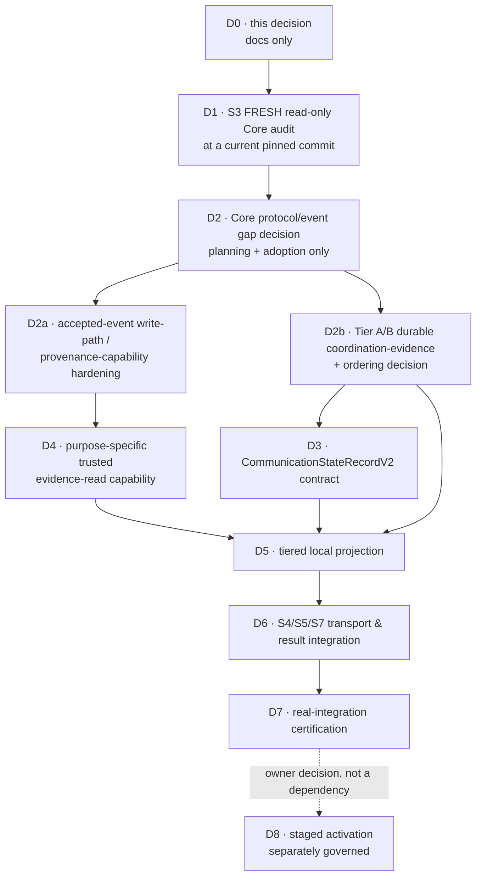

# Communication-state projection — Model 2 design

**Status:** Adopted under
[ADR-0135](../decisions/ADR-0135-qfj-p09-s2-local-communication-state-projection-architecture.md)
(**MERGED**, PR #176, `eebee71`). **Nothing here is implemented, adopted, connected or
activated.** Its D1 prerequisite is **MERGED** as PR #177 under [ADR-0136](../decisions/ADR-0136-qfj-p10-s3-fresh-quickfurno-core-audit.md) — that audit **confirmed Model 2**. **D2 is MERGED under [ADR-0137](../decisions/ADR-0137-qfj-p10-d2-core-protocol-and-event-gap-decision.md)**, which fixes the **first durable projection subset** this document's §8.2 leaves open: **6 durable Tier-C states** (`rejected`, `authorized`, `provider-accepted`, `delivered`, `read`, `failed`), **2 conditional Tier-B** (`authorization-requested`, `scheduled`), **10 deliberately excluded** — **`completed` among them, blocked by missing Core truth.** **Its D2a prerequisite (§7) is MERGED as PR #179 ([ADR-0138](../decisions/ADR-0138-qfj-p09-d2a-accepted-event-write-path-and-provenance-hardening.md), merge commit `2027d3215a36e8fdbed6809d0f12a917bb71cdee`), so the prerequisite this document locked is SATISFIED: the accepted-event writer has left the `@qf-jarvis/event-backbone` root barrel, the low-level writer and the governed cross-package writer each have exactly one tested production caller, the mint has one tested call site, and a single production `INSERT` is enforced by test — a repository/application-path guarantee that does NOT bind a privileged database operator, does not make Core events live, and allocates no migration.** **D4 — the purpose-specific trusted communication evidence-read capability — is MERGED as PR #180 ([ADR-0140](../decisions/ADR-0140-qfj-p09-d4-trusted-communication-evidence-read-capability.md), merge commit `182a9cb1c00cf1e3ad0225654992099208b992a0`), so the trusted-reader prerequisite is SATISFIED: one internal, root-unexported, position-keyed reader for the six durable Tier-C states above, at canonical event wire version `@2` with the embedded artifacts still `V1`, built and proved OFFLINE. **No adopted or live emission for either target family was established at the accepted S3 pin, and no current-live emission claim is made.** It adds no V2 contract, no projection and no consumer — its production importer count is deliberately ZERO until D5 opens one. **The active slice is now D2b — the Tier A/B durable-evidence and ordering confirmation ([ADR-0139](../decisions/ADR-0139-qfj-p09-d2b-tier-ab-durable-evidence-and-ordering-confirmation.md), Proposed), which closes the §6.3 ordering question this document left open: any future Option-A Tier-B fact enters the SAME accepted Core event-position stream, no second Jarvis log or order is created, and missing evidence means state unavailable rather than inferred. D3 follows D2b, and D5 still waits on D3 + D4 + D2b.**
**Baseline:** `c6b21dcf921e350f33477d3b18fd4413b8a8aa00` (merge of PR #175 / S2 readiness audit)

Read with [ADR-0134](../decisions/ADR-0134-qfj-p09-s2-communication-state-evidence-alignment.md) (the
locked evidence findings), [ADR-0132](../decisions/ADR-0132-aarohi-real-execution-integration-planning.md),
[communication-model.md](./communication-model.md) and
[versioning-and-compatibility.md](../contracts/versioning-and-compatibility.md).

---

## 1. What is being decided, and what is not

ADR-0134 proved that the planned `CommunicationStateRecordV1` producer must not be built, and left
one question open: **who authors communication state?**

This document answers that question and designs the boundary the answer requires. It designs; it does
not build. **No production code, no `CommunicationStateRecordV2`, no `qf.communication.state-recorded@3`,
no event reader, no write-path hardening, no coordination store, no migration, no activation.**
`projection-event-reader.ts`, `event-store.ts`, `create-event-ingestor.ts`, the event catalog and every
contract are read-only references here.

---

## 2. The decision: Model 2

> **Jarvis maintains a LOCAL communication-state view using authenticated, ADOPTED primitive Core
> evidence for Core-owned facts, while Jarvis remains the ORIGINATOR of its own coordination facts.**

- **QuickFurno Core stays authoritative** for consent, eligibility, authorization, provider outcomes
  and every Tier-C fact.
- **Jarvis consumes only trusted, accepted evidence**, never an arbitrary shape-valid payload.
- **Jarvis derives a LOCAL view** for orchestration and observability, and **never presents it as
  Core's authoritative business history.**
- **Jarvis authors Tier A and Tier B facts only when their prerequisites are lawfully proven** — and,
  per §6, only where a durable ordered evidence source for that fact exists.
- `communication-lifecycle-runtime` stays a **consistency validator, never an authority**.

### 2.1 Artifact author and canonical-event authority are different questions

`event-catalog.ts` states the rule the whole design rests on:

> ### Every event is sourced from QuickFurno Core
>
> Including `qf.recommendation.created`. Jarvis _produces_ the recommendation — the payload says so,
> with `producingSystem: "qf-jarvis"` — but the canonical _event_ is emitted by Core once Core has
> recorded the submission. **The artifact's author and the event's authority are different questions,
> and the envelope answers only the second.**

So **Core RECORDING a Jarvis-produced primitive artifact is NOT Core AUTHORING the Jarvis decision.**
The repository already does this twice: `qf.recommendation.created` carries a Jarvis-produced
`RecommendationV1`, and `qf.communication.human-handoff-requested` carries a Jarvis-produced
`HumanHandoffRequestV1` (`producingSystem: qf-jarvis`, enforced). Both envelopes are Core-sourced.

### 2.2 Candidate contracts are not adopted Core emissions

| | |
| --- | --- |
| **A. Repository-defined candidate canonical contracts** | defined **here**, in `@qf-jarvis/contracts` |
| **B. Live / adopted Core emission capability** | **not established** |
| **C. Core protocol/event gaps** | to be discovered by **S3** |

**S3 must verify which of those facts the current pinned Core can actually expose or adopt before D2
freezes the integration contract.** This document does not assert Core emits any of them today.

### 2.3 Why Model 2, and why Model 1 stays deferred

| | Model 1 (Core-authored state event) | **Model 2 (chosen)** |
| --- | --- | --- |
| New Core **state** event | **`qf.communication.state-recorded@3` required** | **not required** |
| What crosses the boundary | one **generic Core-authored state record** spanning the whole lifecycle | only the **primitive facts that actually cross it** |
| Jarvis coordination facts | Core would **author or echo** them | stay Jarvis's; Core may **record** the primitive artifact without authoring the decision (§2.1) |
| Core-side work | a new state event **plus** whatever primitive adoption S3 finds missing | **avoids the mandatory state event and the Tier A/B echo. MAY still require targeted Core protocol/event adoption** for primitives S3 finds absent |
| Incrementality | all-or-nothing | tier by tier |

**Model 1 is REJECTED for the current MVP** — not on principle, but because it introduces **one
generic Core-authored state record across the lifecycle instead of recording only the primitive facts
that genuinely cross the boundary**, and incurs every Core cost Model 2 might, plus that event and the
echo. **No canonical contradiction blocks Model 2.**

---

## 3. Identity, provenance, and what may be trusted

| Capability / object | Proves | Does **not** prove | Who can construct it today | May S2 treat it as authority? |
| --- | --- | --- | --- | --- |
| A shape-valid communication artifact | it satisfies its schema | that Core wrote it | **anyone** | **NO** |
| A shape-valid canonical event envelope | the envelope is well-formed | that it was signed, accepted or stored | **anyone** | **NO** |
| An `eventId` | an event has that identity | anything about origin | **anyone** — it is a UUID | **NO** |
| An event **actually carried through** `createEventIngestor` (**verify → prepare → persist**) | Core signed the exact bytes, the contract validated behind the signature, and the row was committed | that any *later* copy is faithful | only the ingestion composition | **YES** — the trust anchor |
| An `EventPersistenceRecord` | the caller assembled a record | that it was verified — the primitive verifies **nothing** | **any caller holding the type** | **NO** |
| A row in `qf_jarvis.event` | a row exists | **that it arrived through ingestion** (§7) | anything with the write role, and today any package importing the root-exported primitive | **NO, by itself** |
| A positioned row reached by a projection reader | a row exists at that position | that the row is Core-originated | as above | **NO, by itself** |
| Re-parsing a stored payload | **schema shape** | **origin** | anyone with the row | **NO** |
| A `ProjectionEvent` metadata object | position, type, version, acceptedAt | nothing about payload, subject or identity | the projection runner | metadata only |
| **A future communication evidence object** (§5) | see the rule below | anything outside its allowlist | only the designated reader | **conditional — see below** |
| **A row written directly into the V2 read model** | that something wrote it | **that any fact occurred** | any code with the write path | **NO — §6.2** |
| A `sourceEventId` stored in a future V2 record | which event was cited | that the citer ever saw that event | **anyone**, if accepted as naked input | **NO** |

### 3.1 The authority rule for a future evidence object

> A future evidence object **MAY** be treated as authoritative only after **BOTH**:
>
> 1. the source event is **bound to the governed accepted-event trust path** (requires **D2a**, §7);
>    **AND**
> 2. the purpose-specific reader has **re-parsed and minimised** it.
>
> **The designated reader alone is not enough.**

### 3.2 The invariants this design must never break

```
identity              !=  provenance
shape                 !=  origin
data-access boundary  !=  authentication boundary
read model            !=  source of fact
derived state         !=  evidence
lifecycle consistency !=  truth
request               !=  submission
issuance              !=  dispatch
approval              !=  communication authorization
prior authorization   !=  execution-time permission
```

---

## 4. The generic projection boundary stays metadata-only

`ProjectionEvent` exposes `position`, `eventType`, `eventVersion`, `acceptedAt` and nothing else. Its
own doc-comment calls widening _"a deliberate, ADR-gated decision — not a convenience edit."_ **This
design does not widen it**, and recommends it never be widened for this purpose: that would hand
payload access to every present and future projection to avoid writing one narrow module.

---

## 5. The evidence-read boundary — a least-privilege ACCESS pattern

### 5.1 What ADR-0044 is, and is not, a precedent for

`projection-subject-reader.ts` (ADR-0044) resolves only `subject_type`/`subject_id` for one
projection, is not part of `ProjectionEvent`, is not root-exported, and is lint-restricted to the
`subject-activity` reducer.

**Valid precedent for:** purpose-bounded read access · position-keyed lookup · root-unexported module ·
restricted import · field minimisation.

**NOT a precedent for:** authenticating event origin · proving an event passed `createEventIngestor` ·
granting authority to payload content.

> **Joining `projection_event_position → qf_jarvis.event` and re-parsing proves REACHABILITY and
> SHAPE — never ORIGIN.** A designated reader cannot "upgrade" an unauthenticated row into provenance
> merely because only one handler imports it.

### 5.2 Required properties

| # | Property | How it is met |
| --- | --- | --- |
| A | **Not arbitrary caller input** | resolves evidence **by projection position**. A caller cannot hand it a payload. |
| B | **No raw event-store bypass** | no "read any event by id" entry point. |
| C | **Positioned rows only — and, after D2a, governed accepted-event evidence** | the join reaches **only positioned rows**; that alone does not make them authenticated. After **D2a**, they may be relied upon as governed accepted-event evidence **within the application trust model** (§7.3 states the limit). |
| D | **Identity is reference only** | `eventId` may be returned for audit. It authenticates nothing. |
| E | **Allowlisted semantics** | evidence only for §5.3; any other type yields "not applicable". |
| F | **Narrow payload** | a re-parsed, minimised evidence object per §5.4. |
| G | **Re-parse, fail closed** | stored `jsonb` parsed with the canonical schema for that exact `event_type@event_version`; typed fixed-message errors carrying no stored value. **Proves shape, not origin.** |
| H | **Replay order** | position-keyed, so the runner's gap-free `last_position + 1` traversal is the ordering, unchanged. |
| I | **Trust assumption stated** | §7. |

### 5.3 Allowlist — re-audited, each entry justified

Necessity must be proved before payload access is granted. **Nothing is carried "just in case."**

#### Tier-C authority events

| Event type | State(s) | Status | Why |
| --- | --- | --- | --- |
| `qf.communication.authorization-recorded` | `rejected`, `authorized` | **LOCKED** | `CommunicationAuthorizationV1.outcome` **is** the fact. Nothing else carries either state (ADR-0134 §2.1, §3.5). |
| `qf.communication.result-recorded` | `provider-accepted`, `delivered`, `read`, `answered`, `no-answer`, `busy`, `failed`, `completed` | **LOCKED** | `lifecycleState` is the Core-recorded outcome, and the contract already refuses `succeeded` for `provider-accepted`. |
| `qf.execution.intent-issued` | ~~`execution-submitted`~~ | **CONDITIONAL — UNRESOLVED** | §5.5. An issued intent is not proof of dispatch. |
| `qf.execution.result-recorded` | — | **removed pre-S3** | `CommunicationResultV1` already carries `lifecycleState`, `outcome`, `failure` **and** both execution ids. |
| `qf.communication.human-handoff-recorded` | — | **removed pre-S3** | Justifies neither `human-handoff-required` (Jarvis's *request*) nor `completed` (needs a Core-recorded result). **No lifecycle state is currently derivable from it.** |

**The pre-S3 Tier-C locked allowlist is exactly two event types.**

#### Tier-B coordination candidate — a different list, for a different purpose

**Do not confuse the Tier-C authority allowlist with every input the hybrid local view needs.** A
Tier-B fact is Jarvis's decision; what it needs is a **durable, ordered record** that the decision
happened.

| Event type | State | Status | Notes |
| --- | --- | --- | --- |
| `qf.communication.human-handoff-requested` | `human-handoff-required` | **CONDITIONAL candidate** | Payload is `HumanHandoffRequestV1`; **Jarvis is the artifact producer** (`producingSystem: qf-jarvis`, enforced); the **canonical event is Core-recorded** (§2.1). **Not** `human-handoff-recorded`. **Live/adopted availability requires S3/D2; trusted use requires D2a + D4.** |

### 5.4 Field minimisation

For the two locked Tier-C entries only. A conditional candidate earns a minimisation row when admitted.

| Event | Minimal fields needed | Why needed | Must **NOT** cross |
| --- | --- | --- | --- |
| `authorization-recorded` | `communicationId`, `communicationRequestId`, `outcome`, `authorizedChannel?`, `reasonCode`, `decidedAt`, `correlationId` | each maps to a named derivation input | **`explanation`** (free text), `policy` internals, **`approvalDecisionId`** — the human approval, never the communication decision |
| `result-recorded` | `communicationId`, `communicationResultId`, `lifecycleState`, `outcome`, `recordedAt`, `reasonCode`, `failure.failureCode`, `failure.retryClassification` | the state, its qualification, and a countable reason | **`explanation`**, **`providerEvidence.providerReference`**, `providerOccurredAt` unless later proved needed |

**Categorically excluded, on every path:** free-text `explanation`; raw provider payloads and
references; recipient contact details; credentials; model output; template or message body content;
governed `parameters`/`metadata` containers; a named human actor unless separately re-approved.

### 5.5 `execution-submitted` — evidence UNRESOLVED

`communication-model.md` defines the state as **"Core dispatched an authorized execution intent to
n8n."** `qf.execution.intent-issued` is documented as *"QuickFurno Core issued a bounded, expiring
execution intent to n8n."*

**Issuance is not dispatch**, and the repository does not prove the event is emitted only after a
successful n8n submission:

- the event is named `intent-issued`, not `intent-dispatched`; `event-catalog.ts` carries no dispatch
  vocabulary;
- `ExecutionIntentV1.executor` is a **literal naming n8n as the intended executor** — an address, not
  a delivery receipt;
- **ADR-0090 / `execution-dispatch-runtime`:** *"The wire protocol is PROPOSED. Core does not sign
  this way yet and the execution side does not verify this way yet."*

Same shape as `authorization-requested`: **construction/issuance ≠ submission.** **The source evidence
for `execution-submitted` is UNRESOLVED**, pending S3/D2 and S5. No dispatch event name, receipt
schema, endpoint or acknowledgement is invented here.

### 5.6 Where the boundary should live

**`packages/event-backbone/src/projections/`**, beside the two existing readers, internal and
root-unexported, with a `no-restricted-imports` rule naming the one communication-state handler.
Rejected: a new package; `@qf-jarvis/contracts` (data-only); a general query API (violates B).

The **derivation logic** belongs in a separate pure module taking evidence objects and returning
state, testable without a database.

---

## 6. Tier A/B facts need a durable, ordered replay source

### 6.1 The audit

The complete communication canonical-event surface is five events —
`authorization-recorded`, `result-recorded`, `human-handoff-requested`, `human-handoff-recorded`,
`state-recorded`. No canonical event records a communication draft, a submission, or a schedule, and
no durable Jarvis-local store holds communication coordination state (migrations `0008`/`0009` are
conversation-control and the approval queue).

| # | State | A. Artifact proving the Jarvis act | B. Durable today? | C. Canonical Core-recorded event today? | D. Other replayable Jarvis store? | E. Ordering vs Core events | F. Rebuildable after read-model loss? | G. Status |
| --- | --- | --- | --- | --- | --- | --- | --- | --- |
| 1 | `draft` (Tier A) | S1 can construct a `CommunicationRequestV1` — **construction is not durable recording** | **NO** | **NO** — no draft/request-created event exists | **NO** | undefined | **NO** | **UNRESOLVED** |
| 2 | `authorization-requested` (B) | an S4 submission receipt | **NO** — the S4 artifact is itself unresolved | **NO** | **NO** | undefined | **NO** | **UNRESOLVED** |
| 3 | `scheduled` (B) | a Jarvis scheduling act and instant | **NO** | **NO** | **NO** | undefined | **NO** | **UNRESOLVED** |
| 4 | `follow-up-requested` (B) | a Jarvis follow-up decision | **NO** | **NO** | **NO** | undefined | **NO** | **UNRESOLVED** |
| 5 | `human-handoff-required` (B) | **`HumanHandoffRequestV1`** — Jarvis-produced, enforced | **not yet** | **`qf.communication.human-handoff-requested` exists as a candidate contract** | n/a | Core event position, **if adopted** | **yes, if adopted + D2a/D4** | **CONDITIONAL** |

Two derivations are explicitly forbidden:

- **`scheduled` must NOT be inferred from `requestedTiming`** in `CommunicationRequestV1` — that field
  is a *request*, not a record that Jarvis scheduled anything.
- **`follow-up-requested` must NOT be inferred merely because a later `CommunicationRequestV1`
  exists**, unless a canonical causation/correlation contract proves the mapping. A later attempt is a
  **new request, not a retry**.

### 6.2 Read model ≠ source of fact

Explicitly forbidden:

> "Jarvis decides `scheduled` / `follow-up-requested` / `human-handoff-required`, writes the
> projection row, therefore it is durable."

A projection is **derived** state. **Direct write without an independent replayable source turns a
cache into authority and makes rebuild impossible.** If a Tier A/B fact is persisted, its source
evidence must exist **independently of the read model**.

Also forbidden: a **process-memory** fact becoming durable state truth, and reconstructing any state
from **timestamps or heuristics alone**.

### 6.3 Ordering

Core event positions give gap-free ordering for Core-recorded canonical events. If Jarvis-local
coordination evidence ever lives outside that stream, its ordering relative to Core evidence must be
made deterministic by a mechanism decided later.

**Ordering must NOT be solved by:** wall-clock timestamp sorting · `createdAt` comparison · UUID
ordering · last-writer-wins · non-durable process arrival order.

**The final mechanism is not invented here.**

### 6.4 Options for the Tier A/B evidence source — evaluated, not chosen

**Option A — Core records Jarvis-produced primitive coordination artifacts.** Already a repository
pattern (§2.1): `qf.recommendation.created` and `qf.communication.human-handoff-requested`.
*Advantages:* one gap-free canonical ordering; the existing backbone and rebuild pattern; Core records
occurrence without authoring the decision; no second Jarvis event log. *Costs:* targeted Core
protocol/event adoption may be required, and **an unsubmitted `draft` cannot naturally be
Core-recorded**. **No event names are invented here — S3/D2 decides what Core can expose or adopt.**

**Option B — a separate durable Jarvis coordination evidence log/store.** Possible but larger: new
durable persistence, independent replay semantics, deterministic ordering against Core events, likely
schema/migration work, separate authority boundaries. **Fallback only. Not selected. No migration
allocated.**

**Option C — some states stay ephemeral/runtime-only and are excluded from the durable view.** For
example `draft` until something is durably submitted. A possible MVP simplification, but if later
chosen it must document exactly which states are durable, must not claim full lifecycle rebuild, and
must make the runtime/UI semantics explicit. **Not chosen now.**

**No A/B/C choice is forced before S3.** That is **D2b**.

### 6.5 The rebuild rule

> **A durable/rebuildable `CommunicationStateRecordV2` view may contain a state only when every fact
> used to derive that state has a durable, replayable, deterministically ordered evidence source.**

- **Tier C:** the intended source is authenticated/adopted Core events, through **D2a + D4**.
- **Tier A/B:** the durable evidence source is **not fully decided** (§6.1).

Until those sources are settled: **D5 cannot claim full 18-state deterministic rebuild**; no direct
imperative read-model write is sufficient; no process-memory fact becomes durable truth; no state is
reconstructed from timestamps or heuristics.

**ADR-0043-style deterministic rebuild is a REQUIREMENT, not yet a proved property of the full
communication view.** Tier-C reconstruction can use ordered accepted Core events once D2a/D4 exist.
Tier A/B reconstruction additionally requires durable ordered coordination evidence; **until those
sources are resolved, full 18-state rebuild is not certified.** The rebuildable subset today is
**none** — Tier C awaits D2a/D4 and adoption, Tier A/B awaits D2b.

### 6.6 Privacy under rebuild

Because no free text, contact detail or provider payload crosses the boundary (§5.4), the read model
holds opaque references and machine tokens, and an erasure reaching the event log leaves no prose
behind in this view. Any Tier A/B source chosen at D2b must preserve the same minimisation.

---

## 7. Write-path trust: D2a is a PREREQUISITE, not an option

> **STATUS — D2a is MERGED**
> ([ADR-0138](../decisions/ADR-0138-qfj-p09-d2a-accepted-event-write-path-and-provenance-hardening.md),
> PR #179, merge commit `2027d3215a36e8fdbed6809d0f12a917bb71cdee`). §7.1 below records the **pre-D2a** state and is kept as the evidence that
> motivated the slice — it is history, not a current description. Against the §7.2 invariants:
> **A, B and C now hold structurally and are tested**; **D still stands as written** — a privileged
> database operator remains outside the application-code guarantee, and D2a changed **no database
> role or grant**. §7.3's limits are unchanged and are restated verbatim in ADR-0138.

### 7.1 What the repository proved BEFORE D2a (historical)

1. `storeValidatedEvent` is exported from `@qf-jarvis/event-backbone`'s **root barrel**.
2. `EventPersistenceRecord` is **caller-constructible**.
3. It performs **no signature verification and no contract parsing**.
4. `event-store.ts`: *"This is a TRUSTED low-level primitive. It verifies nothing"*, and trust *"is a
   caller obligation, not a structural guarantee this package can enforce."*
5. **No repository-wide containment rule** confines it to `event-ingestion`; nine packages/apps
   already depend on the package.
6. Direct SQL writes under a granted role are possible.
7. **A row in `qf_jarvis.event` does not, by itself, prove Core origin.**
8. **Re-parsing proves schema shape, not origin.**
9. **A narrow reader is a least-privilege data-access pattern, not an authentication boundary.**

### 7.2 The consequence

> **Joining to `qf_jarvis.event` and re-parsing ≠ trusted Core evidence.**

**D2a — accepted-event write-path / provenance-capability hardening** is locked as a bounded
prerequisite. **D4 MUST depend on D2a**; **D5 may not consume reader output as authority before
D2a + D4.**

Minimum invariant:

- **A.** Only the governed event-ingestion composition may use the supported event-write primitive.
  — **MET (ADR-0138)**, as a THREE-LAYER chain rather than one barrel change: the SQL `INSERT` lives
  in `event-store.ts` alone, the low-level `storeValidatedEvent` has one production caller
  (`event-write.ts`) that invokes it exactly once, and the governed cross-package writer has one
  production importer and exactly one mint **call site** (the ingestion bridge). Each is enforced by
  lint **and** by a source scan, because an `eslint-disable` comment can silence the first but not
  the second; the lint ban covers every practical import spelling including the bare sibling
  `./event-store.js`, and the mint scan counts occurrences rather than files. The `AuthenticatedEventWrite`
  wrapper is **nominal-substitution protection, not independent authentication evidence** — its mint
  takes a plain record, so the boundary is the tested one-file/one-call-site containment plus the
  bridge's evidence binding.
- **B.** Repository code has **no supported bypass** for `qf_jarvis.event` writes.
  — **MET (ADR-0138):** exactly one production `INSERT` exists, and a repository-wide scan fails if a
  second appears; migrations (DDL) and projection readers (`JOIN`) are explicitly not counted as
  bypasses.
- **C.** The reader's trusted capability is produced **only** from that governed path.
  — **MET.** ADR-0138 is merged, and the reader itself is built by **D4**
  ([ADR-0140](../decisions/ADR-0140-qfj-p09-d4-trusted-communication-evidence-read-capability.md),
  Proposed): position-keyed, purpose-bounded, root-unexported, with zero production consumers until
  D5 opens exactly one. Its output is trusted **within the application trust model only** — §7.3's
  limits are unchanged, and invariant **D** below still stands as written.
- **D.** **A direct database administrator or infrastructure actor remains OUTSIDE the
  application-code trust guarantee** unless a DB-level capability boundary is separately adopted.

### 7.3 What code containment can and cannot claim

**It can** make the invariant **structural within the reviewed application code**. **It cannot**
defend against an already-privileged database operator; ADR-0044's boundary already concedes the
analogous point — its control holds *"even though the shared projection DB role technically holds the
column grant."*

**Whether separate DB role/grant hardening is required must be proved by the future hardening slice
against the actual migration and grant model. This document allocates NO migration.**

### 7.4 The minimum D2a hardening to design (not implement)

1. **Repository-wide import/API containment** — only `event-ingestion` may call or name
   `storeValidatedEvent`.
2. **Narrow it off the root public barrel** if compatibility allows — a **public-API change**; if
   breaking, its own slice.
3. **Repository-wide direct-write containment** on `qf_jarvis.event`.
4. **A purpose-owned evidence capability** not constructible by arbitrary projection code.
5. **Negative containment tests** — a sibling package cannot gain authority by importing the
   primitive, deep-importing it, writing the table directly, or constructing a naked evidence object.

### 7.5 Post-hoc re-verification — the honest limit

The signature commits to `"qf-jarvis-event-v1" ‖ keyId ‖ signedAt ‖ hex(sha256(rawBody))`, and every
component is persisted, so the Ed25519 check **is** re-runnable from a stored row. **But the exact raw
signed bytes are not stored** — only their digest — so it proves *"a body with this digest was
signed"*, not that the stored payload **is** that body. `semantic_event_digest` detects later mutation
but is Jarvis-computed and is **not a Core attestation**. **No cryptographic fact is invented.**

---

## 8. `CommunicationStateRecordV2` — semantics only

Under Model 2, **V2 is a Jarvis-local projection/read-model contract**, not automatically a Core wire
payload. **Not implemented here**; no Zod or TypeScript is written.

### 8.1 Locked semantics

1. **V1 stays immutable and published.**
2. **`ApprovalDecisionV1` is never again generic "Core decided" evidence.**
3. V2 **structurally distinguishes** Tier A, Tier B and Tier C evidence.
4. **A caller-provided event id is never authority.** The runtime accepts evidence objects from the
   governed reader **over a D2a-hardened write path**; a record may *retain* the source event identity
   for audit once it came from trusted evidence.
5. No consent snapshot, DNC flag, suppression cache, `canSend`, `canExecute`, `authorizedUntil` or
   reusable permission.
6. `previousState` stays evidence and context. `reasonCode` stays an open Core machine token.
7. **No nineteenth state. No invented cancellation, expiry, dispatch or submission contract.**
8. **D3 may not freeze an evidence variant for any Tier A/B state whose durable source is unresolved**
   (§6.1). **D5 may not implement a state until its durable source and ordering are decided.**

### 8.2 Per-state requirements and durable-source status

| State | Tier | Evidence requirement | Durable source status |
| --- | --- | --- | --- |
| `draft` | A | Jarvis-local | **UNRESOLVED** |
| `authorization-requested` | B | **actual submission**, not construction | **UNRESOLVED** (S4 receipt undefined) |
| `rejected` | C | communication-**authorization** refusal evidence; never a human approval id | Tier-C locked event; needs D2a + D4 + adoption |
| `authorized` | C | Core communication-authorization evidence | as above |
| `scheduled` | B | trusted `authorized` prerequisite **and** Jarvis's scheduling act | **UNRESOLVED** — never inferred from `requestedTiming` |
| `execution-submitted` | C | evidence Core **dispatched** to n8n | **UNRESOLVED** (§5.5) |
| `provider-accepted` | C | **Core-recorded result**; an intent is never sufficient | Tier-C locked event; needs D2a + D4 + adoption |
| `delivered` / `read` / `answered` / `no-answer` / `busy` / `failed` | C | Core-recorded provider/result evidence | as above |
| `follow-up-requested` | B | trusted prior outcome **and** Jarvis's follow-up decision | **UNRESOLVED** — never inferred from a later request alone |
| `human-handoff-required` | B | the Jarvis handoff request **and** its trusted prior outcome | **CONDITIONAL** — `qf.communication.human-handoff-requested` / `HumanHandoffRequestV1`, subject to S3/D2 adoption + D2a/D4 |
| `completed` | C | authoritative completion/result evidence | Tier-C locked event; needs D2a + D4 + adoption |
| `cancelled` | C | — | **UNRESOLVED** — no Core cancellation fact exists |
| `expired` | C | — | **UNRESOLVED** — the authoritative expiry fact is undetermined |

State meaning and ownership are unchanged from ADR-0134.

### 8.3 `channel`, deliberately open

V1 makes `channel` mandatory, so a `rejected` record must name a channel Core never authorized. Three
candidate repairs — optional `channel`; a *proposed* vs *authorized* distinction; or a state-sensitive
rule — are all defensible. Settled when S3 establishes whether Core's authorization always names one.

### 8.4 Intentionally unresolved until S3 / D2 / D2b

`cancelled` · `expired` · **`execution-submitted` dispatch evidence** · the S4 submission receipt ·
`channel` semantics · which candidate contracts the current Core can expose or adopt · **and the
durable ordered evidence source for `draft`, `authorization-requested`, `scheduled` and
`follow-up-requested`.**

---

## 9. Versioning consequences

- **`qf.communication.state-recorded@3` is NOT required under Model 2, and is not scheduled.**
- **`@2` stays published compatibility and history**; not the Model-2 source of truth, and **not
  retired here**.
- **`CommunicationAuthorizationV2` is NOT required.**
- **V2 is not added to the canonical Core event registry** merely because it is a contract.

---

## 10. Sequence



**Dependencies — load-bearing:**

- **D3 depends on D2 + D2b** for any Tier A/B evidence variant it freezes.
- **D4 depends on D2a.** A reader over an unhardened write path produces reachable rows, not trusted
  evidence.
- **D5 depends on D3 + D4 + D2b.**
- Transport-dependent states still wait for **S4/S5/S7** evidence; `execution-submitted` cannot become
  a valid projected fact until §5.5 is settled.
- **If D2b chooses Core-recorded primitive coordination events (Option A), D4 may serve both Tier B
  and Tier C.** If D2b requires a separate local evidence store (Option B), its implementation and
  ordering proof must be inserted **before D5** under separate owner review.

Architecture-step labels inside this decision — **not new QFJ phases**. **No migration now.**

**S2a (`draft` alone) is deliberately not scheduled before D1** — and §6.1 now gives a second reason:
`draft` has no durable replay source at all.

---

## 11. Posture

No production code. No contract. No event registry, event-backbone, projection-runtime or ingestion
change. No Core access, no n8n, no provider, no message sent. No persistence and **no migration** —
`0013` is not allocated, and the `0010`–`0012` ledger drift remains separate governance debt.

**Production rollout remains OFF. Aarohi's runtime remains PLANNED / DISABLED.**
