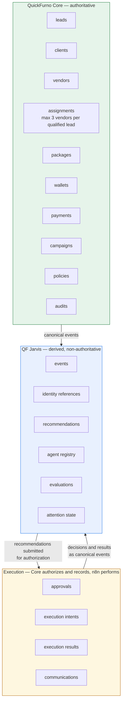

# Domain Map — QF Jarvis

**Status:** Phase 0 — Approved
**Date:** 2026-07-11

This document names the logical domains that will exist across the QuickFurno ecosystem, and states where each one lives. **Nothing here is implemented.** Naming a domain is not designing a schema, and this document deliberately stops short of both.

Ownership follows [system-boundary.md](./system-boundary.md), which is authoritative.

---

## The four classes of domain

| Class | Lives in | Authoritative? |
| --- | --- | --- |
| **Authoritative QuickFurno domains** | QuickFurno Core | Yes — these *are* the business truth |
| **Jarvis intelligence domains** | QF Jarvis | No — derived, rebuildable, non-authoritative |
| **Execution domains** | QuickFurno Core (authorization and record) + n8n (mechanics) | Core's record is authoritative |
| **Shared contract domains** | Agreed between systems; versioned | The contract is authoritative for *shape*, not for business state |

---

## Authoritative QuickFurno domains

Owned by QuickFurno Core. QF Jarvis may **read derived views** of these and may **reason** about them. QF Jarvis may never own, write, or hold the truth for any of them.

| Domain | What it holds |
| --- | --- |
| **leads** | Lead records, verification status, qualification, lifecycle |
| **clients** | Client identity, requirements, relationship state |
| **vendors** | Vendor identity, qualification, onboarding and activation state, service areas, categories, performance |
| **assignments** | Which vendors received which lead. Enforces the business rule: a qualified lead is shared with **at most three suitable vendors**. This rule is QuickFurno Core's, not Jarvis's |
| **packages** | Package definitions, eligibility, purchase, state, expiry |
| **wallets** | Balances, debits, credits |
| **payments** | Money movement |
| **campaigns** | Authoritative campaign and spend state |
| **policies** | Policy definitions, versions, and enforcement rules |
| **audits** | The authoritative audit trail |

---

## Jarvis intelligence domains

Owned by QF Jarvis. Every one of these is **derived** — rebuildable from canonical events — and none of them is business truth.

| Domain | What it holds | Why it is not truth |
| --- | --- | --- |
| **events** | Ingested canonical events: receipt, deduplication, ordering, routing state | The event is a *copy* of a fact Core already owns |
| **identity references** | References to Core's identifiers — lead IDs, vendor IDs, client IDs — plus the minimum attributes needed to reason | Deliberately references rather than copies. Data minimization ([privacy-principles.md](../governance/privacy-principles.md)) |
| **recommendations** | Structured agent outputs: subject, evidence, rationale, confidence, risk, priority, expiry, required approval | A recommendation is a proposal. It has no authority and causes no effect |
| **agent registry** | Which agents exist, their versions, their domains, their prompts and rules, their enablement state | Configuration of the intelligence layer, not of the business |
| **evaluations** | Measured quality of recommendations against what actually happened | Jarvis's own report card |
| **attention state** | Consolidated, deduplicated, ranked founder attention items and their read/dismiss state | A view, not a fact |

**A derived read model is not a second source of truth.** If a Jarvis read model disagrees with QuickFurno Core, Core is right and the read model is stale or wrong. Every read model must be rebuildable by replaying events, and must never be the basis of a business decision that Core has not confirmed.

---

## Execution domains

Authorization and record live in QuickFurno Core. The mechanics live in n8n. Jarvis reads these to close its own lifecycle and to learn; it writes none of them.

| Domain | Authoritative owner | Mechanics | Jarvis's access |
| --- | --- | --- | --- |
| **approvals** | QuickFurno Core — the attributable record of who decided what, when | — | Read |
| **executions** (execution intents) | QuickFurno Core — bounded, expiring, created only from an approved recommendation | n8n validates and performs | Read |
| **execution results** | QuickFurno Core — recorded as truth | n8n reports | Read |
| **communications** | QuickFurno Core — contact identity, consent, opt-out, do-not-contact, eligibility, approved purpose, attempt limits, quiet hours, communication history, and authoritative delivery and call outcomes | n8n + the **QF Communications Runtime** (WhatsApp adapter, QF Voice Runtime) deliver | Read. Jarvis may originate a communication **request**, and may never write `delivered` or `completed` ([communication-model.md](./communication-model.md)) |

Note what is absent: there is no Jarvis-owned execution domain, because Jarvis does not execute.

---

## Shared contract domains

These are the agreements between systems. They are versioned, and a breaking change to any of them requires a version bump and a migration plan ([change-management.md](../governance/change-management.md)). Defined in Phase 2, not here.

| Contract | Between | Carries |
| --- | --- | --- |
| **Canonical event contract** | Core → Jarvis | Versioned business facts, with stable identifiers, correlation, and causation |
| **Recommendation contract** | Jarvis → Core | Subject, evidence, rationale, confidence, risk, priority, expiry, required approval level |
| **Approval decision contract** | Core → Jarvis | Approved, rejected, or changes requested; attributable; with reason |
| **Execution intent contract** | Core → n8n | The bounded, expiring, authorized action |
| **Execution result contract** | n8n → Core → Jarvis | Outcome, provider status, failure detail, idempotency key |

---

## Domain map diagram

---

## Rules that constrain every future domain design

1. **A domain has exactly one authoritative owner.** If two systems both think they own it, that is a bug in the architecture, not a synchronization problem to solve.
2. **Jarvis domains are derived and rebuildable.** Losing every Jarvis read model should cost nothing but replay time.
3. **Reference, don't copy.** Jarvis holds Core's identifiers plus the minimum attributes it needs to reason — not a mirror of Core's records.
4. **No new Jarvis domain may hold business truth.** A future domain called `jarvis.leads` that holds lead state is a boundary violation, whatever it is named.
5. **Contract domains are versioned.** Shape changes are visible, planned, and reversible.
