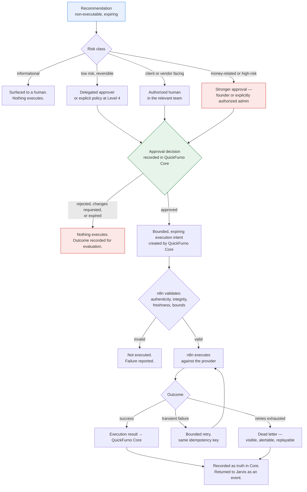

# Execution Governance — QF Jarvis

**Status:** Phase 0 — in progress (pending review)
**Date:** 2026-07-11

Ownership follows [system-boundary.md](./system-boundary.md), which is authoritative. The decision behind this model is [ADR-0002](../decisions/ADR-0002-recommend-authorize-execute-model.md) and [ADR-0005](../decisions/ADR-0005-human-and-policy-approval.md).

---

## The governing sentence

**Nothing reaches a real client, vendor, or ad account without an authorization decision recorded in QuickFurno Core.**

Everything below is a consequence of that sentence.

---

## 1. Recommendations are non-executable

A recommendation is inert by construction. It is a structured proposal — evidence, rationale, confidence, risk, priority, expiry, required approval — and it has no mechanism to cause an effect.

This is not enforced by policy alone; it is enforced by the architecture. Jarvis has no path to n8n and no provider credentials ([system-boundary.md](./system-boundary.md)). Even a compromised agent producing a malicious recommendation cannot execute it. The worst it can do is *propose* something a human or a policy then declines.

## 2. Approval decisions are explicit

An approval is a positive, attributable act recorded in QuickFurno Core: **approved**, **rejected**, or **changes requested**, by a named human or by a named, versioned policy.

- There is **no timeout-to-approve**. An undecided recommendation expires; expiry is not approval.
- There is **no implicit approval** from prior similar decisions. "We approved one like this last week" is not an authorization.
- There is **no agent self-approval**, at any confidence, in any circumstance.
- Silence is never consent.

## 2a. The approval interface may live in Jarvis; the approval authority never does

**This section is authoritative for how a founder or an operator actually approves something.** The decision is recorded in [ADR-0007](../decisions/ADR-0007-founder-approval-interface-and-authority.md). Other documents cross-reference this; they do not restate it.

The future **QF Jarvis Control Plane** (Phase 12) may present the founder-facing approval interface — the button lives where the evidence lives, which is the whole reason the control plane exists. But the interface is a **client**, not an authority.

The flow, exactly:

1. The founder (or an authorized operator) acts in the Jarvis Control Plane.
2. **Jarvis submits an approval request to QuickFurno Core.** It does not approve anything.
3. **QuickFurno Core validates** — identity, authority, current state, risk policy, expiry, and recommendation eligibility.
4. **QuickFurno Core authorizes or rejects.**
5. **QuickFurno Core records the authoritative approval decision.**
6. **QuickFurno Core emits the resulting canonical decision event.**
7. **Jarvis displays the authoritative result** it received back.

Three consequences, stated as rules:

- **A button click inside Jarvis is not authorization.** It is a request for authorization. The distinction is the entire point: authority is granted on the other side of a trust boundary from the system that asked for it ([trust-boundaries.md](./trust-boundaries.md), B3).
- **Jarvis must never locally mark an action as approved before receiving Core's authoritative response.** No optimistic UI state, no local "approved" flag, no rendering the outcome the user probably wants while the request is in flight. In flight renders as **pending**. Core's rejection renders as **rejected**.
- **Core may reject a request the founder made.** Stale state, expired recommendation, insufficient authority for that risk class, a policy that has since changed — Core validates against its own truth, and its answer is the one that counts. A control plane that cannot display "the founder clicked approve and Core said no" has been built wrong.

## 3. Only approved recommendations may become execution intents

The conversion happens **inside QuickFurno Core**, from an approval decision that Core itself recorded. Jarvis does not create execution intents. It cannot manufacture authority by manufacturing an artifact.

## 4. Execution intents are bounded and expiring

An execution intent is not a general permission. It is a narrow, time-limited authorization to do one specific thing.

| An intent must state | Why |
| --- | --- |
| **The exact action** | No interpretation, no expansion |
| **The exact subject** | This client, this vendor, this campaign — not a class of them |
| **The exact provider and channel** | No substitution |
| **The exact content or parameters** | The approved message, the approved amount |
| **An expiry** | An authorization that made sense at 09:00 may be wrong at 17:00 |
| **An idempotency key** | So a retry cannot double-send or double-charge |
| **Correlation and causation** | So the result can be traced back to the approval and the evidence |

Anything outside those bounds is unauthorized. An intent to message one client does not authorize messaging a cohort. An intent to shift a budget by a stated amount does not authorize a larger shift.

## 5. n8n validates, then executes

n8n does not trust an intent because it arrived. Before acting, it verifies:

- **Authenticity** — the intent genuinely came from QuickFurno Core's authorized dispatch (signature verification).
- **Integrity** — it has not been altered in transit.
- **Freshness** — it has not expired, and it is not a replay ([trust-boundaries.md](./trust-boundaries.md)).
- **Bounds** — the action it is about to perform is exactly what the intent describes.

If validation fails, n8n does not execute, and the failure is reported. n8n never "helpfully" adjusts, expands, or reinterprets an intent. It has no discretion, by design — discretion is where an execution fabric becomes a decision-maker.

## 6. Providers deliver; results return

The provider performs the real-world effect. n8n records what the provider said. The execution result returns to **QuickFurno Core**, which records it as truth, and reaches Jarvis as a canonical event so it can close the recommendation's lifecycle and learn from the outcome.

A provider's own view of a delivery is not truth until Core has recorded it.

## 7. Retries preserve idempotency

Retry is normal. Double-charging a vendor's wallet is not.

- Every intent carries an **idempotency key**.
- Every retry reuses the same key.
- The provider or the execution layer must ensure that N attempts with the same key produce **one** effect.
- Retries are bounded — a retry policy that never gives up is a retry policy that hides a fault.

Where a provider cannot guarantee idempotency, the action is treated as **at-most-once**: on ambiguity, it fails rather than repeats. For money-related actions this is not negotiable — **and it applies equally to voice calls.**

**One execution intent may produce at most one provider call initiation.** A technical retry re-attempts the same execution under the same idempotency key; it does not dial again. **An ambiguous provider outcome is reconciled before another attempt is made** — the answer to "did that call connect?" is to find out, not to dial and see.

**A later attempt is a new decision, not a retry.** A no-answer, a busy line, or a "call me later" is a *result*: it may justify a **new recommendation and a new authorized execution intent**, with its own identity, policy validation, consent check, attempt-limit check, expiry, and audit trail. The architecture must distinguish a **duplicate execution** — one decision producing two calls, which is a defect — from a **legitimate later attempt**, which is a fresh decision validated against consent and attempt limits that may have moved since ([communication-model.md](./communication-model.md)).

## 8. Failures may enter dead-letter handling

When retries are exhausted, the intent or result goes to a dead letter. Dead letters are **visible, alertable, and replayable** after the underlying fault is fixed.

A silently dropped execution is the worst failure mode in this architecture: a human believes an approved action happened, and it did not. Dead-letter rate is a tracked system metric ([success-metrics.md](../charter/success-metrics.md)).

## 9. Money-related and high-risk actions require stronger approval

Risk determines the approval path. Confidence does not.

| Risk class | Examples | Approval required |
| --- | --- | --- |
| **Informational** | A metric summary, an attention item with no proposed action | None — nothing executes |
| **Low risk, reversible** | An internal flag, a task for an operator, a template message within approved bounds | Delegated team member. Candidate for policy automation at Level 4, after evaluation |
| **Client- or vendor-facing communication** | An outbound WhatsApp, SMS, or email within an approved template | Authorized human in the relevant team, within approved templates. **Core additionally validates consent, opt-out, do-not-contact, quiet hours, and attempt limits, and may refuse** ([communication-model.md](./communication-model.md)) |
| **Outbound voice call** | A call placed to a client or vendor | **Higher risk than asynchronous messaging**: synchronous, intrusive, harder to template, impossible to retract. **Production outbound voice initially requires explicit human approval** — every call traces to a named human decision — within an approved call purpose and script, plus every check above. Any future limited-policy automation for voice requires a **separate accepted ADR** ([automation-levels.md](../governance/automation-levels.md)) |
| **Money-related** | Recharge conversations that move money, package changes, payments, wallet effects, ad-spend changes | **Stronger approval** — the founder, or an administrator with explicit authority. Never delegated by default. Never policy-automated in the current roadmap |
| **High-risk or novel** | Anything not covered by an existing policy; bulk actions; anything affecting many subjects at once | The founder |

**A high-confidence recommendation to spend money requires exactly the same authorization as a low-confidence one.** Confidence informs priority and evaluation; it never informs permission. Any design that shortens an approval path because a model was sure is a design that has misunderstood the system.

## 10. Jarvis never bypasses authorization

There is no exception path, no emergency override, no "urgent" fast lane, and no debug mode in which Jarvis acts directly. If an action is urgent, the answer is a faster human approval — not a bypassed one.

## 11. Founder authority is bounded by mandatory controls

Founder authority may resolve **ordinary business prioritization and discretionary approval questions** where policy permits — which item outranks which, whether to approve within an authority policy already grants.

It may **not silently bypass mandatory consent, privacy, security, or legal controls.** QuickFurno Core **must refuse or block** an action — from any originator, the founder included — when required by **consent withdrawal, opt-out or do-not-contact status, invalid or unverified recipient identity, prohibited quiet hours, an expired intent, attempt limits, security concerns, or legal or mandatory policy restrictions** ([communication-model.md](./communication-model.md)).

Where a control is genuinely discretionary and policy permits an override, that override is **explicit, attributable, and audited** — never silent. A control that yields to seniority is not a control.

---

## Governance flow

---

## What an auditor should be able to prove

For any effect the outside world experienced:

1. It corresponds to exactly one execution result.
2. That result corresponds to exactly one execution intent.
3. That intent was created by QuickFurno Core from exactly one approval decision.
4. That decision is attributable to a named human or a named, versioned policy.
5. That decision was made against exactly one recommendation.
6. That recommendation carries the rationale and the evidence — the canonical events — that produced it.

And conversely: for any recommendation Jarvis ever made that was **not** approved, nothing happened. That should be provable too.
