# Phased Roadmap — QF Jarvis

**Status:** Phase 0 — in progress (pending review)
**Date:** 2026-07-11

---

## How this roadmap works

**One phase per branch**, named `phase-N-short-description` ([change-management.md](../governance/change-management.md)). Phases are not compressed, not merged, and not run in parallel to "save time." A phase that skips its exit criteria has not finished; it has just stopped.

Every phase below states an **objective**, **key outputs**, **explicit exclusions**, **entry criteria**, **exit criteria**, **dependencies**, and **principal risks**. The exclusions matter as much as the outputs: they are what keeps a phase from quietly becoming the next three.

**No timeline is given.** Phases complete when their exit criteria are met, not when a date arrives.

```mermaid
flowchart LR
    P0["0<br/>Charter"] --> P1["1<br/>Foundation"] --> P2["2<br/>Contracts"] --> P3["3<br/>Event backbone"] --> P4["4<br/>Jarvis coordination"]
    P4 --> P5["5<br/>Kabir"] --> P6["6<br/>Riya"] --> P7["7<br/>Anisha"] --> P8["8<br/>Jitin"]
    P8 --> P9["9<br/>Approval and policy"] --> P10["10<br/>n8n bridge"] --> P11["11<br/>Core integration"] --> P12["12<br/>Founder control plane"]
    P12 --> P13["13<br/>Security and observability"] --> P14["14<br/>Evaluation loop"] --> P15["15<br/>Controlled automation"]

    style P0 fill:#e8f0fe,stroke:#1a73e8
```

---

## Phase 0 — Project Charter and Architecture

**Objective.** Establish the permanent boundary, the agent model, the governance rules, and the phase plan — before any code exists to argue with them.

**Key outputs.** Charter, product vision, goals and non-goals, stakeholders, success metrics, glossary. Architecture: system context, system boundary, responsibility matrix, domain map, agent model, recommendation lifecycle, execution governance, data ownership, trust boundaries, this roadmap. Six accepted ADRs. Governance: engineering, security, privacy, and auditability principles; automation levels; change management.

**Explicit exclusions.** No application code. No package manager, no `package.json`, no dependencies. No framework, database, AI SDK, agent runtime, workflow integration, provider integration, frontend, CI, or deployment file. No placeholder implementations.

**Entry criteria.** A repository at zero baseline.

**Exit criteria.** Every document above exists and is internally consistent. No document contradicts [system-boundary.md](./system-boundary.md). All ADRs are Accepted. The business owner has reviewed and approved the charter and the boundary.

**Dependencies.** None.

**Principal risks.** Documentation that reads well and constrains nothing. Mitigated by making the boundary and the responsibility matrix specific enough to *fail* a future pull request.

---

## Phase 1 — Engineering Foundation

**Objective.** Create the minimum engineering substrate: repository structure, language and tooling choices, testing approach, and local development — chosen deliberately and recorded as ADRs.

**Key outputs.** Repository and module layout for a modular monolith ([ADR-0004](../decisions/ADR-0004-modular-monolith-first.md)). Language, runtime, and package-manager decision, recorded as an ADR. Linting, formatting, type checking. Test framework and the test-first policy for critical rules. Local development setup. A CI pipeline that runs checks on every pull request.

**Explicit exclusions.** No agents. No event processing. No AI SDK. No provider integration. No production deployment. No business logic of any kind — including "just a small placeholder."

**Entry criteria.** Phase 0 exit criteria met and approved.

**Exit criteria.** A developer can clone, install, run checks, and run an empty test suite. CI runs on every pull request and blocks merge on failure. Every foundational technology choice has an ADR.

**Dependencies.** Phase 0.

**Principal risks.** Tool-choice paralysis; over-building the foundation. Mitigated by choosing boringly and recording the choice, not by choosing perfectly.

---

## Phase 2 — Contracts and Canonical Events

**Objective.** Define the shared contracts before anything depends on them: canonical events, recommendations, approval decisions, execution intents, execution results.

**Key outputs.** Versioned canonical event schemas ([ADR-0003](../decisions/ADR-0003-event-driven-integration.md)). The recommendation contract — subject, evidence, rationale, confidence, risk, priority, expiry, required approval, correlation, causation. Approval request, approval decision, execution intent, and execution result contracts. The **communication request**, **communication result**, and **communication state** contracts, including the full sixteen-state model ([communication-model.md](./communication-model.md)). A **contract registry** holding every version. **Fixtures** — representative sample payloads for every contract and version. Versioning and **compatibility rules**. Contract tests running against the fixtures.

**Explicit exclusions.** No event transport yet. No agents. No implementation of any contract's behavior — only its shape, its fixtures, and its tests. **No dependency on QuickFurno Core's current capabilities.**

**Entry criteria.** Phase 1 complete.

**Exit criteria.** Every contract is versioned, documented, registered, and covered by contract tests running against fixtures. Compatibility rules are defined. Personal data in each contract is minimized and justified. Deletion propagation is designed ([data-ownership.md](./data-ownership.md)).

**Dependencies.** Phase 1. **This phase completes independently.** The contracts define the *target* integration shape; they do not require QuickFurno Core to emit or accept anything yet. Whether Core can currently emit these events, or currently expose an authorization-decision interface, is **unverified and deliberately out of scope here** — establishing those capabilities is **Phase 11's** work.

**Principal risks.** Designing contracts in isolation that Core later cannot produce. Mitigated by fixtures and compatibility rules that make adaptation a Phase 11 adapter problem rather than a redesign, and by keeping the contract surface to what the first agents actually need. Contract drift is mitigated by versioning and by rejecting unknown versions rather than guessing at them.

---

## Phase 3 — Durable Event Backbone

**Objective.** Reliable, idempotent, replayable event ingestion. This is the load-bearing infrastructure of the entire system.

**Key outputs.** Event ingestion with signature verification. Idempotent processing and deduplication. Ordering guarantees where they matter. Bounded retries. Dead-letter handling that is visible, alertable, and replayable. Replay capability. Derived read models, rebuildable from events. Correlation and causation propagation.

**Explicit exclusions.** No agents. No recommendations. No AI. No execution. No approval flow. **No live QuickFurno Core connection.**

**Entry criteria.** Phase 2 complete.

**Exit criteria.** Events are ingested idempotently — proven by deliberately redelivering them. Dead letters are visible and replayable. Read models can be destroyed and rebuilt from the event history with identical results. Duplicate-event and dead-letter metrics are instrumented.

**Dependencies.** Phase 2. **This phase completes independently.** The backbone is built and proven against the Phase 2 contracts and fixtures — a conforming event source, not a live Core. Connecting a real emitter is **Phase 11**. Building the backbone this way is a feature, not a compromise: replayable, fixture-driven ingestion is exactly what makes Phase 11's integration testable and Phase 3's correctness provable without waiting on another system.

**Principal risks.** Getting idempotency and replay wrong here poisons everything built on top. Mitigated by test-first on these rules specifically, and by treating replay as a first-class feature rather than a recovery hack.

---

## Phase 4 — Jarvis Coordination Layer

**Objective.** Build the coordinator before the specialists — routing, consolidation, prioritization, and attention management — so that the first agent has somewhere to land.

**Key outputs.** Event routing. The agent registry, with versioning and enablement. Agent-run recording. Recommendation consolidation and deduplication. Prioritization by impact and time sensitivity. Expiry handling. The founder attention model. **Communication prioritization and scheduling**, plus recording of **specialist context contribution and routing reasons** ([communication-model.md](./communication-model.md)). Automation **Level 0 — observation only**.

**Explicit exclusions.** No specialist agents. No approval submission. No execution. No founder UI — the attention model exists as data, not as a screen. **No communication is sent, prepared, or connected to anything** — scheduling exists as coordination logic only.

**Entry criteria.** Phase 3 complete.

**Exit criteria.** Events route correctly to a placeholder-free registry with no agents registered. Consolidation, prioritization, and expiry are implemented and tested. The system observes and measures, and recommends nothing, because nothing recommends yet.

**Dependencies.** Phase 3.

**Principal risks.** The coordinator absorbing domain logic that belongs to specialists ([ADR-0006](../decisions/ADR-0006-agent-responsibility-boundaries.md)). Mitigated by building it with zero agents registered, which makes domain logic impossible to sneak in.

---

## Phase 5 — Kabir: Lead Intelligence

**Objective.** The first specialist. Lead quality, completeness, plausibility, consistency, fraud signals, and matching readiness — in **shadow mode**.

**Key outputs.** Kabir, versioned. Deterministic rules first: completeness, format validity, threshold checks. Model reasoning only for genuine judgment: budget plausibility, urgency plausibility, fraud pattern synthesis. Structured recommendations with mandatory evidence. Automation **Level 1 — shadow recommendations**, not shown to operational users, recorded and evaluated.

**Explicit exclusions.** No lead assignment — ever, in any phase. No approval flow yet. No execution. No other agents. Kabir does not decide how many vendors receive a lead; the max-three rule is QuickFurno Core's.

**Entry criteria.** Phase 4 complete.

**Exit criteria.** Kabir produces evidence-backed recommendations on real events, in shadow. Deterministic rules demonstrably run before model reasoning. Shadow evaluation has run long enough to say whether Kabir is worth a human's attention.

**Dependencies.** Phase 4. Lead events from Phase 2.

**Principal risks.** Using a model where a rule would do; false positives that would erode trust in the system if surfaced. Mitigated by shadow mode — the first agent's mistakes cost nothing but evaluation data.

---

## Phase 6 — Riya: Client Intelligence

**Objective.** Client follow-up, nurture, abandoned-requirement recovery, reactivation, and communication timing and channel — in shadow mode.

**Key outputs.** Riya, versioned. Follow-up timing and channel recommendations. Abandoned-requirement detection. Reactivation candidates. Relationship intelligence. Structured recommendations with proposed actions that are bounded and specific.

**Explicit exclusions.** No message is sent. No approval flow yet. No provider contact — Riya proposes content, timing, and channel, and nothing else.

**Entry criteria.** Phase 5 complete and evaluated.

**Exit criteria.** Riya produces evidence-backed recommendations in shadow. Proposed actions are bounded enough to become execution intents later without reinterpretation.

**Dependencies.** Phase 5 (proves the specialist pattern). Client and lead events.

**Principal risks.** Recommending outreach that would annoy real clients; recommending it at volume. Mitigated by shadow mode and by evaluating proposed-message quality before any of it is ever surfaced, let alone sent.

---

## Phase 7 — Anisha: Vendor Intelligence

**Objective.** Vendor acquisition, qualification, onboarding, profile completion, activation, package readiness, recharge, retention, upgrade, inactivity recovery, and win-back — in shadow mode.

**Key outputs.** Anisha, versioned. Onboarding and activation funnel intelligence. Package-readiness and recharge recommendations. Churn-risk and win-back detection. Structured recommendations that flag their money-adjacency and therefore their required approval level.

**Explicit exclusions.** **No wallet, package, or payment mutation, by any path.** No recharge execution. No approval flow yet. Anisha recommends a recharge *conversation*; it never touches money.

**Entry criteria.** Phase 6 complete and evaluated.

**Exit criteria.** Anisha produces evidence-backed vendor-lifecycle recommendations in shadow. Every money-adjacent recommendation correctly declares that it requires **stronger approval** ([execution-governance.md](./execution-governance.md)).

**Dependencies.** Phase 6. Vendor, package, and wallet events (read-only, derived).

**Principal risks.** Boundary erosion around money — this is the phase where "Jarvis could just top up the wallet" gets suggested. The answer is no, and the reason is [ADR-0001](../decisions/ADR-0001-source-of-truth-boundary.md).

---

## Phase 8 — Jitin: Marketing Intelligence

**Objective.** Campaign performance, channel analysis, cost per verified lead by city and category, demand intelligence, SEO opportunity, content, creative fatigue, and budget-shift recommendations — in shadow mode.

**Key outputs.** Jitin, versioned. Cost-per-verified-lead analysis segmented by city and category. Channel and creative-fatigue analysis. SEO opportunity detection. Budget-shift recommendations with evidence, correctly classified as **money-related** and therefore requiring stronger approval.

**Explicit exclusions.** No ad-account access. No budget change. No provider contact. No approval flow yet. Jitin has no path to Google Ads or Meta Ads and never will.

**Entry criteria.** Phase 7 complete and evaluated.

**Exit criteria.** Jitin produces evidence-backed marketing recommendations in shadow, segmented by city and category. Cost per verified lead is computed from QuickFurno Core's authoritative verification state, not from Jarvis's own inference of what "verified" means.

**Dependencies.** Phase 7. Campaign events, plus Kabir's verified-lead signal from Phase 5.

**Principal risks.** Optimizing for lead *volume* rather than *verified* lead quality — the exact failure the metric exists to prevent. Mitigated by defining cost per verified lead against Core's verification truth.

---

## Phase 9 — Approval and Policy Layer

**Objective.** **Define** the approval and policy capabilities: risk classification, approval levels, delegated limits, expiry, attribution, and the approval-request submission path — as a specified, tested capability on the Jarvis side.

**Key outputs.** The **approval-request submission capability** — Jarvis submitting an approval request to Core's authorization interface, and reflecting Core's authoritative response ([execution-governance.md](./execution-governance.md), [ADR-0007](../decisions/ADR-0007-founder-approval-interface-and-authority.md)). Approval-decision handling: approved, rejected, changes requested. Risk classification driving the approval path. Delegated approval limits. Expiry with **no timeout-to-approve**. Attribution and audit of every decision. Policy awareness — Jarvis knowing what approval a recommendation would require. Automation **Level 2 — assisted recommendations**: recommendations are shown to humans, who act manually.

**Explicit exclusions.** No execution — approval exists, but nothing is executed from it yet. No policy automation. No n8n. **No optimistic or local approval state** — Jarvis never marks anything approved on its own. This phase deliberately builds the approval mechanism *before* anything can act on an approval, so the path is proven while it is still harmless.

**Entry criteria.** Phases 5–8 complete, with at least one agent evaluated as good enough to show a human.

**Exit criteria.** Recommendations reach humans, who approve, reject, or request changes against Core's authorization interface as specified in Phase 2's contracts. Every decision is attributable and audited. Money-related recommendations demonstrably require stronger approval. An expired recommendation demonstrably does *not* become approved. Jarvis demonstrably does **not** display an approved state without an authoritative Core decision. Recommendation acceptance rate and approval turnaround are instrumented.

**Dependencies.** Phases 5–8, and the approval-request and approval-decision contracts from Phase 2. **This phase defines the capability against those contracts.** Whether Core's authorization interface exists yet is **unverified and out of scope here** — building or adapting it is **Phase 11's** work.

**Principal risks.** Approval fatigue; a UI that makes rejection harder than approval. Mitigated by consolidation, prioritization, and expiry — and by tracking the stale-recommendation rate as an adoption canary.

---

## Phase 10 — n8n Execution Bridge

**Objective.** Turn authorized execution intents into real actions — safely, idempotently, and reversibly.

**Key outputs.** Execution intent contract in production use: bounded, expiring, signed, idempotency-keyed. n8n-side validation of authenticity, integrity, freshness, and bounds. Provider integration inside n8n's trust zone. Bounded retries preserving idempotency. Dead-letter handling. Execution results returning to QuickFurno Core. Rate and volume bounds. Automation **Level 3 — approval-controlled execution**.

**The QF Communications Runtime** ([communication-model.md](./communication-model.md)): consent and policy validation interface, template and script registry, scheduling, retry and idempotency controls, delivery and call status handling, human handoff, structured result reporting. Provider credentials live **here and nowhere else**.

### Phase 10 capability gates — messaging before voice

Voice is a **capability gate inside this phase**, not a separate phase. The roadmap is not renumbered; the gates are sequenced.

**Gate 10a — Messaging adapter and provider integration.** The WhatsApp adapter, on the shared communication contracts from Phase 2, behind bounded, expiring, idempotency-keyed execution intents dispatched by Core. Authorization and consent validation enforced by Core and **re-validated by the runtime at execution time**.

**Gate 10b — Controlled messaging pilot.** A narrow, low-volume pilot: one recipient class, one purpose, volume-bounded, every message behind a named human approval.

**Gate 10c — Messaging evaluation.** Did consent enforcement hold? Did a retry ever double-send? Did every result reach Core and close the lifecycle? Was any message claimed as delivered that was not?

**Gate 10d — Staged messaging rollout.** Widened by purpose and by volume, one step at a time, each step reversible.

**Gate 10e — QF Voice Runtime.** Only once messaging has proven consent enforcement, at-most-once execution, and authoritative result recording end to end. Voice brings transcript and summary processing, speech handling, recording consent, quiet hours, and misdial risk with it — **none of which arrive before it**.

**Gate 10f — Controlled voice pilot, evaluation, and staged rollout**, mirroring 10b–10d. **Production outbound voice requires explicit human approval on every call** ([automation-levels.md](../governance/automation-levels.md)).

**Explicit exclusions.** **No Jarvis-to-n8n path, ever.** Intents come from QuickFurno Core. **No Jarvis-to-provider path and no provider credential in Jarvis, ever** — Jarvis directly invokes no WhatsApp API and connects to no telephony or SIP provider. No policy automation — every execution in this phase traces to a human approval. No money-related execution until its stronger-approval path is proven end to end. **No voice before gate 10e**, and **no voice policy automation at all**, which would require a separate accepted ADR.

**Entry criteria.** Phase 9 complete. Approval decisions are recorded and attributable.

**Exit criteria.** An approved, low-risk, reversible action executes end to end and its result returns to Core. **Retry demonstrably does not double-send and does not double-dial** — one execution intent produces at most one provider call initiation. **An ambiguous provider outcome is demonstrably reconciled before any further attempt.** **A legitimate later attempt after a no-answer is demonstrably a new intent** — with its own identity, consent check, attempt-limit check, expiry, and audit trail — and is not confused with a retry. An expired intent is demonstrably refused. A forged intent is demonstrably refused. **A communication request for an opted-out recipient is demonstrably refused — including one the founder made.** **A scheduled communication whose recipient withdraws consent before the scheduled moment is demonstrably not sent.** Dead letters are visible and replayable. The full audit chain — event → recommendation → approval → intent → result — is verifiable for every execution.

**Dependencies.** Phase 9. n8n availability. Provider credentials provisioned **in n8n only**. Note the sequencing: intents are dispatched to n8n **by QuickFurno Core**, so the first live end-to-end execution requires Core's dispatch capability. Phase 10 builds and proves the n8n side against the Phase 2 execution-intent contract; **Phase 11 completes and hardens the Core-side emitters, interfaces, and adapters** that make it live. If Core's dispatch capability is not ready when Phase 10 is, Phase 10 exits against a conforming test dispatcher and its live cut-over belongs to Phase 11 — the phases do not merge.

**Principal risks.** The first real effect on a real client or vendor. Mitigated by starting with the lowest-risk, most reversible action class, with volume bounds, and with a human behind every single execution.

---

## Phase 11 — QuickFurno Core Integration

**Objective.** **This is the phase where QuickFurno Core's integration capabilities are established.** Everything before it was built against contracts and fixtures; this phase makes it live, and does the work Core requires in order to participate.

**Key outputs.**

- **Canonical event emitters in QuickFurno Core** — emitting the Phase 2 events for all four agent domains, versioned and signed.
- **The authorization interface in QuickFurno Core** — accepting an approval request, validating identity, authority, current state, risk policy, expiry, and recommendation eligibility; deciding; recording the authoritative decision; and emitting the resulting canonical decision event ([ADR-0007](../decisions/ADR-0007-founder-approval-interface-and-authority.md)).
- **Execution-intent dispatch from Core to n8n**, completing the Phase 10 bridge.
- **Core's communication authority** — contact identity, phone number, WhatsApp eligibility, voice-call consent, opt-in and opt-out status, do-not-contact status, approved message or call purpose, attempt limits, quiet hours, communication history, human-handoff state, and **authoritative delivery and call outcomes** ([communication-model.md](./communication-model.md)).
- **Compatibility adapters** — wherever Core's existing shapes differ from the Phase 2 contracts, an adapter reconciles them. **The adapter absorbs the difference; the contract does not bend.**
- **Callbacks and result flow** — execution results returning to Core and reaching Jarvis as canonical events, closing recommendation lifecycles.
- **Migration requirements for Core**, stated explicitly and planned per [change-management.md](../governance/change-management.md).
- **Reconciliation** between Jarvis derived views and Core truth, with Core winning, always.
- **Deletion and anonymization propagation** into Jarvis derived views and recommendation evidence.
- Backfill and replay against real history.

**Explicit exclusions.** No Jarvis write path into business state — not in this phase, not in any phase. No second source of truth, however convenient. **No weakening of a Phase 2 contract to accommodate what Core happens to emit today** — that is what adapters are for.

**Entry criteria.** Phase 10 complete. **A scoping assessment of what QuickFurno Core can emit and accept today** — the first point in the roadmap where that answer is actually required.

**Exit criteria.** Core emits the events all four agents need. Core's authorization interface accepts approval requests, decides, records authoritatively, and emits decision events. Jarvis reflects those decisions and demonstrably holds **no local approved state** of its own. Every recommendation lifecycle closes with a recorded outcome. Derived views reconcile against Core, and a deliberate divergence is detected and corrected in Core's favor. A deletion in Core demonstrably propagates into Jarvis.

**Dependencies.** Phase 10. **Deep cooperation from QuickFurno Core — this is the phase that needs it, and the first one that does.** Whether Core has these capabilities today is unverified; **establishing them is this phase's work, and their absence changes this phase's size, not the boundary** ([ADR-0001](../decisions/ADR-0001-source-of-truth-boundary.md)).

**Principal risks.** This phase carries the integration risk that earlier phases deliberately deferred, so it may be large. That is the intended trade: the alternative was blocking Phases 2 through 10 on another team's roadmap. Secondary risk: reconciliation quietly turning into synchronization, and a derived view becoming load-bearing — mitigated by rebuilding read models from scratch periodically and proving nothing breaks.

---

## Phase 12 — Founder Control Plane

**Objective.** The product surface: one prioritized founder command view.

**Key outputs.** The consolidated, ranked, expiring attention view. Evidence visible on every item — *why is this here?* answered in one click. **The founder-facing approval interface** — approve, reject, and request-changes actions that submit an **approval request** to QuickFurno Core and display Core's authoritative response ([ADR-0007](../decisions/ADR-0007-founder-approval-interface-and-authority.md)). **The communication actions — Call client, Call vendor, Send WhatsApp, Schedule communication, Request human callback** — which **create governed communication requests** and render the authoritative lifecycle state ([communication-model.md](./communication-model.md), [ADR-0008](../decisions/ADR-0008-controlled-communication-capability.md)). Founder briefings. Proactive alerts. Dismissal feeding evaluation. Cross-domain composite recommendations ([agent-model.md](./agent-model.md)).

**Explicit exclusions.** No new agent capability. No chat interface that "just does things." No approval shortcut that bypasses risk classification. **No optimistic approval or delivery state** — the control plane never renders an action as approved before Core's authoritative decision arrives, and **never claims delivery, call completion, or success before authoritative execution results return**. `execution submitted` is not `provider accepted`, and neither is `delivered`; the UI must not collapse them. The control plane **initiates governed communication requests**; it does not authorize them, does not transport them, and does not deliver them.

**Entry criteria.** Phase 11 complete — in particular, Core's authorization interface exists and emits decision events.

**Exit criteria.** The founder can run a day from this view. Every item shows its evidence. Approving from the view submits a request to Core and renders **only** the decision Core returned — demonstrated by showing that a request Core rejects renders as rejected, and that a request in flight renders as pending, never as approved. **Clicking Call or Send WhatsApp demonstrably initiates a governed request, not a send**: a refused request renders as `rejected` with Core's reason and nothing is sent, an in-flight request renders as `authorization requested` or `execution submitted`, and `delivered` appears **only** on an authoritative execution result. **The rejected, cancelled, expired, and in-flight renderings are demonstrated — not only the happy path.** The view stays short — consolidation and expiry demonstrably work under real volume.

**Dependencies.** Phase 11.

**Principal risks.** **This is the adoption phase, and adoption is the project's largest risk.** A view the founder stops reading is a failed project regardless of engineering quality. Mitigated by ruthless consolidation, honest prioritization, and tracking the stale-recommendation rate.

---

## Phase 13 — Security and Observability Hardening

**Objective.** Make the trust boundaries real, and make the system's behavior visible.

**Key outputs.** Signature verification at every boundary ([trust-boundaries.md](./trust-boundaries.md)). Replay protection. Key rotation without downtime. Secret isolation, verified — including proof that Jarvis holds no provider credentials. Log redaction, verified: no secrets, no raw personal data, no chain-of-thought. Prompt-injection defenses for attacker-influencable content. Rate and volume bounds. Full observability: latency, success, retry, dead-letter, and audit-completeness metrics. Safety metrics instrumented and alerting ([success-metrics.md](../charter/success-metrics.md)).

**Explicit exclusions.** No new agents. No new automation. No new business capability. This phase makes what exists trustworthy; it does not add to it.

**Entry criteria.** Phase 12 complete.

**Exit criteria.** A forged event, a forged intent, a replayed message, and an expired intent are each demonstrably rejected. Key rotation completes with no downtime. A log audit finds no secrets, no raw personal data, **no phone numbers, no message bodies, no call transcripts**, and no chain-of-thought. **No WhatsApp or telephony credential exists anywhere in the Jarvis trust zone** — verified, not assumed. Audit completeness measures **100%**. Unauthorized-action count and sensitive-data-logging incidents both read **zero**, and both alert if they ever do not.

**Dependencies.** Phase 12.

**Principal risks.** Deferring this phase because the system already "works." It works and it is not yet trustworthy; those are different properties, and **Phase 14 and 15 are blocked until this one passes.**

---

## Phase 14 — Evaluation and Learning Loop

**Objective.** Measure whether the agents are actually any good — rigorously enough to justify, or refuse, automation.

**Key outputs.** Recommendation acceptance rate, per agent and per recommendation type. Outcome correlation: when acted upon, did the business metric move? Confidence calibration. Shadow comparison of agent versions against recorded history. Regression detection when an agent version degrades. Evaluation reporting to the founder. Calibrated numerical targets for the metrics that Phase 0 deliberately left as *future calibration items*.

**Explicit exclusions.** No automation promotion in this phase — this phase produces the *evidence* on which the next phase decides. No agent tuning based on vibes.

**Entry criteria.** Phase 13 complete. Enough real decision history to evaluate against.

**Exit criteria.** Every agent has a measured acceptance rate and calibration. A new agent version can be evaluated against the current one on recorded history *before* it is deployed. The metric targets left open in Phase 0 are now set from real data. At least one recommendation class is identifiable as a genuine automation candidate — or, honestly, none is, and that is a valid result.

**Dependencies.** Phase 13. Real usage history from Phases 9–12.

**Principal risks.** Evaluating on proxies rather than outcomes — high acceptance on recommendations that changed nothing. Mitigated by requiring outcome correlation, not just acceptance, before any promotion.

---

## Phase 15 — Controlled Automation Rollout

**Objective.** Promote a **narrow, low-risk, reversible** recommendation class to policy automation — and prove the promotion can be revoked instantly.

**Key outputs.** Automation **Level 4 — limited policy automation**, for one class at a time. An explicit, versioned policy in QuickFurno Core authorizing that class automatically. Gate conditions from Phase 14 evidence. Continuous monitoring of the incorrect-automated-action rate, with a target of zero and an automatic revocation on breach. A revocation procedure, tested. A rollback plan per [change-management.md](../governance/change-management.md).

**Explicit exclusions.** **No money-related automation.** Not recharges, not payments, not wallet effects, not package changes, not ad spend. **No Level 5.** No automation of a class that has not passed its Phase 14 gates. No bulk automation. No automation without an off switch that costs nothing to pull.

**Entry criteria.** Phase 14 complete. A specific recommendation class has passed its gates: high acceptance, correlated outcomes, zero incorrect actions, full reversibility.

**Exit criteria.** One recommendation class runs under policy automation. Its policy is explicit, versioned, and attributable in the audit trail exactly as a human approver would be. Revocation has been **tested**, not just designed. The incorrect-automated-action rate is monitored and reads zero.

**Dependencies.** Phase 14. Explicit approval from the business owner for each class promoted.

**Principal risks.** The whole project's largest risk lands here: an automated action that is wrong, at scale, without a human in the loop. Mitigated by narrowness (one class), reversibility (an off switch that breaks nothing), evidence (Phase 14 gates), and monitoring (automatic revocation on breach). **When in doubt, do not promote.** A system permanently at Level 3 that the founder trusts is a success. A system at Level 4 that the founder has stopped trusting is not.

---

## Two rules that govern the whole roadmap

1. **A phase is done when its exit criteria are met.** Not when it is late, not when it is nearly there, and not when the next phase looks more interesting.
2. **The boundary is not a phase deliverable — it is a permanent constraint.** No phase, including Phase 15, may weaken it. Any change to it requires a superseding ADR and the business owner's explicit decision.
