# Phased Roadmap — QF Jarvis

**Status:** Phase 0 approved · Phase 1 approved · **Phase 2 complete and approved (2026-07-12)** · Phase 3 in progress — Stage 3.2 signature verification complete, owner-accepted and merged (PR #10, 2026-07-16); managed-database readiness established and migration `0001_event_log.sql` applied; Stage 3.3 slice 3 (atomic, idempotent persistence), Stage 3.3.3 (append-only `ingestion_rejection` + `event_conflict` tables, migration `0003`, ADR-0031), and Stage 3.3.4 (the `createEventIngestor` composition only, ADR-0032 — no new migration) **merged via PR #17 (merge commit `40830846c784fdd1e46c3535a2fa97292f32d1d8`)**; **Stage 3.3.5 (Concurrency, Duplicate-Key Decision and Managed Readiness, ADR-0033) merged via PR #18 (merge commit `c07580147cb283d0acdc4357bee3ded45a83d82d`), so Stage 3.3 is COMPLETE**; managed PostgreSQL carries only `0001` and migrations `0002_event_runtime_grants.sql`, `0003_ingestion_rejection_and_event_conflict.sql` and `0004_projection_foundation.sql` are ALL unapplied with no managed migration authorized (and no `0005`); **Stage 3.4 is in progress: Stage 3.4.1 (projection foundation, ADR-0034, migration `0004`) is COMPLETE and merged via PR #19 (merge commit `580568dcb342b8017bec25e93d6f8396ac9b3ef0`); Stage 3.4.2 (the internal projection registry, ADR-0035 — no migration) is implemented locally and pending independent review; Stage 3.4 as a whole is incomplete, the runner, advisory lock, retries, handlers and rebuild remain later slices (3.4.3-3.4.5), and Stage 3.5 remains blocked**; HTTP endpoints and worker loops remain absent; Phase 3 is NOT complete · **AI runtime foundation roadmap amendment approved (2026-07-16, [ADR-0028](../decisions/ADR-0028-ai-runtime-foundations-and-roadmap-sequencing.md)) — approved architecture, not implemented**
**Date:** 2026-07-12

> **Phase 3 must not begin until Phase 2 is merged into `main`.** A phase built on an unmerged branch is a phase built on something that can still change.

> **Revised.** Phase 10 is now **test-only**, Phase 11 carries the live Core integration, and **Phase 11A** is a separate, gated controlled-communication pilot. The vendor assignment rule is now the two-batch, six-per-lead-category policy. See [quickfurno-compatibility-directive.md](./quickfurno-compatibility-directive.md), [ADR-0015](../decisions/ADR-0015-complete-client-journey-and-reassignment-policy.md), [ADR-0016](../decisions/ADR-0016-agent-memory-and-learning-boundaries.md), [ADR-0017](../decisions/ADR-0017-live-communication-sequencing.md).

> **AI runtime foundation amendment (2026-07-16, [ADR-0028](../decisions/ADR-0028-ai-runtime-foundations-and-roadmap-sequencing.md), Accepted).** The former Phase 4 (Jarvis coordination) is now **Phase 4.3**, preceded by **Phase 4.0** (model gateway and AI runtime), **Phase 4.1** (governed knowledge and capabilities), and **Phase 4.2** (continuous evaluation, observability and data quality). **Phase 8.5** (human identity and access) is inserted before Phase 9; **Phase 10.5** (production readiness) between Phases 10 and 11; a **multilingual communication safety gate** is added to Phase 11A; and Phase 12 is expanded into a founder operating system. **Phases 5–15 are not renumbered** — sub-phase numbers keep every existing reference valid. **All of this is approved architecture, not implemented.** The load-bearing rule: **a control appears in the phase that first depends on it, never later** — Phase 13 verifies controls, it does not introduce them. See [model-runtime-and-governance.md](./model-runtime-and-governance.md), [governed-knowledge-and-capabilities.md](./governed-knowledge-and-capabilities.md), [ai-evaluation-observability-and-data-quality.md](./ai-evaluation-observability-and-data-quality.md), [production-readiness-and-access-control.md](./production-readiness-and-access-control.md).

---

## How this roadmap works

**One phase per branch**, named `phase-N-short-description` ([change-management.md](../governance/change-management.md)). Phases are not compressed, not merged, and not run in parallel to "save time." A phase that skips its exit criteria has not finished; it has just stopped.

Every phase below states an **objective**, **key outputs**, **explicit exclusions**, **entry criteria**, **exit criteria**, **dependencies**, and **principal risks**. The exclusions matter as much as the outputs: they are what keeps a phase from quietly becoming the next three.

**No timeline is given.** Phases complete when their exit criteria are met, not when a date arrives.

```mermaid
flowchart LR
    P0["0<br/>Charter"] --> P1["1<br/>Foundation"] --> P2["2<br/>Contracts"] --> P3["3<br/>Event backbone"]
    P3 --> P40["4.0<br/>Model gateway"] --> P41["4.1<br/>Knowledge &<br/>capabilities"] --> P42["4.2<br/>Evaluation &<br/>tracing"] --> P43["4.3<br/>Jarvis coordination"]
    P43 --> P5["5<br/>Kabir"] --> P6["6<br/>Riya"] --> P7["7<br/>Anisha"] --> P8["8<br/>Jitin"]
    P8 --> P85["8.5<br/>Identity &<br/>access"] --> P9["9<br/>Approval and policy"] --> P10["10<br/>n8n bridge<br/><b>TEST ONLY</b>"]
    P10 --> P105["10.5<br/>Production<br/>readiness"] --> P11["11<br/>Core integration<br/><b>LIVE</b>"]
    P11 --> P11A["11A<br/>Controlled comms pilot<br/>+ multilingual gate"] --> P12["12<br/>Founder control plane<br/>and operating system"]
    P12 --> P13["13<br/>Security and observability"] --> P14["14<br/>Evaluation loop"] --> P15["15<br/>Controlled automation"]

    style P0 fill:#e8f0fe,stroke:#1a73e8
    style P40 fill:#e8f0fe,stroke:#1a73e8
    style P85 fill:#e8f0fe,stroke:#1a73e8
    style P105 fill:#e8f0fe,stroke:#1a73e8
    style P10 fill:#fef7e0,stroke:#f9ab00
    style P11A fill:#fce8e6,stroke:#d93025
```



**The first real message is sent in Phase 11A, and nowhere earlier.** Phase 10 builds and proves the bridge against fixtures and a test dispatcher; it reaches nobody ([ADR-0017](../decisions/ADR-0017-live-communication-sequencing.md)).

---

## Phase 0 — Project Charter and Architecture

**Objective.** Establish the permanent boundary, the agent model, the governance rules, and the phase plan — before any code exists to argue with them.

**Key outputs.** Charter, product vision, goals and non-goals, stakeholders, success metrics, glossary. Architecture: system context, system boundary, responsibility matrix, domain map, agent model, **communication model**, recommendation lifecycle, execution governance, data ownership, trust boundaries, this roadmap. **Eight Accepted ADRs** — [ADR-0001](../decisions/ADR-0001-source-of-truth-boundary.md), [ADR-0002](../decisions/ADR-0002-recommend-authorize-execute-model.md), [ADR-0003](../decisions/ADR-0003-event-driven-integration.md), [ADR-0004](../decisions/ADR-0004-modular-monolith-first.md), [ADR-0005](../decisions/ADR-0005-human-and-policy-approval.md), [ADR-0006](../decisions/ADR-0006-agent-responsibility-boundaries.md), [ADR-0007](../decisions/ADR-0007-founder-approval-interface-and-authority.md), [ADR-0008](../decisions/ADR-0008-controlled-communication-capability.md). Governance: engineering, security, privacy, and auditability principles; automation levels; change management.

**Explicit exclusions.** No application code. No package manager, no `package.json`, no dependencies. No framework, database, AI SDK, agent runtime, workflow integration, provider integration, frontend, CI, or deployment file. No placeholder implementations.

**Entry criteria.** A repository at zero baseline.

**Exit criteria — met.** Every document above exists and is internally consistent. No document contradicts [system-boundary.md](./system-boundary.md). All eight ADRs are Accepted. **The business owner has reviewed and approved the charter and the permanent architecture boundary.**

**Status: complete and approved.**

**Dependencies.** None.

**Principal risks.** Documentation that reads well and constrains nothing. Mitigated by making the boundary and the responsibility matrix specific enough to *fail* a future pull request.

---

## Phase 1 — Engineering Foundation

**Objective.** Create the minimum engineering substrate: repository structure, language and tooling choices, testing approach, and local development — chosen deliberately and recorded as ADRs.

**Key outputs.** Repository and module layout for a modular monolith ([ADR-0004](../decisions/ADR-0004-modular-monolith-first.md)). Language, runtime, and package-manager decision, recorded as an ADR. Linting, formatting, type checking. Test framework and the test-first policy for critical rules. Local development setup. A CI pipeline that runs checks on every pull request.

**Explicit exclusions.** No agents. No event processing. No AI SDK. No provider integration. No production deployment. No business logic of any kind — including "just a small placeholder."

**Entry criteria.** Phase 0 exit criteria met and approved.

**Exit criteria — met.** A developer can clone, install, run checks, and run the test suite. CI runs on every pull request and blocks merge on failure. Every foundational technology choice has an ADR.

**Status: complete and approved.**

**Dependencies.** Phase 0.

**Principal risks.** Tool-choice paralysis; over-building the foundation. Mitigated by choosing boringly and recording the choice, not by choosing perfectly.

---

## Phase 2 — Contracts and Canonical Events

**Objective.** Define the shared contracts before anything depends on them: canonical events, recommendations, approval decisions, execution intents, execution results.

**Key outputs.** Versioned canonical event schemas ([ADR-0003](../decisions/ADR-0003-event-driven-integration.md)). The recommendation contract — subject, evidence, rationale, confidence, risk, priority, expiry, required approval, correlation, causation. **Approval request**, approval decision, execution intent, and execution result contracts — five separate contracts, and the request carries no authority. The **communication request**, **communication authorization**, **communication result**, and **communication state** contracts, including the authoritative eighteen-state communication lifecycle ([communication-model.md](./communication-model.md)).

**The revised contracts** ([quickfurno-compatibility-directive.md](./quickfurno-compatibility-directive.md)): the **assignment batch**, **client reassignment request and decision**, **additional-service request**, and **linked lead** contracts, encoding the two-batch, six-per-lead-category vendor policy ([ADR-0015](../decisions/ADR-0015-complete-client-journey-and-reassignment-policy.md)). The **agent memory** and **learning** contracts — agent-run, model reference, prompt-configuration reference, human correction, recommendation evaluation, outcome feedback, dataset provenance, training eligibility, memory invalidation ([ADR-0016](../decisions/ADR-0016-agent-memory-and-learning-boundaries.md)). **Erasure** and **policy-version** contracts.

The **target event catalogue** — client, assignment, vendor, privacy, policy, and communication-authority events. A **contract registry** holding every version. **Fixtures** — representative sample payloads for every contract and version. Versioning and **compatibility rules**. Contract tests running against the fixtures.

**Explicit exclusions.** No event transport yet. No agents. No implementation of any contract's behavior — only its shape, its fixtures, and its tests. **No dependency on QuickFurno Core's current capabilities.** **No model gateway and no model integration** — Claude and ChatGPT are named as the initial reasoning providers behind a future gateway, and neither is wired to anything here.

**Entry criteria.** Phase 1 complete.

**Exit criteria — met.** Every contract is versioned, documented, registered, and covered by contract tests running against fixtures. Compatibility rules are defined. Personal data in each contract is minimized and justified. Deletion propagation is designed and **representable** — every erasable derived record carries an erasure state ([data-ownership.md](./data-ownership.md)). The vendor assignment, reassignment, and cross-category policies are enforced by the schema, not by prose — **and where a rule is stateful and only Core can enforce it, that is documented rather than implied** ([assignment-and-reassignment.md](../contracts/assignment-and-reassignment.md)).

**973 tests, 11 files, none skipped.** 31 contracts, 41 registered canonical events — every one with a valid fixture. 98 valid and 171 invalid fixtures. **ADR-0012 through ADR-0018 are Accepted.**

**Status: complete and approved (2026-07-12).**

**Target contracts are not claims about Core.** The client and vendor events describe the shape Core's events *will* take. **No claim is made that Core emits any of them today.** The payloads deliberately carry almost nothing — an opaque reference, a reason code, a small governed bag of derived signals — so that a Phase 11 adapter has an easy job rather than an impossible one. **The adapter absorbs the difference; the contract does not bend.**

**Dependencies.** Phase 1. **This phase completes independently.** The contracts define the *target* integration shape; they do not require QuickFurno Core to emit or accept anything yet. Whether Core can currently emit these events, or currently expose an authorization-decision interface, is **unverified and deliberately out of scope here** — establishing those capabilities is **Phase 11's** work.

**Principal risks.** Designing contracts in isolation that Core later cannot produce. Mitigated by fixtures and compatibility rules that make adaptation a Phase 11 adapter problem rather than a redesign, and by keeping the contract surface to what the first agents actually need. Contract drift is mitigated by versioning and by rejecting unknown versions rather than guessing at them.

---

## Phase 3 — Durable Event Backbone

**Status: Stage 3.0 complete and approved. Stage 3.1 (persistence foundation) implemented, pending review. Managed-database readiness is established and migration `0001_event_log.sql` is applied. Stage 3.3 slice 3 (atomic, idempotent persistence — `storeValidatedEvent` plus migration `0002_event_runtime_grants.sql`) and Stage 3.3.3 (the append-only `qf_jarvis.ingestion_rejection` and `qf_jarvis.event_conflict` audit tables plus migration `0003_ingestion_rejection_and_event_conflict.sql`, ADR-0031), and Stage 3.3.4 (the `createEventIngestor` composition only, in `@qf-jarvis/event-ingestion`, ADR-0032 — no new migration) **merged via PR #17**. **Stage 3.3.5 (Concurrency, Duplicate-Key Decision and Managed Readiness, ADR-0033) is merged via PR #18, so Stage 3.3 is COMPLETE.** Migrations `0002` and `0003` are NOT yet applied to the managed database, which carries only `0001`. **Stage 3.4 is in progress: Stage 3.4.1 (projection foundation, ADR-0034, migration `0004`) is COMPLETE and merged via PR #19 (merge commit `580568dcb342b8017bec25e93d6f8396ac9b3ef0`). Stage 3.4.2 (the internal, immutable projection registry, ADR-0035 - no migration) is implemented locally and pending independent review. Stage 3.4 as a whole is incomplete; the runner, advisory lock, retries, handlers and rebuild are later slices (3.4.3-3.4.5); Stage 3.5 remains blocked.** Migration `0004` is local/CI only; no managed readiness for `0004` is claimed; managed PostgreSQL remains `0001`-only, migrations `0002`-`0004` remain unapplied, and no managed migration is authorized. HTTP endpoints and worker loops remain absent; Phase 3 is NOT complete.**

The design is [event-backbone.md](./event-backbone.md); the decisions are [ADR-0019](../decisions/ADR-0019-durable-event-store-and-persistence.md) through [ADR-0022](../decisions/ADR-0022-projections-ordering-and-rebuild-determinism.md), plus [ADR-0023](../decisions/ADR-0023-dedicated-supabase-managed-postgresql.md), **all Accepted**.

**What exists after Stage 3.1:** the `@qf-jarvis/event-backbone` package — a validated database configuration, a connection pool, a transaction helper, a forward-only migration runner with checksum verification, and the **immutable canonical event log**. PostgreSQL 17 for local development and CI.

**Where it will be deployed.** A **dedicated, Supabase-managed QF-Jarvis PostgreSQL 17 project** ([ADR-0023](../decisions/ADR-0023-dedicated-supabase-managed-postgresql.md)) — **its own** project and credentials, and **not QuickFurno Core's Supabase project, which remains forbidden**. Supabase is a Postgres host and nothing else: no Auth, no Storage, no Realtime, no Edge Functions, no `@supabase/supabase-js`. **Managed-database readiness is established and migration `0001_event_log.sql` is applied; migrations `0002_event_runtime_grants.sql` (least-privilege runtime grants), `0003_ingestion_rejection_and_event_conflict.sql` (the boundary audit tables) and `0004_projection_foundation.sql` (the projection foundation) are ALL unapplied — the managed database carries only `0001`, no managed migration is authorized, and because the default migrator applies every pending migration a managed run would apply `0002`, `0003` and `0004`. There is no `0005`. Phase 3 stores synthetic fixtures only.**

**Pure signature verification DOES now exist** — in `@qf-jarvis/event-ingestion` (Stage 3.2, **complete, owner-accepted and merged** via PR #10 on 2026-07-16; **database-free**). **Stage 3.3 slice 3 additionally adds the atomic, idempotent persistence primitive** — `storeValidatedEvent` in `@qf-jarvis/event-backbone`, and the INTERNAL `@qf-jarvis/event-ingestion` bridge that builds its record from a verified, prepared event. First delivery stores exactly one row; a same-digest redelivery is a benign duplicate; a different-digest redelivery fails closed, leaving the original unchanged. **Stage 3.3.3 additionally adds the two append-only boundary audit tables** — `qf_jarvis.ingestion_rejection` (a payload-free rejection record, via the public `recordIngestionRejection`) and `qf_jarvis.event_conflict` (a payload-free conflict record; `storeValidatedEvent` now appends it in the same transaction it classifies the conflict, then throws) — in migration `0003` ([ADR-0031](../decisions/ADR-0031-stage-3-3-3-rejection-and-conflict-storage.md)). **Stage 3.3.4 additionally adds the end-to-end `createEventIngestor`** — the dependency-injected ingest function that decides *when* to reject or store by composing verify → prepare → persist in the fixed boundary order, appending exactly one payload-free `ingestion_rejection` row on a signature or preparation failure and letting a conflict commit-then-throw, returning one frozen `IngestResult` (`stored | duplicate | rejected`); it adds **no** migration and **no** new vocabulary, and — by design at this point in the roadmap — **no** live endpoint or emitter ([ADR-0032](../decisions/ADR-0032-stage-3-3-4-full-ingest-composition.md)); it is **merged via PR #17**. **Stage 3.3.5 additionally exists (merged via PR #18)** — it hardens and proves that boundary ([ADR-0033](../decisions/ADR-0033-stage-3-3-5-concurrency-duplicate-key-and-managed-readiness.md)): duplicate JSON object member names are rejected (compared by decoded name, at every depth, before `JSON.parse`) through the existing `contract-validation-failed` / `invalid-format` vocabulary; concurrency, restart, pre-commit-failure, and unknown-commit (acknowledgement-loss) behaviour are proven against real PostgreSQL 17 at READ COMMITTED; and the pg concurrent-query lifecycle warning is eliminated at its test-only source — all with **no** migration and **no** public runtime export. **Stage 3.3 is therefore COMPLETE. Stage 3.4.1 additionally exists (COMPLETE, merged via PR #19, merge commit `580568dcb342b8017bec25e93d6f8396ac9b3ef0`)** — the projection foundation ([ADR-0034](../decisions/ADR-0034-stage-3-4-projections-checkpoints-and-bounded-retries.md), migration `0004`): the `projection_checkpoint`/`projection_attempt` tables and two disposable metadata read models, with internal repositories. **Stage 3.4.2 additionally exists (locally, pending independent review)** — the INTERNAL, immutable projection registry ([ADR-0035](../decisions/ADR-0035-stage-3-4-2-projection-registry.md)): validated, frozen `{name, version, apply}` definitions, one active definition per name, deterministic name-sorted enumeration, metadata-only handler events with an immutable canonical acceptance instant, construction-time registration only, and **no** migration and **no** root export. **What still does NOT exist:** the advisory lock and runner · bounded-retry runner logic · dead letters · replay · quarantine · populated read models · the test emitter · metrics · a worker loop · an HTTP endpoint. **Stage 3.4 as a whole is incomplete**: Stage 3.4.2 already delivers the local internal registry (above), and later slices (3.4.3–3.4.5) deliver only the advisory lock, the runner, bounded retries, the handlers and isolation proof, and the rebuild work; wiring the boundary to a live transport or worker belongs to a later phase. **`apps/api` and `apps/worker` remain compileable boundaries.**

> The `UNIQUE (event_id)` constraint lays the **foundation** for eventId idempotency ([ADR-0020](../decisions/ADR-0020-event-ingestion-signature-verification-and-idempotency.md)). It is **not** the Stage 3.3 behaviour that distinguishes a benign duplicate from a conflicting one, and Stage 3.1 does not claim it is.

| Stage | Status |
| --- | --- |
| **3.0** — decisions and architecture | ✅ **Complete and approved (2026-07-12)** |
| **3.1** — persistence foundation | ✅ **Complete and merged (2026-07-13)** |
| **3.1.1** — managed database connection hardening | ✅ **Complete and merged (2026-07-13)** — [ADR-0024](../decisions/ADR-0024-verified-tls-and-managed-database-preflight.md) **Accepted** |
| **3.1.2** — QuickFurno compatibility baseline | ✅ **Complete and merged (2026-07-13)** — [ADR-0025](../decisions/ADR-0025-quickfurno-compatibility-boundary-and-core-adapter-baseline.md) **Accepted** |
| **3.1.3** — QuickFurno Core compatibility and safety remediation | **Not started.** **Runs in the QuickFurno repository, not here** — see below |
| **3.1.4** — canonical payload privacy hardening | ✅ **Complete and accepted (2026-07-13)** — [ADR-0026](../decisions/ADR-0026-canonical-payload-privacy-boundary.md) **Accepted**. `qf-jarvis` |
| 3.2 — signature verification | **Complete, owner-accepted and merged (PR #10, 2026-07-16).** Pure Ed25519 signature verification in `@qf-jarvis/event-ingestion` ([ADR-0027](../decisions/ADR-0027-stage-3-2-signature-verification-protocol.md), Accepted); merge commit `4d041edb10c7a511cbad58e4054ead16c01e2b7e`. Fixture-only, database-free; no `ingest`, no persistence, no idempotency |
| 3.3 — validated signed ingestion | **COMPLETE and merged through PR #18.** Slice 1 — a **semantic-digest foundation** ([ADR-0029](../decisions/ADR-0029-stage-3-3-semantic-digest-foundation.md)) — and slice 2 — **validated event preparation** ([ADR-0030](../decisions/ADR-0030-stage-3-3-validated-event-preparation.md)) — are INTERNAL and database-free. **Slice 3 delivers atomic, idempotent persistence:** `storeValidatedEvent` in `@qf-jarvis/event-backbone` (race-safe `INSERT ... ON CONFLICT DO NOTHING`, duplicate classified by semantic digest, conflict fails closed; no `UPDATE`/`DELETE`/replacement UPSERT) and the INTERNAL `@qf-jarvis/event-ingestion` bridge, with migration `0002_event_runtime_grants.sql` granting the runtime role least privilege. **Stage 3.3.3 additionally delivers** the append-only `qf_jarvis.ingestion_rejection` and `qf_jarvis.event_conflict` audit tables (migration `0003`, ADR-0031): payload-free records, in-transaction conflict recording, four append-only triggers, and column-level runtime least privilege; `recordIngestionRejection` is the public append primitive and `recordEventConflict` is internal. **Stage 3.3.4 additionally delivers** the `createEventIngestor` composition **only** (verify → prepare → persist; frozen discriminated `IngestResult`; one payload-free rejection row per refused delivery; commit-then-throw conflict) in `@qf-jarvis/event-ingestion` — no new migration, no live endpoint or emitter (ADR-0032). Stage 3.3.4 **merged via PR #17.** Managed-database readiness is established and `0001_event_log.sql` is applied; **migrations `0002`, `0003` and `0004` are all pending and NOT applied to the managed database — it carries only `0001`, and no managed run is authorized.** **Stage 3.3.5 (ADR-0033) is merged via PR #18, so Stage 3.3 is COMPLETE and merged through PR #18.** HTTP endpoints and worker loops remain absent (3.3.4 and 3.3.5 exclude live endpoints, live emitters, and external access) and are not the exit requirement of Stage 3.3 |
| 3.3.5 — Concurrency, Duplicate-Key Decision and Managed Readiness | **Merged via PR #18 (ADR-0033); Stage 3.3 COMPLETE.** Duplicate JSON object keys rejected (contract-validation-failed / invalid-format); concurrency, restart, pre-commit and unknown-commit fault behaviour proven against local PostgreSQL 17 at READ COMMITTED; pg concurrent-query warning eliminated; managed readiness for `0002`/`0003` documented with **no** managed application. No new migration, no public export. Excludes live endpoints, live emitters, and external access |
| 3.4 — projections and bounded retries | **In progress. Stage 3.3.5 is merged (PR #18), so Stage 3.3 is complete. Stage 3.4.1 (projection foundation — migration `0004`, checkpoint/attempt tables, two disposable metadata read models, internal checkpoint/attempt repositories; ADR-0034) is COMPLETE and merged via PR #19 (merge commit `580568dcb342b8017bec25e93d6f8396ac9b3ef0`). Stage 3.4.2 (the INTERNAL immutable projection registry — validated frozen definitions, one active definition per name, deterministic name-sorted enumeration, metadata-only handler events, construction-time registration only; ADR-0035 — no migration, no root export) implemented locally, pending independent review. Stage 3.4 as a whole remains incomplete; the advisory lock, runner, retries, handlers and rebuild are later slices (3.4.3–3.4.5); Stage 3.5 remains blocked. Migration `0004` is local/CI only; managed PostgreSQL carries only `0001`; `0002`/`0003`/`0004` unapplied; no managed migration authorized; there is no `0005`.** |
| 3.5 — dead letters and replay | Not started (not skipped) |
| 3.6 — rebuild determinism | Not started |
| 3.7 — fixture-only test emitter | Not started |
| 3.8 — metrics and adversarial validation | Not started |
| 3.9 — documentation and exit audit | Not started |

## Stage 3.1.3 — QuickFurno Core Compatibility and Safety Remediation

**This work occurs in the QuickFurno repository, NOT in `qf-jarvis`.** Stage 3.1.2 read QuickFurno at a pinned commit and **wrote nothing to it**; Stage 3.1.3 is where the findings get fixed, by whoever owns that repository.

| Work item | Why |
| --- | --- |
| **Replace the 9-vendor manual recovery model with the approved 3 + 3, lifetime-6 policy** | Core permits 9 unique vendors per lead from one combined count. The owner-approved maximum is **6 per lead-category** |
| **Introduce explicit primary and replacement batch records** | Core has **no batch number and no replacement concept**. Without them, `qf.assignment.batch-created` has nothing to carry |
| **Enforce no-overlap and lifetime uniqueness** | Otherwise the cap arithmetic is a lie |
| **Add guarded state transitions** | **No entity enforces any transition today.** `Won → New` and `Suspended → Approved` are permitted |
| **Secure missing RLS and operational settings** | **7 tables have no RLS.** `marketplace_runtime_settings` — which holds operational kill-switches — is **anonymously mutable** |
| **Disable or guard the live WhatsApp Edge Function** | It calls the real Meta Graph API, gated **only** by secret presence, and **no Next.js feature flag can reach it** |
| **Remove GPS from free-text storage** | Precise client coordinates are interpolated into `leads.message` |
| **Add actor-aware audit records** | `audit_logs.admin_user_id` is **never written**. Core cannot answer *"who approved this?"* |
| **Prepare the durable signed Core outbox** | The current bridge is fire-and-forget. **An event permitted to vanish is not an event to derive truth from** |

**Stage 3.1.3 is:**

- **allowed to run in parallel** with fixture-only Jarvis backbone work;
- **not required** to begin Stage 3.2 (pure, database-free signature verification);
- a **hard gate before Phase 11** live Core integration;
- a **hard gate before Phase 11A** live WhatsApp.

> **Fixture-driven Jarvis work does not wait on Core.** That is exactly why the backbone is built against conforming fixtures rather than a live emitter — Stage 3.2 can prove signature verification against a fixture stream while Core is still being repaired. **What it may not do is go live.**

---

## Stage 3.1.4 — Canonical Payload Privacy Hardening

**This is `qf-jarvis` work, and it is a HARD GATE before Stage 3.2.**

**Why it cannot wait for Phase 11.** The canonical payload today refuses the obvious free-text carriers (`body`, `notes`, `freetext`, `raw`), every contact key, and any value containing an email or a phone number. It does **not** refuse a **latitude/longitude pair hidden inside an arbitrary string value** — and Core stores precise client coordinates *inside* `leads.message`, so the exposure is concrete rather than theoretical.

> **Phase 11 is the first LIVE Core integration, and it may not begin with an already-known canonical payload privacy weakness.** Deferring this would mean the first real personal data crosses the boundary through a hole we had written down and chosen to leave open. And it must close before **Stage 3.2**, not merely before Phase 11: **signing a payload that can smuggle coordinates only makes the smuggling authenticated.**

**Purpose:**

- **Review every canonical event payload.**
- **Replace generic arbitrary-string payload freedom** with **bounded, event-specific or explicitly allowlisted** fields.
- **Prevent** raw Core `requirement`, `message`, `notes`, `body`, free text, addresses, phone numbers, emails and **GPS coordinates** from entering Jarvis canonical events.
- **Reject latitude/longitude pairs hidden inside string values.**
- **Preserve safe bounded fields** — city code, area code, category, score, reason code, status, and **opaque Core references**.
- **Add positive and negative fixtures.**
- **Document false-positive handling.** A coordinate detector that fires on a version string or a price is a detector somebody switches off.
- **Retain Core-side contact resolution at authorized execution time** — Jarvis never learns the recipient, because it never holds them.

**Until Stage 3.1.4 closes the gap: no adapter may forward Core free text.** The finding is `gps-value-shape-not-refused` — **a known contract gap, not an accepted risk.**

> ### Accepted, 2026-07-13
>
> The owner accepted **ADR-0026** on 2026-07-13, explicitly including the **zero-length migration window** and the **immediate retirement of v1** — on the stated grounds that producer, consumer and persisted-event counts are all **zero**. Stage 3.1.4 is **complete and accepted**; the finding is **resolved**, and its `historical_status` remains `contract_gap` with the evidence preserved permanently.
>
> **Stage 3.2's blocker (Stage 3.1.4) is closed.** The gate was cleared by the owner's decision, not by the tests going green — which is the order that matters. Stage 3.2 — **pure signature verification** — is now **complete, owner-accepted and merged** via PR #10 on 2026-07-16 ([ADR-0027](../decisions/ADR-0027-stage-3-2-signature-verification-protocol.md), Accepted); it is **database-free**.

**This correction is NOT implemented in Stage 3.1.2**, which is forbidden from changing contract implementation. Stage 3.1.2 records the gap honestly and tests that it is still open.

---

### The order — each step separately owner-authorized

```
1. Stage 3.1.2 — QuickFurno compatibility baseline      ← complete and accepted (ADR-0025 Accepted)
2. Stage 3.1.3 — QuickFurno Core remediation            ← MAY BEGIN IN PARALLEL.
                                                          QuickFurno repository track; Phase 11 gate
3. Provider hardening and managed migration             ← owner-authorized; runbook steps 2-7
4. Stage 3.1.4 — canonical payload privacy hardening    ← qf-jarvis. Complete and accepted. Was the hard gate before 3.2
5. Stage 3.2 — pure signature verification              ← database-free. Blocker 3.1.4 closed; complete, owner-accepted and merged (PR #10, 2026-07-16)
6. Stage 3.3 — validated signed ingestion               ← composes 3.2 + contracts + persistence. Semantic-digest foundation (ADR-0029), validated event preparation (ADR-0030), atomic persistence (slice 3), boundary audit tables (3.3.3), the createEventIngestor composition (3.3.4, ADR-0032, PR #17), and hardening/proofs (3.3.5, ADR-0033, PR #18) — Stage 3.3 is COMPLETE; managed application of migrations 0002/0003 is still pending; HTTP endpoints and worker loops remain absent (excluded by 3.3.4/3.3.5)
7. Stage 3.4 — projections, checkpoints, bounded retries ← Stage 3.4.1 (projection foundation, ADR-0034, migration 0004) COMPLETE, merged via PR #19 (580568dcb342b8017bec25e93d6f8396ac9b3ef0); Stage 3.4.2 (internal projection registry, ADR-0035, no migration) implemented locally, pending independent review; lock/runner/retries/handlers/rebuild are later slices; Stage 3.4 as a whole is incomplete; Stage 3.5 is not skipped
```

| Gate | Blocked by |
| --- | --- |
| **Stage 3.2** — signature verification | **Stage 3.1.4 (closed).** Complete, owner-accepted and merged (PR #10); **database-free** |
| **Stage 3.3** — validated signed ingestion | **COMPLETE.** Slice 3 atomic persistence, Stage 3.3.3 boundary audit tables, Stage 3.3.4 the `createEventIngestor` composition (PR #17), and Stage 3.3.5 hardening/proofs (ADR-0033, **merged via PR #18**); migrations `0002` and `0003` not yet applied to the managed database |
| **Stage 3.4** — projections, checkpoints, bounded retries | **Stage 3.3 (satisfied).** Stage 3.4.1 (projection foundation, ADR-0034, migration `0004`) is COMPLETE and merged via PR #19 (merge commit `580568dcb342b8017bec25e93d6f8396ac9b3ef0`); Stage 3.4.2 (the internal projection registry, ADR-0035) is implemented locally and pending independent review; later slices deliver the advisory lock, runner, retries, handlers and rebuild |
| **Phase 11** — live Core integration | **Stage 3.1.3 AND Stage 3.1.4** |
| **Phase 11A** — live communication | **Stage 3.1.3, Stage 3.1.4, and Phase 11** |

**Stage 3.1.3 is a QuickFurno repository track and remains a Phase 11 gate. Stage 3.1.4 belongs to `qf-jarvis` and is closed.** **Stage 3.3 does not begin until Stage 3.2 is accepted and the managed database is ready; Phase 11 does not begin while Stage 3.1.3 is open.**

**Steps 2–7 are recorded in [managed-database-runbook.md](../engineering/managed-database-runbook.md).** Managed-database readiness has been established and migration `0001_event_log.sql` is applied. **Migrations `0002_event_runtime_grants.sql` (least-privilege runtime grants), `0003_ingestion_rejection_and_event_conflict.sql` (the boundary audit tables) and `0004_projection_foundation.sql` (the projection foundation) are recorded here but are ALL pending and NOT applied to the managed database.** Only migration `0001` has been applied there. **No managed `pnpm db:migrate` is authorized:** the default migrator applies every pending migration, so the next managed run would apply `0002`, `0003` and `0004` — blocked until `0004` receives its own managed-readiness review and explicit owner authorization.

> **Stage 3.3 begins only after Stage 3.2 is accepted AND the managed database is ready.** Both, not either — Stage 3.3 is the first stage that writes to the event store. The pure **Stage 3.2** verifier is **database-free** and is **not** gated on managed-database readiness; it was gated only on Stage 3.1.4, which is closed.

**Objective.** Reliable, idempotent, replayable event ingestion. This is the load-bearing infrastructure of the entire system.

**Key outputs.** Event ingestion with signature verification. Idempotent processing and deduplication. Ordering guarantees where they matter — **see the scoping note below**. Bounded retries. Dead-letter handling that is visible and replayable. Replay capability. Derived read models, rebuildable from events. Correlation and causation propagation. A **fixture-driven conforming test emitter**, which is the only event source in this phase.

### Ordering — scoped, because the envelope cannot carry more

The canonical envelope defined in Phase 2 carries **no aggregate sequence**. Phase 3 therefore guarantees **deterministic ingestion order, deterministic replay in that order, preserved correlation and causation, and late-event-safe reducers** — and **does not claim** global business ordering, per-aggregate ordering, or sequence-gap detection.

**There is no sequence to detect a gap in.** Per-aggregate ordering requires a future versioned envelope carrying one, which requires Core to emit it — a **Phase 11** decision that **must not be invented in Phase 3** ([ADR-0022](../decisions/ADR-0022-projections-ordering-and-rebuild-determinism.md)).

**Explicit exclusions.** No agents. No recommendations. No AI or model SDK. No execution. No approval flow. No communication sending. No n8n. No provider integration. **No live QuickFurno Core connection. No QuickFurno Supabase credential. No writes to QuickFurno business tables.** No founder control-plane UI. **No HTTP ingestion endpoint** — ingestion is a function, and `apps/api` remains a compileable boundary. **No agent-specific or domain-intelligence read model.** Per [ADR-0034](../decisions/ADR-0034-stage-3-4-projections-checkpoints-and-bounded-retries.md) §10: **exactly two infrastructure-metadata proof projections during Stage 3.4** (`rm_event_type_activity` and `rm_daily_event_acceptance`) — the locked Stage 3.4 exit gate needs two to prove isolation. **No agent, domain-intelligence, or authoritative business projection.** **`rm_subject_activity` remains deferred to Stage 3.6.**

**Note.** `apps/worker` **begins to run a loop** in this phase. That is a planned change, anticipated by name in [ADR-0010](../decisions/ADR-0010-workspace-and-module-structure.md) §2 — not scope creep.

**Privacy.** Phase 3 uses **synthetic Phase 2 fixtures only**. No live personal data, no contact information, no production recipient, no production event stream. **The legal classification and retention policy of a production canonical event log is deliberately not decided in this phase** — it is an owner-approved gate on Phase 11 ([ADR-0019](../decisions/ADR-0019-durable-event-store-and-persistence.md) §7).

**A deployment database now existing does not change that.** The QF-Jarvis Supabase project must contain **no live QuickFurno personal data during Phase 3**, and provisioning it unblocks nothing: **having somewhere to put the data is not permission to put it there** ([ADR-0023](../decisions/ADR-0023-dedicated-supabase-managed-postgresql.md) §7).

**Entry criteria.** Phase 2 complete, approved, **and merged into `main`.** Phase 3 does not begin on an unmerged branch. **Met — merged 2026-07-12.**

**Exit criteria.** Events are ingested idempotently — proven by deliberately redelivering them. Dead letters are visible and replayable. Read models can be destroyed and rebuilt from the event history with identical results. Duplicate-event and dead-letter metrics are instrumented. **A conflicting duplicate — the same event id with different content — fails closed, stays visible, and never overwrites the accepted event.**

**Dependencies.** Phase 2. **This phase completes independently.** The backbone is built and proven against the Phase 2 contracts and fixtures — a conforming event source, not a live Core. Connecting a real emitter is **Phase 11**. Building the backbone this way is a feature, not a compromise: replayable, fixture-driven ingestion is exactly what makes Phase 11's integration testable and Phase 3's correctness provable without waiting on another system.

**Principal risks.** Getting idempotency and replay wrong here poisons everything built on top. Mitigated by test-first on these rules specifically, and by treating replay as a first-class feature rather than a recovery hack.

---

## Phase 4.0 — Model Gateway and AI Runtime Foundation

**Objective.** Build the one gateway through which **all** model invocation passes — before any agent exists to call a model. **This is approved architecture, not implemented** ([ADR-0028](../decisions/ADR-0028-ai-runtime-foundations-and-roadmap-sequencing.md), [model-runtime-and-governance.md](./model-runtime-and-governance.md)).

**Key outputs.** One internal model gateway. **Agents never import or call model providers directly.** A **Gemma-first, model-independent** architecture. Runtime modes — `OFF`, `SHADOW`, `CANARY`, `ACTIVE`, `FALLBACK`. Model routing; local-versus-remote policy; timeout and circuit-breaker policy; retry budgets; structured-output validation; prompt versioning; model versioning; model and prompt provenance; privacy classification before remote processing; token budgets; cost budgets; concurrency limits; queue limits; resource-pressure controls; provider fallback; an emergency kill switch.

**Explicit exclusions.** **No specialist agent.** No coordinator. No knowledge system. **No consumer AI subscription as a production model backend.** **No raw chat, model output or business conversation becoming training data automatically.** No provider communication credential — a model backend is not a communication provider. The gateway authorizes nothing and executes nothing.

**Entry criteria.** Phase 3 complete.

**Exit criteria.** Every model call in the system goes through the gateway, and an agent that tried to hold a provider client could not resolve one. Budgets, concurrency and queue limits are enforced and observable. The kill switch stops all model invocation. Structured-output validation refuses a malformed model output rather than coercing it. Model and prompt provenance is recorded on every model-backed run.

**Dependencies.** Phase 3. **This phase completes independently** — proven against fixtures and synthetic reasoning tasks, with no live Core and no real personal data.

**Principal risks.** A gateway that agents can route around is not a gateway. Mitigated structurally: the provider client is a dependency of the gateway package and of nothing else, exactly as `packages/contracts` is kept pure and the test emitter is kept unresolvable.

---

## Phase 4.1 — Governed Knowledge and Capability Foundation

**Objective.** Establish **governed knowledge retrieval** (separate from agent memory) and a **secure capability registry**, so that when agents arrive they draw on reviewed reference material through bounded, contract-typed doors. **Approved architecture, not implemented** ([ADR-0028](../decisions/ADR-0028-ai-runtime-foundations-and-roadmap-sequencing.md), [governed-knowledge-and-capabilities.md](./governed-knowledge-and-capabilities.md)).

**Key outputs.** A knowledge lifecycle — `uploaded → scanned → reviewed → approved → active → retired` — with every record carrying document identifier, version, source, owner, `approvedBy`, `effectiveFrom`, `expiresAt` (where applicable), classification, retrieval permissions, and `supersededBy` (where applicable). A secure capability registry, each capability declaring identifier, owning component, allowed caller or agent, read/write classification, input contract, output contract, data classification, timeout, rate limit, audit requirements, environment availability, feature flag, and failure behaviour.

**Explicit exclusions.** **Retrieved knowledge is evidence, never business authority** — QuickFurno Core remains authoritative for current operational and business state. **No commitment to a vector database merely because retrieval exists** — vector retrieval must be justified by Phase 4.2 evaluation evidence, and deterministic lookup with metadata filtering is the valid first implementation. **Open-ended capabilities are prohibited** — no arbitrary SQL, arbitrary shell, unrestricted filesystem access, arbitrary URL fetching, generic provider invocation, or unrestricted document retrieval. Jarvis retains **no write access to business state, no path to n8n, no provider credentials, and no direct communication transport.**

**Entry criteria.** Phase 4.0 complete.

**Exit criteria.** Knowledge is retrievable only through the lifecycle, with full provenance on every record, and a retired or expired document is refused rather than silently served. Every capability an agent could invoke is declared, bounded, and denyable by flag; an open-ended capability is impossible to express.

**Dependencies.** Phase 4.0.

**Principal risks.** A knowledge base treated as truth; a capability that quietly becomes open-ended. Mitigated by "evidence, never authority," classification-scoped retrieval, and the prohibition on open-ended capabilities.

---

## Phase 4.2 — Continuous Evaluation, Observability and Data Quality

**Objective.** Stand up the **engineering evaluation harness**, **AI operational tracing**, and **input-readiness gating** — before the first specialist, so each specialist is built against a harness that can fail it. **Approved architecture, not implemented** ([ADR-0028](../decisions/ADR-0028-ai-runtime-foundations-and-roadmap-sequencing.md), [ai-evaluation-observability-and-data-quality.md](./ai-evaluation-observability-and-data-quality.md)).

**Key outputs.** Evaluation categories — golden cases, hard negatives, adversarial prompt-injection, multilingual prompt injection, routing correctness, domain-boundary refusal, evidence grounding, structured-output compliance, stale-context behaviour, incomplete-context behaviour, model-fallback behaviour, cost regressions, latency regressions, and the multilingual/Indian-market set (Hindi, English, Hinglish, Romanized Hindi, Indian number formats, lakh and crore interpretation, locality and category terminology). AI tracing across the whole path — canonical event → projection → coordinator route → specialist run → deterministic rules → knowledge retrieval → model gateway → output validation → recommendation — recording only identifiers, versions, counts and outcomes. A formal **input-readiness result** — `READY`, `READY_WITH_WARNINGS`, `STALE_CONTEXT`, `INCOMPLETE_CONTEXT`, `CONFLICTED_CONTEXT`, `SOURCE_UNAVAILABLE` — and an **input watermark** on every recommendation.

**Explicit exclusions.** **Tracing never records** chain-of-thought, raw personal-data prompts, complete raw model output, secrets, provider credentials, phone numbers, message bodies, or call transcripts. **Phase 4.2 is the engineering evaluation harness, not Phase 14** — real-world business effectiveness, outcome correlation and automation-promotion evidence remain Phase 14.

**Entry criteria.** Phase 4.1 complete.

**Exit criteria.** The harness can fail an agent version on grounding, refusal, structured-output, cost, latency, and the multilingual categories. Tracing reconstructs a reasoning path from identifiers alone, and a trace-store audit finds none of the never-record items. Every recommendation carries an input watermark, so a recommendation built on stale or incomplete context is detectably so.

**Dependencies.** Phase 4.1.

**Principal risks.** An evaluation harness written after the agents it grades; a trace store that leaks personal data. Mitigated by building the harness first and by the never-record list, which is [security-principles.md](../governance/security-principles.md) and [privacy-principles.md](../governance/privacy-principles.md) applied to tracing.

---

## Phase 4.3 — Jarvis Coordination Layer

**Objective.** Build the coordinator before the specialists — routing, consolidation, prioritization, and attention management — so that the first agent has somewhere to land. **This is the former Phase 4, renumbered by [ADR-0028](../decisions/ADR-0028-ai-runtime-foundations-and-roadmap-sequencing.md); its content is unchanged.**

**Key outputs.** Event routing. The agent registry, with versioning and enablement. Agent-run recording. Recommendation consolidation and deduplication. Conflict detection. Prioritization by impact and time sensitivity. Expiry handling. The founder attention model. Cross-domain synthesis. **Communication prioritization and scheduling**, plus recording of **specialist context contribution and routing reasons** ([communication-model.md](./communication-model.md)). Automation **Level 0 — observation only**.

**Explicit exclusions.** No specialist agents. No approval submission. No execution. No founder UI — the attention model exists as data, not as a screen. **No communication is sent, prepared, or connected to anything** — scheduling exists as coordination logic only. **Do not move specialist domain logic into Jarvis** ([ADR-0006](../decisions/ADR-0006-agent-responsibility-boundaries.md)).

**Entry criteria.** **Phases 4.0, 4.1 and 4.2 complete.** The coordinator is not built until the runtime it coordinates, the knowledge and capabilities it draws on, and the evaluation and tracing that watch it all exist.

**Exit criteria.** Events route correctly to a placeholder-free registry with no agents registered. Consolidation, prioritization, and expiry are implemented and tested. The system observes and measures, and recommends nothing, because nothing recommends yet.

**Dependencies.** Phases 4.0–4.2.

**Principal risks.** The coordinator absorbing domain logic that belongs to specialists ([ADR-0006](../decisions/ADR-0006-agent-responsibility-boundaries.md)). Mitigated by building it with zero agents registered, which makes domain logic impossible to sneak in.

---

## Phase 5 — Kabir: Lead Intelligence

**Objective.** The first specialist. Lead quality, completeness, plausibility, consistency, fraud signals, and matching readiness — in **shadow mode**.

**Key outputs.** Kabir, versioned. Deterministic rules first: completeness, format validity, threshold checks. Model reasoning only for genuine judgment: budget plausibility, urgency plausibility, fraud pattern synthesis. Structured recommendations with mandatory evidence. Automation **Level 1 — shadow recommendations**, not shown to operational users, recorded and evaluated.

**Explicit exclusions.** No lead assignment — ever, in any phase. No approval flow yet. No execution. No other agents. Kabir does not decide how many vendors receive a lead: the batch policy — **at most three per batch, one replacement batch, six unique vendors per lead-category** — is QuickFurno Core's to enforce ([ADR-0015](../decisions/ADR-0015-complete-client-journey-and-reassignment-policy.md)).

**Entry criteria.** Phase 4.3 complete.

**Exit criteria.** Kabir produces evidence-backed recommendations on real events, in shadow. Deterministic rules demonstrably run before model reasoning. Shadow evaluation has run long enough to say whether Kabir is worth a human's attention.

**Dependencies.** Phase 4.3. Lead events from Phase 2.

**Principal risks.** Using a model where a rule would do; false positives that would erode trust in the system if surfaced. Mitigated by shadow mode — the first agent's mistakes cost nothing but evaluation data.

---

## Phase 6 — Riya: Client Intelligence (the complete client journey)

**Objective.** The **complete client journey** — requirement completion, follow-up, satisfaction and dissatisfaction detection, complaints, explicit client-confirmation capture, reassignment *requests*, cross-category *requests*, review, human escalation, and lifecycle closure — in shadow mode.

**Key outputs.** Riya, versioned. Follow-up timing and channel recommendations. Abandoned-requirement detection. Reactivation candidates. Relationship intelligence. **Dissatisfaction detection with evidence.** **Reassignment requests carrying an explicit client confirmation.** **Cross-category additional-service requests.** Human escalation. Structured recommendations with proposed actions that are bounded and specific.

**Explicit exclusions.** No message is sent. No approval flow yet. No provider contact. **Riya never assigns a vendor**, never changes consent, and never sends anything directly. She may notice dissatisfaction, may carry the client's confirmation, and may ask Core to reassign — and `ClientReassignmentRequestV1` **has no field in which she could name a vendor** ([ADR-0015](../decisions/ADR-0015-complete-client-journey-and-reassignment-policy.md)).

**Entry criteria.** Phase 5 complete and evaluated.

**Exit criteria.** Riya produces evidence-backed recommendations in shadow. Proposed actions are bounded enough to become execution intents later without reinterpretation. **A reassignment request without an explicit client confirmation is demonstrably impossible to construct** — dissatisfaction is evidence, never permission.

**Dependencies.** Phase 5 (proves the specialist pattern). Client, lead, and assignment events.

**Principal risks.** Recommending outreach that would annoy real clients; recommending it at volume. **And the new one: inferring dissatisfaction and precipitating a reassignment nobody asked for** — three vendors contacted about a real person's home because a model read their tone as cooling. Mitigated by shadow mode, and structurally by the mandatory `ClientConfirmationV1`, which points at the canonical event in which the client actually asked.

---

## Phase 7 — Anisha: Vendor Intelligence

**Objective.** Vendor acquisition, qualification, onboarding, profile completion, activation, package readiness, recharge, retention, upgrade, inactivity recovery, and win-back — in shadow mode.

**Key outputs.** Anisha, versioned. Onboarding and activation funnel intelligence. Package-readiness and recharge recommendations. Churn-risk and win-back detection. Structured recommendations that flag their money-adjacency and therefore their required approval level.

**Explicit exclusions.** **No wallet, package, or payment mutation, by any path.** No recharge execution. No approval flow yet. Anisha recommends a recharge *conversation*; it never touches money.

**Entry criteria.** Phase 6 complete and evaluated.

**Exit criteria.** Anisha produces evidence-backed vendor-lifecycle recommendations in shadow. Every money-adjacent recommendation correctly declares that it requires **stronger approval** ([execution-governance.md](./execution-governance.md)).

**Dependencies.** Phase 6. Vendor, package, and wallet events (read-only, derived).

**Principal risks.** Boundary erosion around money — this is the phase where "Jarvis could just top up the wallet" gets suggested. The answer is no, and the reason is [ADR-0001](../decisions/ADR-0001-source-of-truth-boundary.md).

---

## Phase 8 — Jitin: Marketing Intelligence

**Objective.** Campaign performance, channel analysis, cost per verified lead by city and category, demand intelligence, SEO opportunity, content, creative fatigue, and budget-shift recommendations — in shadow mode.

**Key outputs.** Jitin, versioned. Cost-per-verified-lead analysis segmented by city and category. Channel and creative-fatigue analysis. SEO opportunity detection. Budget-shift recommendations with evidence, correctly classified as **money-related** and therefore requiring stronger approval.

**Explicit exclusions.** No ad-account access. No budget change. No provider contact. No approval flow yet. Jitin has no path to Google Ads or Meta Ads and never will.

**Entry criteria.** Phase 7 complete and evaluated.

**Exit criteria.** Jitin produces evidence-backed marketing recommendations in shadow, segmented by city and category. Cost per verified lead is computed from QuickFurno Core's authoritative verification state, not from Jarvis's own inference of what "verified" means.

**Dependencies.** Phase 7. Campaign events, plus Kabir's verified-lead signal from Phase 5.

**Principal risks.** Optimizing for lead *volume* rather than *verified* lead quality — the exact failure the metric exists to prevent. Mitigated by defining cost per verified lead against Core's verification truth.

---

## Phase 8.5 — Human Identity and Access Foundation

**Objective.** Establish identity and access controls **before approval capability is exposed to people in Phase 9** — because approval authority is the most valuable credential in the system, and it may not be exposed to accounts that cannot be attributed, revoked, or stepped up. **Approved architecture, not implemented** ([ADR-0028](../decisions/ADR-0028-ai-runtime-foundations-and-roadmap-sequencing.md), [production-readiness-and-access-control.md](./production-readiness-and-access-control.md)).

**Key outputs.** Named individual accounts. No shared approver accounts. MFA. Role-based access control. Delegated limits. Step-up authentication for sensitive actions. Session expiry. Session and device revocation. Emergency read-only mode. An access-review process. Full actor attribution. Separate reviewer and approver permissions where appropriate.

**Explicit exclusions.** No approval capability itself — that is Phase 9; this phase builds the identity controls it will rest on. No new edge across the permanent boundary; identity governs *who among authorized humans may do what*, and grants no agent any authority.

**Entry criteria.** Phase 8 complete.

**Exit criteria.** Every human with approval authority has a named, MFA-protected account; there are no shared approver accounts; sessions expire and can be revoked; sensitive actions require step-up; and every action is attributable to an individual. Emergency read-only mode can freeze the system to observation.

**Dependencies.** Phase 8.

**Principal risks.** Building the most dangerous door (approval) before its lock (identity). This phase is the lock, and it comes first by design.

---

## Phase 9 — Approval and Policy Layer

**Objective.** **Define** the approval and policy capabilities: risk classification, approval levels, delegated limits, expiry, attribution, and the approval-request submission path — as a specified, tested capability on the Jarvis side.

**Key outputs.** The **approval-request submission capability** — Jarvis submitting an approval request to Core's authorization interface, and reflecting Core's authoritative response ([execution-governance.md](./execution-governance.md), [ADR-0007](../decisions/ADR-0007-founder-approval-interface-and-authority.md)). Approval-decision handling: approved, rejected, changes requested. Risk classification driving the approval path. Delegated approval limits. Expiry with **no timeout-to-approve**. Attribution and audit of every decision. Policy awareness — Jarvis knowing what approval a recommendation would require. Automation **Level 2 — assisted recommendations**: recommendations are shown to humans, who act manually.

**Explicit exclusions.** No execution — approval exists, but nothing is executed from it yet. No policy automation. No n8n. **No optimistic or local approval state** — Jarvis never marks anything approved on its own. This phase deliberately builds the approval mechanism *before* anything can act on an approval, so the path is proven while it is still harmless.

**Entry criteria.** Phases 5–8 complete, with at least one agent evaluated as good enough to show a human. **Phase 8.5 complete** — identity, MFA and RBAC exist before approval is exposed to people.

**Exit criteria.** Recommendations reach humans, who approve, reject, or request changes against Core's authorization interface as specified in Phase 2's contracts. Every decision is attributable and audited. Money-related recommendations demonstrably require stronger approval. An expired recommendation demonstrably does *not* become approved. Jarvis demonstrably does **not** display an approved state without an authoritative Core decision. Recommendation acceptance rate and approval turnaround are instrumented.

**Dependencies.** Phases 5–8, Phase 8.5, and the approval-request and approval-decision contracts from Phase 2. **This phase defines the capability against those contracts.** Whether Core's authorization interface exists yet is **unverified and out of scope here** — building or adapting it is **Phase 11's** work.

**Principal risks.** Approval fatigue; a UI that makes rejection harder than approval. Mitigated by consolidation, prioritization, and expiry — and by tracking the stale-recommendation rate as an adoption canary.

---

## Phase 10 — n8n Execution Bridge — **TEST ONLY**

**Objective.** Build and prove the n8n execution bridge **against fixtures and a test dispatcher**. Reach nobody.

> **This phase sends nothing to anyone.** No production recipient. No live provider. No production message. No production call. Not "discouraged", not "only with approval" — **forbidden** ([ADR-0017](../decisions/ADR-0017-live-communication-sequencing.md)).

**Why the earlier plan was wrong.** The Phase 0 roadmap put a live messaging pilot inside this phase, *conditional on QuickFurno Core's dispatch capability being ready*. That made the most consequential property of the whole project — **whether a real client's phone rings** — depend on another team's schedule. And the pilot would have validated consent enforcement against a **simulated** Core, which is the very authority that owns consent. A green pilot would have proved that our mock agrees with our contracts. That is a statement about us, not about the world.

**The first real message must not be sent against a fake consent authority.**

**Key outputs.** A **test dispatcher** and fixtures. A **simulated Core interface**. Execution-intent validation: authenticity, integrity, freshness, bounds. n8n-side contract validation. **Duplicate-effect testing** — one execution intent produces at most one provider call initiation, proven by deliberately redelivering. Messaging lifecycle simulation across all eighteen states. Bounded retries preserving idempotency. Dead-letter handling. **Voice-gate design and tests.**

**The QF Communications Runtime** ([communication-model.md](./communication-model.md)), built and tested but not connected: consent and policy validation interface, template and script registry, scheduling, retry and idempotency controls, delivery and call status handling, human handoff, structured result reporting. Provider credentials live **here and nowhere else** — and in this phase, nowhere at all.

**Explicit exclusions.** **No production recipient. No live provider. No production message. No production call.** **No Jarvis-to-n8n path, ever** — intents come from QuickFurno Core. **No Jarvis-to-provider path and no provider credential in Jarvis, ever.** No policy automation. No voice execution of any kind.

**Entry criteria.** Phase 9 complete. Approval decisions are recorded and attributable.

**Exit criteria.** Against the test dispatcher and a conforming simulated Core: an approved, low-risk, reversible action executes end to end and its result returns. **Retry demonstrably does not double-send and does not double-dial.** **An ambiguous provider outcome is demonstrably reconciled before any further attempt.** **A legitimate later attempt after a no-answer is demonstrably a new intent** — its own identity, consent check, attempt-limit check, expiry, and audit trail — not a retry. An expired intent is demonstrably refused. A forged intent is demonstrably refused. **A communication request for an opted-out recipient is demonstrably refused — including one the founder made.** **A scheduled communication whose recipient withdraws consent before the scheduled moment is demonstrably not sent.** Dead letters are visible and replayable. The full audit chain — event → recommendation → approval → intent → result — is verifiable.

**Dependencies.** Phase 9. n8n availability. **No dependency on QuickFurno Core's readiness** — that is the point. This phase completes on its own schedule.

**Principal risks.** The temptation to "just try one" because the bridge is working. There is no production credential in this phase, which is what makes the temptation unactionable rather than merely resisted.

---

## Phase 10.5 — Production Readiness Foundation

**Objective.** Make the platform **recoverable and its artifacts verifiable** before Phase 11 turns on live Core data — because live data may not run on infrastructure whose recovery has never been proven. **Approved architecture, not implemented** ([ADR-0028](../decisions/ADR-0028-ai-runtime-foundations-and-roadmap-sequencing.md), [production-readiness-and-access-control.md](./production-readiness-and-access-control.md)).

**Key outputs.** Backup policy; encrypted backup mechanism; point-in-time recovery where supported; a **restore drill**; documented RPO and RTO; a disaster-recovery runbook. Named failure modes — Mac mini, VPS, managed database, provider outage — and a degraded read-only mode. Supply-chain and artifact verification — model artifact hashes, tokenizer hashes, model licences, quantization records, prompt hashes, dependency-lockfile verification, build provenance, container/deployment artifact digest where applicable, security-scan evidence, and secret-isolation verification.

**Explicit exclusions.** **This phase does not authorize live QuickFurno data or production communication.** It makes the platform recoverable; it grants no licence to put real data or real messages on it. The Phase 11 privacy-and-retention gate ([ADR-0019](../decisions/ADR-0019-durable-event-store-and-persistence.md) §7) is untouched.

**Entry criteria.** Phase 10 complete.

**Exit criteria.** **A restore drill has succeeded** — a backup is not proven until it has been restored. RPO and RTO are documented and met by the drill. Every failure mode has a written response, and degraded read-only mode works. Model and software artifacts have verified hashes, known licences, and recorded provenance; secret isolation is verified.

**Dependencies.** Phase 10.

**Principal risks.** A backup nobody has restored, discovered to be unusable at the worst possible moment. Mitigated by making the restore drill the exit criterion — the drill, not the backup, is the proof.

---

## Phase 11 — QuickFurno Core Integration — **LIVE**

**Objective.** **This is the phase where QuickFurno Core's integration capabilities are established, and where the system becomes live.** Everything before it was built against contracts and fixtures.

**Key outputs.**

- **Canonical event emitters in QuickFurno Core** — emitting the Phase 2 events for all four agent domains, including the **client, assignment, and vendor target events**, versioned and signed.
- **The authorization interface in QuickFurno Core** — accepting an `ApprovalRequestV1`, validating identity, authority, current state, risk policy, expiry, and recommendation eligibility; deciding; recording the authoritative decision; and emitting the resulting canonical decision event ([ADR-0007](../decisions/ADR-0007-founder-approval-interface-and-authority.md)).
- **Execution-intent dispatch from Core to n8n**, completing the Phase 10 bridge.
- **The QuickFurno Communication Core** — the real consent authority. Contact identity, phone number, WhatsApp eligibility, voice-call consent, opt-in and opt-out status, do-not-contact, suppressions, STOP/START, approved purpose, attempt limits, quiet hours, communication history, human-handoff state, and **authoritative delivery and call outcomes** ([communication-model.md](./communication-model.md)).
- **Consent re-validation at execution time** — the runtime asks Core, and Core's answer *then* is the one that counts.
- **Assignment, reassignment, and linked-lead capability in Core** — batch creation, the two-batch cap, the six-per-lead-category lifetime cap, client-confirmation capture, and separate linked-lead creation ([ADR-0015](../decisions/ADR-0015-complete-client-journey-and-reassignment-policy.md)).
- **Compatibility adapters** — wherever Core's existing shapes differ from the Phase 2 contracts, an adapter reconciles them. **The adapter absorbs the difference; the contract does not bend.**
- **Callbacks and result flow** — execution results returning to Core and reaching Jarvis as canonical events, closing recommendation lifecycles.
- **Migration requirements for Core**, stated explicitly and planned per [change-management.md](../governance/change-management.md).
- **Reconciliation** between Jarvis derived views and Core truth, with Core winning, always.
- **Deletion and anonymisation propagation** into Jarvis derived views, recommendation evidence, **agent memory, and dataset examples** ([ADR-0016](../decisions/ADR-0016-agent-memory-and-learning-boundaries.md)).
- Backfill and replay against real history.

**Explicit exclusions.** No Jarvis write path into business state — not in this phase, not in any phase. No second source of truth, however convenient. **No weakening of a Phase 2 contract to accommodate what Core happens to emit today** — that is what adapters are for. **No production communication** — that is Phase 11A, and it is gated.

**Entry criteria.** Phase 10 complete. **Phase 10.5 complete** — the platform is recoverable and its restore drill has succeeded. **A scoping assessment of what QuickFurno Core can emit and accept today.**

**And a hard gate, added in Phase 3.** Before Phase 11 permits a **single live event**, a **separate owner-approved privacy and retention decision** must exist. Phase 3 deliberately did not decide it, because it is a legal question rather than an engineering one: the event log is immutable and append-only, and it carries **pseudonymous** Core identifiers — and a pseudonymous identifier linked to a person is still personal data.

That decision must define:

- whether the canonical event log is a **retained audit record**;
- **legal retention periods**;
- **erasure and anonymisation behaviour**;
- **legal holds**;
- **pseudonymous identifier handling**;
- **unlinking or cryptographic-erasure options**;
- **deletion propagation**;
- **access-control requirements**.

**No live event flows until that decision is approved.** Phase 3 built the mechanism that makes any of those answers implementable — erasure events are processable, derived models are rebuildable, and an erasure survives a rebuild — but **it hardcoded no retention period and claimed no override of any applicable erasure requirement** ([ADR-0019](../decisions/ADR-0019-durable-event-store-and-persistence.md) §7).

**Exit criteria.** Core emits the events all four agents need. Core's authorization interface accepts approval requests, decides, records authoritatively, and emits decision events. Jarvis reflects those decisions and demonstrably holds **no local approved state** of its own. Every recommendation lifecycle closes with a recorded outcome. Derived views reconcile against Core, and a deliberate divergence is detected and corrected in Core's favour. **A deletion in Core demonstrably propagates into Jarvis derived views, recommendation evidence, and agent memory** — and a record that claims completion while data remains anywhere is demonstrably refused. **The QuickFurno Communication Core answers eligibility questions authoritatively**, and an opted-out recipient is demonstrably refused.

**Dependencies.** Phase 10, Phase 10.5. **Deep cooperation from QuickFurno Core — this is the phase that needs it, and the first one that does.** Whether Core has these capabilities today is unverified; **establishing them is this phase's work, and their absence changes this phase's size, not the boundary** ([ADR-0001](../decisions/ADR-0001-source-of-truth-boundary.md)).

**Principal risks.** This phase carries the integration risk that earlier phases deliberately deferred, so it may be large. That is the intended trade: the alternative was blocking Phases 2 through 10 on another team's roadmap. Secondary risk: reconciliation quietly turning into synchronisation, and a derived view becoming load-bearing — mitigated by rebuilding read models from scratch periodically and proving nothing breaks.

---

## Phase 11A — Controlled Communication Pilot

**Objective.** **Reach a real person, for the first time, on purpose.**

This is a separate phase and not a gate inside Phase 11, for a specific reason: a controlled pilot buried inside a large integration phase is a pilot that gets **compressed when the phase runs late**. It needs its own gates, its own evidence, and its own ability to **stop** without stalling everything else ([ADR-0017](../decisions/ADR-0017-live-communication-sequencing.md)).

### The multilingual communication safety gate — mandatory before any real message

**Before a single real communication is sent, the multilingual safety gate must pass** ([ADR-0028](../decisions/ADR-0028-ai-runtime-foundations-and-roadmap-sequencing.md)). QuickFurno's clients and vendors communicate in Hindi, English, and the mixtures people actually use — and the first real message must be safe in the language it is actually written in, not only in English.

**The gate tests:** Hindi · English · Hinglish · Romanized Hindi · STOP and START interpretation · opt-out language · mixed-language consent · quiet-hours wording · numbers, dates, budgets and measurements · Pune and Mumbai locality names · interior, carpentry and modular terminology · respectful and non-manipulative tone · multilingual prompt injection · template rendering · **no invented promises** · **no invented pricing** · **no invented availability**.

**Voice remains after messaging safety evidence** ([ADR-0017](../decisions/ADR-0017-live-communication-sequencing.md)). The multilingual gate does not move voice earlier.

### The sequence — and it is never run out of order

1. **Internal test destinations.** Our own numbers. Nobody else's. The first end-to-end send will surface something nobody predicted; it should surface it against our own phone.
2. **One low-risk transactional purpose.** *One.* Not a category of purposes.
3. **Human-approved client pilot.** Volume-bounded. Every single message behind a named human approval.
4. **Delivery and result reconciliation.** Did consent enforcement hold? Did a retry ever double-send? Did every result reach Core and close the lifecycle? **Was anything claimed as delivered that was not?**
5. **Controlled expansion**, widened by purpose and by volume, one reversible step at a time.
6. **Voice only after messaging safety evidence.**

### Voice goes last, and brings its own risks with it

Voice is not just another channel. It is synchronous, intrusive, impossible to retract, and it brings transcript and summary processing, speech handling, recording consent, quiet hours, and misdial risk — **none of which arrive before it, and none of which messaging ever tested.**

**Production outbound voice requires explicit human approval on every call.** This is enforced in the contract, not merely in the process: a voice `CommunicationRequestV1` must carry `requiredApproval` of `stronger-approval` or `founder`, and must reference an approved **script** rather than a message template.

**No voice policy automation is permitted.** Any future limited-policy voice automation requires a separate Accepted ADR, Phase 14 evaluation evidence, explicit Phase 15 promotion gates, business-owner approval, and immediate revocation capability. **Unrestricted autonomous calling remains prohibited**, and the example call types recorded in [automation-levels.md](../governance/automation-levels.md) — requested callbacks, appointment reminders, opted-in status calls, vendor-requested onboarding assistance — are **possibilities for a future ADR to argue, not authorized scope**.

**Explicit exclusions.** No policy automation — every communication in this phase traces to a human approval. No money-related execution until its stronger-approval path is proven end to end. **No voice before messaging safety evidence exists.** **No real message before the multilingual safety gate passes.** **No Jarvis-to-n8n path and no Jarvis-to-provider path, ever.**

**Entry criteria.** **Phase 11 has succeeded** — not started, not mostly working. Core emits, Core authorizes, Core records, and consent is enforced by the authority that owns it. **The multilingual communication safety gate passes.**

> **No production communication is permitted before Phase 11 succeeds and the multilingual safety gate passes.**

**Exit criteria.** A real, approved, low-risk, reversible message reaches a real recipient and its authoritative result returns to Core. **A retry demonstrably does not double-send and does not double-dial.** **An opted-out recipient is demonstrably refused — including one the founder approved.** **A scheduled communication whose recipient withdraws consent before the scheduled moment is demonstrably not sent.** Nothing was rendered as `delivered` that was not. Dead letters are visible and replayable. The full audit chain is verifiable for every message sent.

**Dependencies.** Phase 11. Provider credentials provisioned **in n8n only** — and verifiably nowhere inside the Jarvis trust zone.

**Principal risks.** **The first real effect on a real client or vendor.** Mitigated by internal destinations first, by one purpose, by volume bounds, by a named human behind every single message, by the multilingual safety gate, and by an off switch that costs nothing to pull.

---

## Phase 12 — Founder Control Plane and Operating System

**Objective.** The product surface: one prioritized founder command view, expanded into a **founder operating system**.

**Key outputs.** The consolidated, ranked, expiring **prioritized attention view**. An **evidence view** — *why is this here?* answered in one click. An **approval queue**. **The founder-facing approval interface** — approve, reject, and request-changes actions that submit an **approval request** to QuickFurno Core and display Core's authoritative response ([ADR-0007](../decisions/ADR-0007-founder-approval-interface-and-authority.md)). **The communication actions — Call client, Call vendor, Send WhatsApp, Schedule communication, Request human callback** — which **create governed communication requests** and render the authoritative lifecycle state ([communication-model.md](./communication-model.md), [ADR-0008](../decisions/ADR-0008-controlled-communication-capability.md)).

The operating-system surfaces ([ADR-0028](../decisions/ADR-0028-ai-runtime-foundations-and-roadmap-sequencing.md)): a **daily founder briefing**; a **decision register**; a **waiting-for tracker**; a **delegated-action tracker**; **recurring review queues**; **stale-approval alerts**; an **unresolved-incident view**; **agent health**; **model-gateway health**; a **business-KPI summary**; **searchable audit history**; a **mobile urgent-review experience**; and **governed calendar and reminder integration**. Founder briefings, proactive alerts, dismissal feeding evaluation, and cross-domain composite recommendations ([agent-model.md](./agent-model.md)).

**Explicit exclusions.** No new agent capability. No chat interface that "just does things." No approval shortcut that bypasses risk classification. **The dashboard must never: display optimistic approval; display optimistic delivery; collapse submitted, provider-accepted and delivered states; authorize locally; or store a second copy of QuickFurno business truth.** `execution submitted` is not `provider accepted`, and neither is `delivered`; the UI must not collapse them. The control plane **initiates governed communication requests**; it does not authorize them, does not transport them, and does not deliver them.

**Entry criteria.** Phase 11 complete — in particular, Core's authorization interface exists and emits decision events. **Phase 11A's messaging pilot is under way**, so that the communication actions the control plane exposes are backed by a path that has actually been proven against a real recipient.

**Exit criteria.** The founder can run a day from this view. Every item shows its evidence. Approving from the view submits a request to Core and renders **only** the decision Core returned — demonstrated by showing that a request Core rejects renders as rejected, and that a request in flight renders as pending, never as approved. **Clicking Call or Send WhatsApp demonstrably initiates a governed request, not a send**: a refused request renders as `rejected` with Core's reason and nothing is sent, an in-flight request renders as `authorization requested` or `execution submitted`, and `delivered` appears **only** on an authoritative execution result. **The rejected, cancelled, expired, and in-flight renderings are demonstrated — not only the happy path.** The view stays short — consolidation and expiry demonstrably work under real volume. The operating-system surfaces — briefing, decision register, waiting-for and delegated-action trackers, incident and health views, searchable audit history, and the mobile urgent-review experience — are usable and never render an optimistic or locally-authorized state.

**Dependencies.** Phase 11, and Phase 11A for anything the view can actually send.

**Principal risks.** **This is the adoption phase, and adoption is the project's largest risk.** A view the founder stops reading is a failed project regardless of engineering quality. Mitigated by ruthless consolidation, honest prioritization, and tracking the stale-recommendation rate. Secondary risk: an operating system that grows into a second source of truth — mitigated by the never-store-business-truth rule and by every surface reading Core's authoritative state rather than a local copy.

---

## Phase 13 — Security and Observability Hardening

**Objective.** Make the trust boundaries real, and make the system's behavior visible. **Phase 13 hardens and independently verifies controls introduced earlier; it is not the first appearance of any of them** ([ADR-0028](../decisions/ADR-0028-ai-runtime-foundations-and-roadmap-sequencing.md)).

> **Phase 13 must not be the first appearance of** tracing, redaction, access control, backup, model governance, cost limits, evaluation, or capability restrictions. Those now appear in the phase that first depends on them — tracing and evaluation in Phase 4.2, model governance and cost limits in Phase 4.0, capability restrictions in Phase 4.1, access control in Phase 8.5, backup in Phase 10.5. **Phase 13 proves them under adversarial conditions and closes the gaps; it does not originate them.**

**Key outputs.** Independent verification of signature verification at every boundary ([trust-boundaries.md](./trust-boundaries.md)). Replay protection. Key rotation without downtime. Secret isolation, verified — including proof that Jarvis holds no provider credentials. Log and trace redaction, verified: no secrets, no raw personal data, no chain-of-thought. Adversarial prompt-injection defenses for attacker-influencable content, including multilingual injection. Rate and volume bounds. Full observability: latency, success, retry, dead-letter, cost, and audit-completeness metrics. Safety metrics instrumented and alerting ([success-metrics.md](../charter/success-metrics.md)). Independent verification of the identity, access-control, backup, model-governance, and capability controls introduced in the earlier phases.

**Explicit exclusions.** No new agents. No new automation. No new business capability. This phase makes what exists trustworthy and independently verified; it does not add to it, and it does not introduce a control for the first time.

**Entry criteria.** Phase 12 complete.

**Exit criteria.** A forged event, a forged intent, a replayed message, and an expired intent are each demonstrably rejected. Key rotation completes with no downtime. A log and trace audit finds no secrets, no raw personal data, **no phone numbers, no message bodies, no call transcripts**, and no chain-of-thought. **No WhatsApp or telephony credential exists anywhere in the Jarvis trust zone** — verified, not assumed. Audit completeness measures **100%**. Unauthorized-action count and sensitive-data-logging incidents both read **zero**, and both alert if they ever do not. The earlier-phase controls are independently re-verified under adversarial conditions.

**Dependencies.** Phase 12, and the controls established in Phases 4.0–4.2, 8.5, 10.5, and 11A.

**Principal risks.** Deferring this phase because the system already "works." It works and it is not yet trustworthy; those are different properties, and **Phase 14 and 15 are blocked until this one passes.**

---

## Phase 14 — Evaluation and Learning Loop

**Objective.** Measure whether the agents are actually any good — rigorously enough to justify, or refuse, automation. **This is the real-world business evaluation, distinct from the engineering evaluation harness of Phase 4.2.**

**Key outputs.** Recommendation acceptance rate, per agent and per recommendation type. Outcome correlation: when acted upon, did the business metric move? Confidence calibration. Shadow comparison of agent versions against recorded history. Regression detection when an agent version degrades. Automation-candidate evidence. Evaluation reporting to the founder. Calibrated numerical targets for the metrics that Phase 0 deliberately left as *future calibration items*.

**Explicit exclusions.** No automation promotion in this phase — this phase produces the *evidence* on which the next phase decides. No agent tuning based on vibes. The **engineering** evaluation harness (grounding, refusal, structured-output, cost, latency, multilingual correctness) is Phase 4.2's; Phase 14 owns **business effectiveness**.

**Entry criteria.** Phase 13 complete. Enough real decision history to evaluate against.

**Exit criteria.** Every agent has a measured acceptance rate and calibration. A new agent version can be evaluated against the current one on recorded history *before* it is deployed. The metric targets left open in Phase 0 are now set from real data. At least one recommendation class is identifiable as a genuine automation candidate — or, honestly, none is, and that is a valid result.

**Dependencies.** Phase 13. Real usage history from Phases 9–12.

**Principal risks.** Evaluating on proxies rather than outcomes — high acceptance on recommendations that changed nothing. Mitigated by requiring outcome correlation, not just acceptance, before any promotion.

---

## Phase 15 — Controlled Automation Rollout

**Objective.** Promote a **narrow, low-risk, reversible** recommendation class to policy automation — and prove the promotion can be revoked instantly.

**Key outputs.** Automation **Level 4 — limited policy automation**, for one class at a time. An explicit, versioned policy in QuickFurno Core authorizing that class automatically. Gate conditions from Phase 14 evidence. Continuous monitoring of the incorrect-automated-action rate, with a target of zero and an automatic revocation on breach. A revocation procedure, tested. A rollback plan per [change-management.md](../governance/change-management.md).

**Explicit exclusions.** **No money-related automation.** Not recharges, not payments, not wallet effects, not package changes, not ad spend. **No bulk automation. No unrestricted autonomous communication. No Level 5.** No automation of a class that has not passed its Phase 14 gates. No automation without an off switch that costs nothing to pull.

**Entry criteria.** Phase 14 complete. A specific recommendation class has passed its gates: high acceptance, correlated outcomes, zero incorrect actions, full reversibility.

**Exit criteria.** One recommendation class runs under policy automation. Its policy is explicit, versioned, and attributable in the audit trail exactly as a human approver would be. Revocation has been **tested**, not just designed. The incorrect-automated-action rate is monitored and reads zero.

**Dependencies.** Phase 14. Explicit approval from the business owner for each class promoted.

**Principal risks.** The whole project's largest risk lands here: an automated action that is wrong, at scale, without a human in the loop. Mitigated by narrowness (one class), reversibility (an off switch that breaks nothing), evidence (Phase 14 gates), and monitoring (automatic revocation on breach). **When in doubt, do not promote.** A system permanently at Level 3 that the founder trusts is a success. A system at Level 4 that the founder has stopped trusting is not.

---

## Two rules that govern the whole roadmap

1. **A phase is done when its exit criteria are met.** Not when it is late, not when it is nearly there, and not when the next phase looks more interesting.
2. **The boundary is not a phase deliverable — it is a permanent constraint.** No phase, including Phase 15, may weaken it. Any change to it requires a superseding ADR and the business owner's explicit decision.
