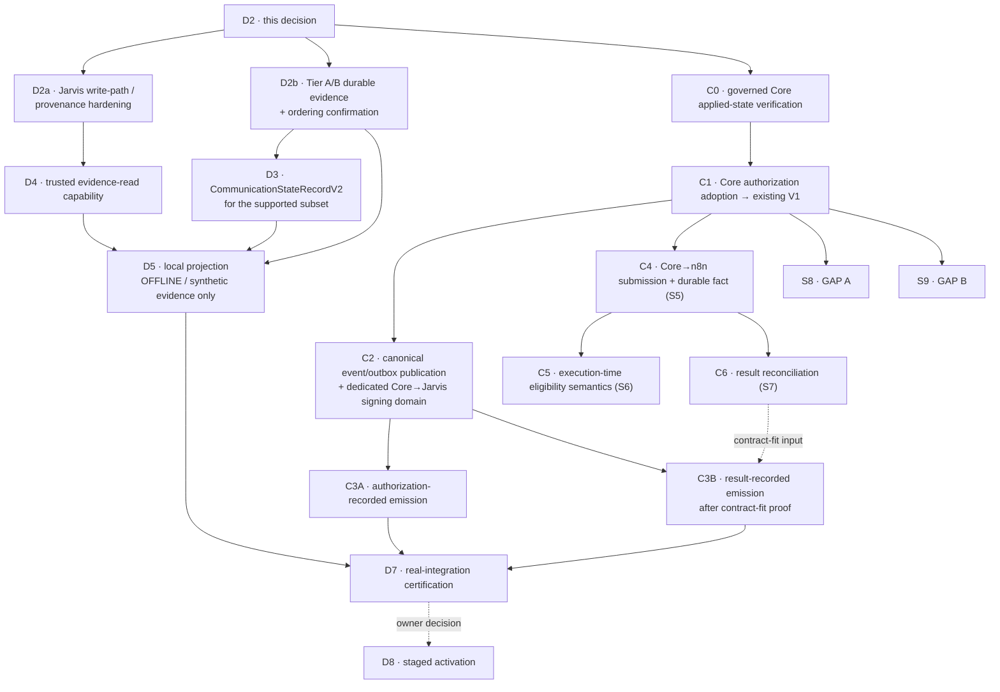

# QFJ-P10 — Core protocol and event adoption plan (D2)

**Status:** **Proposed** under
[ADR-0137](../decisions/ADR-0137-qfj-p10-d2-core-protocol-and-event-gap-decision.md); **PR open, not
merged.** **Nothing here is implemented, adopted, connected or activated.**
**Jarvis baseline:** `1c8b4f6a2b4090db816da7dc49654713e8bbcc3b` (merge of PR #177 / ADR-0136)
**Accepted Core evidence pin:** `af7c2bb4f5a83731666fe059e963d1824cddd7b6` — **not re-pinned**

Read with [ADR-0136](../decisions/ADR-0136-qfj-p10-s3-fresh-quickfurno-core-audit.md) and its
[S3 report](../reports/qfj-p10-s3-fresh-core-audit/01-current-core-capability-audit.md), which are the
**frozen fact base** for every decision below.

> **This is an architecture decision, not a specification.** It decides authority, ownership,
> semantics, evidence families, ordering, failure-closed rules and sequence. It invents **no**
> endpoint, URL, header, credential, SQL, schema or event name.

---

## 1. Decision matrix — D2-Q1…Q15

| Q | Decision status | Decision | Authority owner | Source of truth | Future slice | Core change? | Jarvis change? | Migration? | Blocks |
| --- | --- | --- | --- | --- | --- | --- | --- | --- | --- |
| **Q1** prospect ↔ vendor continuity | **DECIDED_NOW** (semantics) + **DEFERRED_TO_NAMED_SLICE** (shape) | Core owns **one durable, unique, idempotent, queryable** correlation. Jarvis already carries **opaque acquisition references** (`caseRef`, `prospectRef`); D2 chooses to **REUSE** them rather than invent a second prospect identifier. **Jarvis format validation is not uniqueness, persistence or identity authority** — see §1.2. | Core | Core | **C-S8** | **YES** | reference carriage only | **CORE-SIDE POSSIBLE — MUST PROVE** | S8 / GAP A |
| **Q2** registration completion | **DECIDED_NOW** + **DEFERRED_TO_NAMED_SLICE** | A **distinct Core business fact** — not auth-account creation, not activation. Core exposes a machine-readable read/receipt for the same correlated acquisition. | Core | Core | **C-S8** | **YES** | consume only | **CORE-SIDE POSSIBLE — MUST PROVE** | S8 |
| **Q3** payment / prospect addressability | **REJECTED_FOR_MVP** | **No prospect-addressable payment layer.** After Q1 yields the Core vendor identity, use Core's vendor-keyed commercial truth. `paid ≠ activated ≠ live`. | Core | Core | — | no | no | **NONE EXPECTED** | — |
| **Q4** authoritative party-live fact | **DECIDED_NOW** + **DEFERRED_TO_NAMED_SLICE** | **One explicit machine-readable "this party is live as a vendor" read**, Core-derivable, not necessarily a new column. `package_status='active'`, `is_active`, `Approved`, auth-enabled are each **insufficient**. Jarvis stores only the Core assertion reference. | Core | Core | **C-S9** | **YES** | reference carriage only | **CORE-SIDE POSSIBLE — MUST PROVE** | S9 / GAP B |
| **Q5** communication authorization | **DECIDED_NOW** + **DEFERRED_TO_NAMED_SLICE** (wire) | **(A)** submission/receipt · **(B)** Core business authorization adapted into the **existing `CommunicationAuthorizationV1`** · **(C)** execution-time re-validation. Core's closed **consent** outcome is **never** returned as the whole authorization. | Core | Core | **C1 → S4** | **YES** | consume + correlate (existing runtime) | **CORE-SIDE POSSIBLE — MUST PROVE** | S4 |
| **Q6** first primitive events | **DECIDED_NOW** (target family) + **DEFERRED** (result readiness) | Exactly **two TARGET families**: `qf.communication.authorization-recorded` and `qf.communication.result-recorded`. **Target selection ≠ emission readiness** — see §2.1 and the **C3A / C3B split**. | Core | Core | **C3A / C3B** | **YES** | consume only | **CORE-SIDE POSSIBLE — MUST PROVE** | Tier-C projection |
| **Q7** dispatch / `execution-submitted` | **DECIDED_NOW** (semantics) + **BLOCKED_BY_MISSING_CORE_TRUTH** (artifact) | Core **actually handed** the authorized execution to the governed n8n boundary **and holds durable evidence** the handoff reached the defined submission boundary. Never request/authorization/intent creation, a generic outbox insert, "attempt started", provider acceptance or delivery. | Core | Core | **C4 / S5** | **YES** | consume only | **CORE-SIDE POSSIBLE — MUST PROVE** | `execution-submitted` |
| **Q8** cancellation | **REJECTED_FOR_MVP** | Core's consent-deny `cancelled` maps to Jarvis **`rejected`**. No authoritative Core cancellation operation exists; none is invented. | Core (future) | Core | future, on product need | **YES (future)** | no | **UNKNOWN** | Jarvis `cancelled` |
| **Q9** expiry | **REJECTED_FOR_MVP** | No owning Core clock or recorded outcome. **`now > expires_at` is never authoritative.** | Core (future) | Core | future | **YES (future)** | no | **UNKNOWN** | Jarvis `expired` |
| **Q10** Tier A/B evidence + ordering | **DECIDED_NOW** (option per state) → **D2b** confirmation | `draft` **C** · `authorization-requested` **A** · `scheduled` **A** · `follow-up-requested` **C** · `human-handoff-required` **C/blocked**. **Option B (separate durable Jarvis log) REJECTED_FOR_MVP.** | mixed | mixed | **D2b** | **YES** for the two A states | yes | **NONE EXPECTED** in Jarvis | D2b, D3, D5 |
| **Q11** channel semantics | **DECIDED_NOW** | Request keeps `proposedChannel`; authorization keeps `authorizedChannel`; Core may refuse before authorizing a channel. **First live runtime is WhatsApp-only**; any other authorized channel **fails closed as unsupported**. No `CommunicationAuthorizationV2`. | Core decides; Jarvis constrains its runtime | Core | **S4 / D5** | no | runtime capability gate | **NONE EXPECTED** | — |
| **Q12** provider result / reconciliation | **DECIDED_NOW** (family) + **DEFERRED** (readiness) | Target family is **`qf.communication.result-recorded`**. Core receives, verifies, normalises, records, then emits. **Jarvis never accepts provider or n8n truth directly.** Emission readiness is gated by **C3B** (§2.1). | Core | Core | **C3B → C6 / S7** | **YES** | consume only | **CORE-SIDE POSSIBLE — MUST PROVE** | S7 |
| **Q13** execution-time eligibility | **DECIDED_NOW** (semantics) + **DEFERRED_TO_C5/S6** (denial evidence) | Core remains **sole authority**, re-evaluated by the execution side **before the external provider effect**. **Jarvis caches no eligibility answer.** A late denial is a **Core-authoritative policy/eligibility outcome, never a provider failure** — but **its durable artifact and lifecycle mapping are NOT yet proved** (§3.2). | Core | Core | **C5 / S6** | **YES** | no cache, no gate | **CORE-SIDE POSSIBLE — MUST PROVE** | S6 |
| **Q14** Core event / outbox capability | **DECIDED_NOW** (gate) + **DEFERRED_TO_NAMED_SLICE** | **A governed Core readiness gate (C0) must verify actual applied-state under Core ownership** before anything relies on event/outbox. Then, if required, apply/align under **Core** migration governance, wire transactionally, publish idempotently — **only then adopted**. Jarvis gets **no database role**. | Core | Core | **C0 → C2** | **YES** | no | **CORE-SIDE POSSIBLE — MUST PROVE** | every Tier-C fact |
| **Q15** signature / trust protocol | **DECIDED_NOW** | Adopt Jarvis's **existing** ingestion trust model: **Ed25519** (`SUPPORTED_ALGORITHM`), domain `qf-jarvis-event-v1`, key purpose **`core-to-jarvis-event`**, with the verifier's key-id/rotation, freshness and replay semantics. **No existing Core webhook or n8n signing key/domain is reused.** **D2a is required regardless.** | shared boundary | — | **C2 + D2a** | **YES** (Core signs) | **D2a** | **NONE EXPECTED** | trusted ingestion |

**Statuses:** `DECIDED_NOW` · `DEFERRED_TO_NAMED_SLICE` · `REJECTED_FOR_MVP` ·
`BLOCKED_BY_MISSING_CORE_TRUTH`. **No item is left "TBD" without a named owner and prerequisite.**

### 1.2 Q1 — what the acquisition references do and do not prove

`AcquisitionCase` carries `caseRef` and `prospectRef` as opaque strings validated against a format
regex. **That is format validation and nothing more.** AVG-1 has **no persistence**, and
`openAcquisitionCase(...)` accepts **caller-provided** opaque refs.

So, precisely:

- Jarvis **already carries** opaque acquisition references, and D2 **reuses** them rather than
  inventing another prospect identifier.
- **Core must establish the durable uniqueness, idempotency and queryability** of the correlation.
- **A shared character grammar proves nothing about semantic compatibility or uniqueness**, and
  **Jarvis infers no uniqueness, persistence or identity authority** from its own schema.
- **Which of `caseRef` / `prospectRef` plays which role** in the Core correlation is **deferred to
  C-S8** unless already semantically fixed elsewhere.

---

## 2. Event adoption matrix

| Candidate event | Exact underlying Core fact | S3 fact status | D2 decision | First consumer | Readiness | Reason |
| --- | --- | --- | --- | --- | --- | --- |
| `qf.communication.authorization-recorded` | Core's authoritative communication authorization / refusal | consent decision + evidence **AUTHORITATIVE_PRESENT**; full business authorization not proved | **TARGET FAMILY — adopt first** | D5 (`rejected`, `authorized`) | **reachable after C1 + C2** → **C3A** | a real Core-owned fact; the only artifact that can carry a lawful refusal |
| `qf.communication.result-recorded` | Core-recorded normalised provider/lifecycle outcome | **AUTHORITATIVE_PRESENT** as rows; event adoption **CANDIDATE_OR_PROPOSED_ONLY** | **TARGET FAMILY — retained**, but **NOT C3-ready** | D5 (provider outcomes) | **blocked until the §2.1 contract-fit gate passes** → **C3B** | the payload is `{ result: CommunicationResultV1 }`, which mandates two execution ids Core has no semantic for |
| `qf.execution.result-recorded` | Core-recorded execution result | **AUTHORITATIVE_PRESENT** | **DEFER** | none proved | later, only on need | would duplicate what `result-recorded` carries for this projection |
| `qf.execution.intent-issued` | — | **NOT ESTABLISHED** — zero ExecutionIntent hits; generic outbox ≠ intent persistence | **DO NOT ADOPT** | — | blocked | **it is not adopted merely because `CommunicationResultV1` references an `executionIntentId`** — see §2.1 |
| `qf.communication.human-handoff-requested` | — | **ABSENT** | **DO NOT ADOPT** | — | blocked | no Core handoff fact exists |
| `qf.communication.human-handoff-recorded` | — | **ABSENT** | **DO NOT ADOPT** | — | blocked | no lifecycle state derivable from it |
| `qf.communication.state-recorded@2` | — | compatibility/history | **RETAIN, DO NOT USE** | — | never for Model 2 | history/compat surface only |
| `qf.communication.state-recorded@3` | — | — | **NOT REQUIRED, NOT SCHEDULED** | — | never under Model 2 | Model 2 needs no Core-authored state event |

**The target event set remains exactly two.** It is not expanded by this correction.

### 2.1 Target family ≠ emission readiness — the C3A / C3B split

`qf.communication.result-recorded` carries exactly `{ result: CommunicationResultV1 }`
(`governance-events.ts`), and there is **no lighter alternative payload**.
`CommunicationResultV1` **always requires**:

`communicationResultId` · `contractVersion` · `communicationId` · **`executionIntentId`** ·
**`executionResultId`** · `issuer` · `lifecycleState` · `outcome` · `recordedAt` · `reasonCode` ·
`correlationId` — plus `failure` where the outcome demands it.

Accepted S3 established that Core has **zero ExecutionIntent semantic** (five term variants, 0 hits)
and that a **generic outbox is not ExecutionIntent persistence**.

> **Therefore current Core provider-result rows are not automatically a lawful
> `CommunicationResultV1`.** C3B must not fabricate `executionIntentId`, `executionResultId`, a failure
> classification, a reason code or a correlation.

**The adoption work therefore splits:**

| Slice | Scope | Prerequisites |
| --- | --- | --- |
| **C3A** | adopt and emit **`authorization-recorded`** | **C1 + C2**, and a lawful `CommunicationAuthorizationV1` adapter |
| **C3B** | adopt and emit **`result-recorded`** | **C2** plus a bounded **Core result-contract-fit / execution-chain correlation proof** establishing where **every** required field comes from — especially `executionIntentId` and `executionResultId` — **without invention**. Its exact dependency on **C4/S5** and/or **C6/S7** is to be made explicit by that slice. |

**Event adoption and artifact existence are separate questions.** Core may need an authoritative
execution-intent/result **artifact** or a compatible correlation identity **without** adopting the
`qf.execution.*` **events**.

---

## 3. Durable state support matrix — first Model-2 projection

**The first durable projection deliberately supports a SUBSET.** It is not an 18-state history.

| # | State | Tier | MVP durable? | Evidence source family | Implementation dependency | Must NOT infer from |
| --- | --- | --- | --- | --- | --- | --- |
| 1 | `draft` | A | **NO** (Option C — runtime/UI only) | none — pre-submission | — | a constructed `CommunicationRequestV1` |
| 2 | `authorization-requested` | B | **CONDITIONAL** (Option A) | Core-recorded **receipt** of a submitted request | D2b + C1 | request construction |
| 3 | `rejected` | C | **YES** | `authorization-recorded` (refusal) | **C3A** + D2a + D4 | a consent outcome treated as the whole authorization |
| 4 | `authorized` | C | **YES** | `authorization-recorded` (authorized) | **C3A** + D2a + D4 | an `ApprovalDecisionV1` |
| 5 | `scheduled` | B | **CONDITIONAL** (Option A) | Core-recorded scheduling **after** authorization | D2b + C1 | `requestedTiming` on a request |
| 6 | `execution-submitted` | C | **NO** — artifact unresolved (Q7) | a future Core durable **submission** fact | C4 / S5 | intent creation, an outbox insert, "attempt started" |
| 7 | `provider-accepted` | C | **YES** | `result-recorded` (`accepted`) | **C3B** + D2a + D4 | an execution intent |
| 8 | `delivered` | C | **YES** | `result-recorded` (`delivered`) | **C3B** + D2a + D4 | provider acceptance |
| 9 | `read` | C | **YES** | `result-recorded` (`read`) | **C3B** + D2a + D4 | delivery |
| 10 | `answered` | C | **NO** — no voice path in Core at the pin | — | Core voice work | any messaging outcome |
| 11 | `no-answer` | C | **NO** — as above | — | Core voice work | — |
| 12 | `busy` | C | **NO** — as above | — | Core voice work | — |
| 13 | `failed` | C | **YES** | `result-recorded` (`failed`) | **C3B** + D2a + D4 | a transport retry |
| 14 | `follow-up-requested` | B | **NO** (Option C) | a later attempt is a **new** request at `draft` | — | the existence of a later request |
| 15 | `human-handoff-required` | B | **NO** (Option C / blocked) | no Core handoff truth | Core handoff workflow | a Jarvis candidate contract |
| 16 | `completed` | C | **NO — `BLOCKED_BY_MISSING_CORE_TRUTH`** (§3.1) | none today | a distinct Core completion fact | **a terminal-looking predecessor** — never derived from `delivered`/`read`/`failed`/`rejected` |
| 17 | `cancelled` | C | **NO** (Q8) | no Core cancellation operation | Core cancellation work | **Core's consent-deny `cancelled` — that is `rejected`** |
| 18 | `expired` | C | **NO** (Q9) | no owning clock | Core expiry work | `now > expires_at` |

### 3.1 `completed` is excluded — Core has no distinct completion fact

Accepted S3 states plainly that Core does **not** model `answered`, `no-answer` or `busy`, and that
**`completed` has no distinct Core representation.** `CommunicationResultV1.lifecycleState` merely
*allows* the value — **contract vocabulary is not Core business truth** — and
`STATES_JARVIS_MAY_NOT_ORIGINATE` lists `completed` as Core-owned, so Jarvis may not author it.

**Therefore:** `completed` must not be derived from a terminal-looking predecessor, must not be
emitted because delivery or failure occurred, and no synthetic completion fact may be created. Future
support needs **a distinct authoritative Core completion fact, a lawful result/event mapping, and
replayable evidence.**

### 3.2 The first durable target, stated plainly

**Durable in the first Model-2 projection — SIX states, all Tier C:**
`rejected` · `authorized` · `provider-accepted` · `delivered` · `read` · `failed`.

**Conditional — TWO (Tier B, pending D2b + C1):** `authorization-requested` · `scheduled`.

**Deliberately excluded — TEN:** `draft`, `execution-submitted`, `answered`, `no-answer`, `busy`,
`follow-up-requested`, `human-handoff-required`, **`completed`**, `cancelled`, `expired`.

**6 + 2 + 10 = 18.** The lifecycle **vocabulary** stays eighteen; the **durable projection** does not.

**Consequences stated, not glossed:** D3 must model the supported subset honestly · **no producer may
emit an unsupported durable state** · **full 18-state deterministic rebuild is NOT a launch gate** ·
an ephemeral state is never described as durable.

---

## 4. Order: implementation ≠ runtime ≠ lifecycle-state

Three orderings are distinct and must not be conflated. **Slice numbering (C4 before C5) is
implementation order, not runtime chronology.**

**Runtime order, per `communication-model.md`:** Core authorizes → Core sends the authorized execution
intent to n8n → n8n/runtime executes → **the runtime re-validates consent/eligibility at execution
time** → provider effect.

**Distinction chain — no arrow collapsed, and this is a chain of DISTINCTIONS, not a claim that every
implementation stage is serialised by these labels:**

```
constructed request
  != submitted to Core
  != initial Core authorization
  != Core→n8n submission
  != execution-side revalidation
  != provider acceptance
  != delivery
```

### 4.1 Where a denial may lawfully land today

The canonical transition graph has **no `authorized → rejected` edge** and **no
`execution-submitted → rejected` edge**. What exists:

| Denial point | Lifecycle mapping | Status |
| --- | --- | --- |
| **Initial Core authorization denial** | `authorization-requested → rejected` | **lawful today** |
| **Scheduled revalidation denial** | `scheduled → rejected` | **lawful today** (the graph has this edge precisely because eligibility is re-checked at the scheduled moment) |
| **Any other post-authorization / execution-time denial** | **no lawful edge exists** | **DEFERRED_TO_C5/S6** |

**D2 does not claim that every execution-time denial is already representable through the adopted
authorization/result semantics.** For MVP, D2 locks only what the architecture proves: initial
authorization precedes dispatch; the runtime performs a second-line check before the provider effect;
a prior authorization is never reusable permission; and **a late denial is a Core-authoritative
policy/eligibility outcome, never a provider failure**.

**C5/S6 must resolve:** what artifact records the second-line denial · whether it lawfully reuses an
existing contract · how it maps into the canonical transition graph · how immediate and scheduled
sends both stay valid · **and it must invent no new edge silently**. If C5 proves the existing graph
cannot represent the required live denial semantics, **that slice raises an ADR-0110 /
communication-model reopen** — **D2 does not preemptively reopen anything, and invents no
`authorized → rejected` or `execution-submitted → rejected` edge.**

Until that is settled, a post-authorization denial **fails closed**: no durable state is emitted for
it.

---

## 5. Protocol boundary matrix

| Boundary | Source | Destination | Authority | Artifact | Trust requirement | Idempotency requirement | Stage | Status now |
| --- | --- | --- | --- | --- | --- | --- | --- | --- |
| Communication request submission | Jarvis | Core | **Core** decides; Jarvis asks | `CommunicationRequestV1` | authenticated Jarvis → Core channel (**shape deferred**) | one request, one `communicationRequestId` | **C1 / S4** | **ABSENT** |
| Authorization response | Core | Jarvis | **Core** | **existing `CommunicationAuthorizationV1`** | Core-authenticated; correlated via the merged runtime | one decision per request; a repeat is the same decision | **C1 / S4** | **ABSENT** |
| Canonical event publication | Core | Jarvis | **Core** | canonical events | **Ed25519**, domain `qf-jarvis-event-v1`, purpose `core-to-jarvis-event`, freshness + replay | `eventId` idempotency; durable-before-publish | **C2 → C3A / C3B** | **CONTRACT ONLY** |
| Execution submission | Core | n8n | **Core** issues; n8n executes | a future Core-owned **durable submission fact** | Core-governed; **the QF-MVP automation transport is NOT this boundary** | at-most-once; replay must not re-dispatch | **C4 / S5** | **NOT ADOPTED** |
| Execution-time revalidation | n8n / QF Communications Runtime | Core | **Core** | a narrow Core decision surface; **denial artifact + lifecycle mapping unresolved** | Core-internal, governed | a denial is a decision, recorded — never retried into an allow | **C5 / S6** | **ABSENT** |
| Provider result ingress | provider / n8n | Core | **Core** normalises and records | webhook receipt → delivery event | signature-gated (**already present in Core**) | provider-event de-duplication (**already present**) | current | **PRESENT in Core** |
| Result reconciliation | Core | Jarvis | **Core** | `qf.communication.result-recorded` | as canonical event publication | `eventId` idempotency | **C3B → C6 / S7** | **ABSENT** |

**No URL, header, credential, payload schema or event name is invented in any row.**

---

## 6. Cross-repo implementation sequence — parallel tracks, no quality bypass



**Mapping to ADR-0132:** C1 → **S4** · C4 → **S5** · C5 → **S6** · C6 → **S7** · S8 → **GAP A** ·
S9 → **GAP B**. **No new major QFJ phase.**

### 6.1 The Jarvis track proceeds offline; the Core track proceeds independently

**This restores ADR-0135's accepted dependency split.** ADR-0135 requires D3 ← D2 + D2b, D4 ← D2a,
D5 ← D3 + D4 + D2b. It does **not** require live Core emissions before D3 or D4 can be built and
tested offline, and D2 does not add that requirement.

| Slice | Entry gate | Live Core needed? |
| --- | --- | --- |
| **D2a** | D2 merged | **NO** |
| **D2b** | D2 merged | **NO** |
| **D3** | **D2 + D2b** — contract/read-model design for the supported subset, using already-published Jarvis contracts | **NO** — and it claims no live emission |
| **D4** | **D2a** — evidence reader over accepted events, exercised with **governed synthetic/test ingestion** | **NO** — and it claims no live Core |
| **D5** | **D3 + D4 + D2b** — offline projection for the supported subset, certified against **synthetic accepted Core-shaped events** | **NO** — **remains NOT LIVE and NOT ACTIVATED** |
| **C0 … C6** | Core governance, scheduled independently | yes, by definition |

> **Live-integration gate:** **D5** *plus* the applicable **C3A / C3B / C4 / C5 / C6** work must all
> land before **D7** real-integration certification, and **D8** activation stays separately governed.
> **D5 passing synthetic tests does not make it production-ready.**

### 6.2 The next execution wave after D2 merges

> **Jarvis wave: D2a and D2b IN PARALLEL.**
> **Core-side: C0 may be scheduled independently under Core governance.**

If a single "first implementation slice" must be named administratively, **D2a is the first executable
Jarvis implementation slice** — but that **must not block starting the docs/design-only D2b at the
same time in an isolated worktree**. Each PR still gets its own exact baseline, tests, CI and owner
review; **no worktree is merged into another and none is silently rebased.**

**Three cautions:** D2a landing does not mean events are live · **D5 is offline until Core integration
lands** · Core adoption stays gated on C0 → C2 → C3A/C3B.

### 6.3 Migration posture per slice

| Slice | Migration need |
| --- | --- |
| D2 (this) | **NONE — none allocated.** `0013` is not reserved. |
| D2a | **NONE EXPECTED** — code-capability containment first |
| D2b | **NONE EXPECTED** (Option B rejected) |
| C0 | **NONE** — verification only |
| C1, C2, C3A, C3B, C4, C5, C6 | **CORE-SIDE POSSIBLE — MUST PROVE**, under Core migration governance |
| D3, D4, D5 | **POSSIBLE — MUST PROVE** |

**No number is reserved anywhere.** The Jarvis `0010`–`0012` ledger drift remains separate governance
debt, **not repaired here**.

---

## 7. Posture

No production code. No contract, event registry, event-backbone, ingestion or projection change. No
Core modification, branch or PR. No managed Supabase. No n8n or provider access. No message sent. **No
migration allocated.**

**Production rollout remains OFF. Runtime activation is unchanged.**
