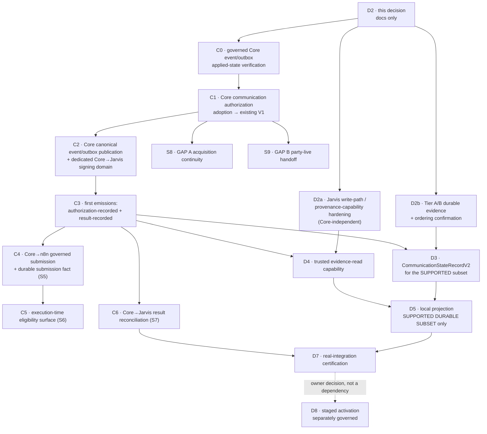

# QFJ-P10 — Core protocol and event adoption plan (D2)

**Status:** **Proposed** under
[ADR-0137](../decisions/ADR-0137-qfj-p10-d2-core-protocol-and-event-gap-decision.md); **PR open, not
merged.** **Nothing here is implemented, adopted, connected or activated.**
**Jarvis baseline:** `1c8b4f6a2b4090db816da7dc49654713e8bbcc3b` (merge of PR #177 / ADR-0136)
**Accepted Core evidence pin:** `af7c2bb4f5a83731666fe059e963d1824cddd7b6` — **not re-pinned**

Read with [ADR-0136](../decisions/ADR-0136-qfj-p10-s3-fresh-quickfurno-core-audit.md) and its
[S3 report](../reports/qfj-p10-s3-fresh-core-audit/01-current-core-capability-audit.md), which are the
**frozen fact base** for every decision below.

> **This is an architecture decision, not a specification.** It decides authority, ownership,
> semantics, evidence families, ordering, failure-closed rules and sequence. It invents **no**
> endpoint, URL, header, credential, SQL, schema or event name.

---

## 1. Decision matrix — D2-Q1…Q15

| Q | Decision status | Decision | Authority owner | Source of truth | Future slice | Core change? | Jarvis change? | Migration? | Blocks |
| --- | --- | --- | --- | --- | --- | --- | --- | --- | --- |
| **Q1** prospect ↔ vendor continuity | **DECIDED_NOW** (semantics) + **DEFERRED_TO_NAMED_SLICE** (shape) | Core owns **one durable, unique, idempotent, queryable** correlation between Jarvis's **existing** `prospectRef`/`caseRef` and the Core vendor identity. **Reuse the existing Aarohi `AcquisitionCase` refs — do not invent a second prospect id.** | Core | Core | **C-S8** | **YES** | reference storage only | **CORE-SIDE POSSIBLE — MUST PROVE** | S8 / GAP A |
| **Q2** registration completion | **DECIDED_NOW** (semantics) + **DEFERRED_TO_NAMED_SLICE** | Registration completion is a **distinct Core business fact** — not auth-account creation, not activation. Core exposes a machine-readable read/receipt for the **same correlated** acquisition. | Core | Core | **C-S8** | **YES** | consume only | **CORE-SIDE POSSIBLE — MUST PROVE** | S8 |
| **Q3** payment / prospect addressability | **REJECTED_FOR_MVP** | **No prospect-addressable payment layer.** Once Q1 yields the Core vendor identity, use Core's existing vendor-keyed commercial truth. `paid ≠ activated ≠ live`; an order being `created` implies no payment state. | Core | Core | — | no | no | **NONE EXPECTED** | — |
| **Q4** authoritative party-live fact | **DECIDED_NOW** (semantics) + **DEFERRED_TO_NAMED_SLICE** | Core exposes **one explicit machine-readable "this party is live as a vendor" decision/read**, which Core **may derive**. It need not be a new column/enum. **`package_status='active'`, `is_active`, `Approved` and auth-enabled are each individually insufficient.** Jarvis stores only the Core assertion reference. | Core | Core | **C-S9** | **YES** | reference storage only | **CORE-SIDE POSSIBLE — MUST PROVE** | S9 / GAP B |
| **Q5** communication authorization | **DECIDED_NOW** (semantics) + **DEFERRED_TO_NAMED_SLICE** (wire) | Three separate concepts: **(A)** request **submission/receipt**; **(B)** Core **business authorization** adapted into the **existing `CommunicationAuthorizationV1`**; **(C)** **execution-time eligibility**, re-evaluated later. The Core **consent** outcome must **never** be returned as if it were the whole authorization. | Core | Core | **C1 → S4** | **YES** | consume + correlate (existing runtime) | **CORE-SIDE POSSIBLE — MUST PROVE** | S4 |
| **Q6** first primitive events | **DECIDED_NOW** | Adopt exactly **two** first: `qf.communication.authorization-recorded` and `qf.communication.result-recorded`. All others deferred or rejected — see §2. | Core | Core | **C3** | **YES** | consume only | **CORE-SIDE POSSIBLE — MUST PROVE** | Tier-C projection |
| **Q7** dispatch / `execution-submitted` | **DECIDED_NOW** (semantics) + **BLOCKED_BY_MISSING_CORE_TRUTH** (artifact) | `execution-submitted` means **Core actually handed the authorized execution to the governed n8n boundary AND holds durable Core evidence the handoff reached the defined submission boundary.** It is **not** request creation, authorization, intent creation, a generic outbox insert, "attempt started", provider acceptance or delivery. | Core | Core | **C4 / S5** | **YES** | consume only | **CORE-SIDE POSSIBLE — MUST PROVE** | `execution-submitted` |
| **Q8** cancellation | **REJECTED_FOR_MVP** | **Jarvis `cancelled` is NOT produced in the first durable projection.** Core's consent-deny `cancelled` maps to Jarvis **`rejected`**. No authoritative Core cancellation operation exists and none is invented. | Core (future) | Core | future, on product need | **YES (future)** | no | **UNKNOWN** | Jarvis `cancelled` |
| **Q9** expiry | **REJECTED_FOR_MVP** | **Jarvis `expired` is NOT produced in the first durable projection.** No owning Core clock or recorded expiry outcome exists. **`now > expires_at` is never authoritative.** | Core (future) | Core | future | **YES (future)** | no | **UNKNOWN** | Jarvis `expired` |
| **Q10** Tier A/B evidence + ordering | **DECIDED_NOW** (per-state option) → **DEFERRED_TO_NAMED_SLICE** (D2b confirmation) | `draft` **C** · `authorization-requested` **A** · `scheduled` **A** · `follow-up-requested` **C** · `human-handoff-required` **C/blocked**. **Option B (a separate durable Jarvis coordination log) is REJECTED_FOR_MVP.** | mixed (see §3) | mixed | **D2b** | **YES** for the two A states | yes | **NONE EXPECTED** in Jarvis | D2b, D3, D5 |
| **Q11** channel semantics | **DECIDED_NOW** | Request keeps `proposedChannel`; `CommunicationAuthorizationV1` keeps `authorizedChannel`; Core may refuse before authorizing any channel. **First live runtime is WhatsApp-only.** A non-WhatsApp authorized channel **fails closed as unsupported for execution** — never silently re-routed. **No `CommunicationAuthorizationV2`.** | Core decides; Jarvis constrains its own runtime | Core | **S4 / D5** | no | runtime capability gate | **NONE EXPECTED** | — |
| **Q12** provider result / reconciliation | **DECIDED_NOW** | First Core → Jarvis authoritative result primitive is **`qf.communication.result-recorded`**. Core receives, verifies, normalises, records, then emits. **Jarvis never accepts provider or n8n truth directly and stores no raw provider payload.** | Core | Core | **C3 → C6 / S7** | **YES** | consume only | **CORE-SIDE POSSIBLE — MUST PROVE** | S7 |
| **Q13** execution-time eligibility | **DECIDED_NOW** (semantics) + **DEFERRED_TO_NAMED_SLICE** | Core remains **sole authority** and is re-evaluated **immediately before governed dispatch** — consent/suppression, purpose/scope, channel eligibility, and current policy/frequency/attempt controls where authoritative. **Jarvis caches no eligibility answer, ever.** A denial there is a **Core decision** recorded through the adopted result/authorization semantics — **never** downgraded to a provider failure. | Core | Core | **C5 / S6** | **YES** | no cache, no gate | **CORE-SIDE POSSIBLE — MUST PROVE** | S6 |
| **Q14** Core event / outbox capability | **DECIDED_NOW** (gate) + **DEFERRED_TO_NAMED_SLICE** | **A governed Core readiness gate must verify actual applied-state under Core ownership before anything relies on event/outbox.** S3 explicitly did not certify live state. Then, if required, apply/align under **Core** migration governance, wire business facts transactionally, publish idempotently — **only then is the capability "adopted".** Jarvis gets **no database role**. | Core | Core | **C0 → C2** | **YES** | no | **CORE-SIDE POSSIBLE — MUST PROVE** | every Tier-C fact |
| **Q15** signature / trust protocol | **DECIDED_NOW** | Core → Jarvis delivery **adopts Jarvis's existing canonical ingestion trust model**: **Ed25519** (`SUPPORTED_ALGORITHM`), domain separator `qf-jarvis-event-v1`, key purpose **`core-to-jarvis-event`** — a **dedicated trust domain that already exists in Jarvis** — with the verifier's key-id/rotation, freshness and replay semantics. **No existing Core webhook or n8n signing key/domain is reused.** **D2a remains required regardless.** | shared boundary | — | **C2 + D2a** | **YES** (Core signs) | **D2a** | **NONE EXPECTED** (code containment first) | trusted ingestion |

**Statuses used:** `DECIDED_NOW` · `DEFERRED_TO_NAMED_SLICE` · `REJECTED_FOR_MVP` ·
`BLOCKED_BY_MISSING_CORE_TRUTH`. **No item is left "TBD" without a named owner and prerequisite.**

### 1.1 Per-question detail carried by ADR-0137

For each question ADR-0137 records the S3 evidence, the authority and artifact owner, the system of
record, what Jarvis may store, **what Jarvis may never infer or cache**, the implementation owner, the
dependency, Core/Jarvis change need, migration need (never allocated), the exact **failure-closed**
behaviour, and what stays deliberately unresolved.

---

## 2. Event adoption matrix

| Candidate event | Exact underlying Core fact | S3 fact status | D2 decision | First consumer | Adopt | Reason |
| --- | --- | --- | --- | --- | --- | --- |
| `qf.communication.authorization-recorded` | Core's authoritative communication authorization / refusal for one request | consent decision + evidence **AUTHORITATIVE_PRESENT**; full business authorization not proved | **ADOPT FIRST** | D5 Tier-C projection (`rejected`, `authorized`) | **now (C3)** | a real Core-owned fact; the only artifact that can carry a lawful refusal; unlocks the two states ADR-0134 proved unrepresentable |
| `qf.communication.result-recorded` | Core-recorded normalised provider/lifecycle outcome | **AUTHORITATIVE_PRESENT** (`accepted, sent, delivered, read, failed`; append-only trace) | **ADOPT FIRST** | D5 Tier-C projection (provider outcomes, `completed`) | **now (C3)** | Core already distinguishes `accepted` from `delivered`; single source for every provider outcome |
| `qf.execution.result-recorded` | Core-recorded execution result | **AUTHORITATIVE_PRESENT** | **DEFER** | none proved | later, only on need | would **duplicate** what `communication.result-recorded` already carries for the communication projection |
| `qf.execution.intent-issued` | — | **NOT ESTABLISHED** — zero ExecutionIntent hits in Core; generic outbox ≠ intent persistence | **DO NOT ADOPT NOW** | — | blocked | no Core semantic exists; adopting it would fabricate truth, and issuance ≠ dispatch (Q7) |
| `qf.communication.human-handoff-requested` | — | **ABSENT** — no Core handoff table or service | **DO NOT ADOPT** | — | blocked | Core truth absent; a Jarvis contract does not create a Core fact |
| `qf.communication.human-handoff-recorded` | — | **ABSENT** | **DO NOT ADOPT** | — | blocked | no lifecycle state is currently derivable from it |
| `qf.communication.state-recorded@2` | — | compatibility/history | **RETAIN, DO NOT USE** | — | never for Model 2 | history/compat surface only; not the Model-2 source |
| `qf.communication.state-recorded@3` | — | — | **NOT REQUIRED, NOT SCHEDULED** | — | never under Model 2 | Model 2 needs no Core-authored state event |

**Rule applied throughout:** *a contract existing in `@qf-jarvis/contracts` is never a reason to
adopt.* Adoption requires a real Core-owned fact **and** a concrete consumer.

---

## 3. Durable state support matrix — first Model-2 projection

**The first durable projection deliberately supports a SUBSET.** It is not an 18-state history, and
this document does not pretend otherwise.

| # | State | Tier | MVP durable? | Evidence source family | Current / future | Implementation dependency | Must NOT infer from |
| --- | --- | --- | --- | --- | --- | --- | --- |
| 1 | `draft` | A | **NO** (Option C — runtime/UI only) | none — pre-submission | current | — | a constructed `CommunicationRequestV1` |
| 2 | `authorization-requested` | B | **CONDITIONAL** (Option A) | Core-recorded **receipt of a submitted request** | future | C1 / S4 | request construction |
| 3 | `rejected` | C | **YES** | `authorization-recorded` (refusal) | future | C3 + D2a + D4 | a consent outcome treated as the whole authorization |
| 4 | `authorized` | C | **YES** | `authorization-recorded` (authorized) | future | C3 + D2a + D4 | an `ApprovalDecisionV1` |
| 5 | `scheduled` | B | **CONDITIONAL** (Option A) | Core-recorded scheduling **after** authorization | future | D2b + C1 | `requestedTiming` on a request |
| 6 | `execution-submitted` | C | **NO** — evidence unresolved (Q7) | a future Core durable **submission** fact | future | C4 / S5 | intent creation, an outbox insert, "attempt started" |
| 7 | `provider-accepted` | C | **YES** | `result-recorded` (`accepted`) | future | C3 + D2a + D4 | an execution intent |
| 8 | `delivered` | C | **YES** | `result-recorded` (`delivered`) | future | C3 + D2a + D4 | provider acceptance |
| 9 | `read` | C | **YES** | `result-recorded` (`read`) | future | C3 + D2a + D4 | delivery |
| 10 | `answered` | C | **NO** — no voice path in Core at the pin | — | future | Core voice work | any messaging outcome |
| 11 | `no-answer` | C | **NO** — as above | — | future | Core voice work | — |
| 12 | `busy` | C | **NO** — as above | — | future | Core voice work | — |
| 13 | `failed` | C | **YES** | `result-recorded` (`failed`) | future | C3 + D2a + D4 | a transport retry |
| 14 | `follow-up-requested` | B | **NO** (Option C) | — a later attempt is a **new** `CommunicationRequestV1` at `draft` | current | — | the mere existence of a later request |
| 15 | `human-handoff-required` | B | **NO** (Option C / blocked) | — no Core handoff truth | future | Core handoff workflow | a Jarvis candidate contract |
| 16 | `completed` | C | **YES** | `result-recorded` (`completed`) | future | C3 + D2a + D4 | a terminal-looking predecessor |
| 17 | `cancelled` | C | **NO** (Q8) | — no Core cancellation operation | future | Core cancellation work | **Core's consent-deny `cancelled` — that is `rejected`** |
| 18 | `expired` | C | **NO** (Q9) | — no owning clock | future | Core expiry work | `now > expires_at` |

### 3.1 The first durable target, stated plainly

**Durable in the first Model-2 projection (7 states, all Tier C, all from the two adopted events):**
`rejected` · `authorized` · `provider-accepted` · `delivered` · `read` · `failed` · `completed`.

**Conditional (2, Tier B, pending D2b + C1):** `authorization-requested` · `scheduled`.

**Deliberately excluded (9):** `draft`, `execution-submitted`, `answered`, `no-answer`, `busy`,
`follow-up-requested`, `human-handoff-required`, `cancelled`, `expired`.

**Consequences that must be stated, not glossed:**

- The lifecycle **vocabulary** remains all eighteen. The **durable projection** does not.
- **D3 must model the supported durable subset honestly** and must not fake completeness.
- **No producer may emit an unsupported durable state.**
- **Full 18-state deterministic rebuild is NOT a launch gate** — the excluded states are excluded by
  decision, not by accident.
- An ephemeral state is **never** described as durable.

---

## 4. Protocol boundary matrix

| Boundary | Source | Destination | Authority | Artifact | Trust requirement | Idempotency requirement | Stage | Status now |
| --- | --- | --- | --- | --- | --- | --- | --- | --- |
| Communication request submission | Jarvis | Core | **Core** decides; Jarvis only asks | `CommunicationRequestV1` | authenticated Jarvis → Core channel (**shape deferred**) | one request, one `communicationRequestId`; replay is one logical submission | **C1 / S4** | **ABSENT** |
| Authorization response | Core | Jarvis | **Core** | **existing `CommunicationAuthorizationV1`** | Core-authenticated response; correlated via the merged authorization runtime | one decision per request; a repeat is the same decision, never a new grant | **C1 / S4** | **ABSENT** |
| Canonical event publication | Core | Jarvis | **Core** | `CanonicalEventEnvelope`-shaped canonical events | **Ed25519**, domain `qf-jarvis-event-v1`, key purpose `core-to-jarvis-event`, freshness + replay per the existing verifier | `eventId` idempotency; durable-before-publish | **C2 → C3** | **CONTRACT ONLY** |
| Execution submission | Core | n8n | **Core** issues; n8n executes | a future Core-owned **durable submission fact** | Core-governed; **the existing QF-MVP automation transport is NOT this boundary** | at-most-once submission; replay must not re-dispatch | **C4 / S5** | **NOT ADOPTED** |
| Execution-time eligibility | n8n / QF Communications Runtime | Core | **Core** | a narrow Core decision surface | Core-internal, governed | a denial is a decision, recorded — not retried into an allow | **C5 / S6** | **ABSENT** |
| Provider result ingress | provider / n8n | Core | **Core** normalises and records | webhook receipt → delivery event | signature-gated (**already present in Core**) | provider-event de-duplication (**already present**) | current | **PRESENT in Core** |
| Result reconciliation | Core | Jarvis | **Core** | `qf.communication.result-recorded` | as canonical event publication | `eventId` idempotency | **C3 → C6 / S7** | **ABSENT** |

**No URL, header, credential, payload schema or event name is invented in any row.**

---

## 5. Cross-repo implementation sequence

**Mapping back to ADR-0132:** C1 → **S4** · C4 → **S5** · C5 → **S6** · C6 → **S7** · S8 → **GAP A** ·
S9 → **GAP B**. **No new major QFJ phase is created**; C0–C6, D2a, D2b and D3–D5 are ADR-local
architecture labels under QFJ-P10/P09.

### 5.1 Entry gates

| Slice | Entry gate |
| --- | --- |
| **D2a** | D2 merged. **Core-independent — no Core dependency at all.** |
| **C0** | D2 merged. Read-only verification **under Core governance**; S3 documentation is not a substitute. |
| **C1** | C0 complete. Adapts Core's authoritative decision into the **existing** `CommunicationAuthorizationV1`. |
| **C2** | C0 + C1. Publication foundation **and** the dedicated Core → Jarvis signing domain. |
| **C3** | C2. Emits exactly the two adopted primitives. |
| **D2b** | D2 merged. **Bounded confirmation** of §3's A/C choices — not an open architecture debate. |
| **D3** | **D2b + C3** — the durable subset and its evidence families must be settled first. |
| **D4** | **D2a + C3** — hardened write path **and** an adopted event family. |
| **D5** | **D3 + D4 + D2b** — and it may emit **only** the supported durable subset. |
| **S8 / S9** | C1 plus their own Core adoption work. |

### 5.2 Migration posture per slice

| Slice | Migration need |
| --- | --- |
| D2 (this) | **NONE — and none is allocated.** `0013` is not reserved. |
| D2a | **NONE EXPECTED** — code-capability containment first; DB role/grant hardening only if that slice proves it |
| C0 | **NONE** — verification only |
| C1, C2, C3, C4, C5, C6 | **CORE-SIDE POSSIBLE — MUST PROVE**, under Core migration governance |
| D2b | **NONE EXPECTED** (Option B rejected) |
| D3, D4, D5 | **POSSIBLE — MUST PROVE** |

**No number is reserved anywhere.** The Jarvis `0010`–`0012` ledger drift remains separate governance
debt and is **not** repaired here.

### 5.3 The next slice after D2 merges

**D2a — accepted-event write-path / provenance-capability hardening.**

It is **Core-independent**, already **mandatory** under ADR-0135, and blocks D4. Nothing about the
Core adoption track has to be settled first.

**Three cautions that travel with it:** D2a landing does **not** mean events are live; **D4 and D5 may
not proceed merely because D2a lands** (they additionally need an adopted event family, and D5 needs
D3 + D2b); and **Core adoption remains separately gated** on C0 → C3.

---

## 6. Posture

No production code. No contract, event registry, event-backbone, ingestion or projection change. No
Core modification, branch or PR. No managed Supabase. No n8n or provider access. No message sent. **No
migration allocated.**

**Production rollout remains OFF. Runtime activation is unchanged.**
