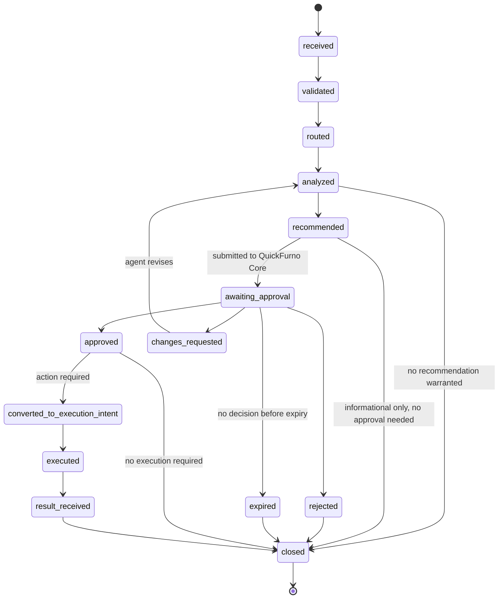

# Recommendation Lifecycle — QF Jarvis

**Status:** Phase 0 — Approved
**Date:** 2026-07-11

Ownership follows [system-boundary.md](./system-boundary.md), which is authoritative.

---

## The states

| State | Meaning | Who moves it |
| --- | --- | --- |
| **received** | A canonical event has arrived at Jarvis and been accepted | QF Jarvis |
| **validated** | The event passed schema, signature, and idempotency checks | QF Jarvis |
| **routed** | Jarvis has decided which specialist, if any, should analyze it | QF Jarvis |
| **analyzed** | The specialist has run and reached a conclusion | Specialist agent |
| **recommended** | A structured recommendation exists, with evidence, rationale, confidence, risk, priority, expiry, and required approval | Specialist agent |
| **awaiting approval** | The recommendation has been submitted into QuickFurno Core's authorization path. A human may act on it from the Jarvis Control Plane — which **submits an approval request** to Core and waits. **While in flight it stays here; it does not optimistically become `approved`** | QuickFurno Core |
| **approved** | QuickFurno Core validated the request — identity, authority, current state, risk policy, expiry, eligibility — authorized it, recorded the authoritative decision, and emitted the decision event. **Jarvis enters this state only on receiving that authoritative response** | QuickFurno Core (on a human's or a policy's decision) |
| **rejected** | An authorized decider declined it | Human approver or policy, recorded by Core |
| **changes requested** | A decider wants it revised before deciding | Human approver, recorded by Core |
| **expired** | It went stale before a decision was made. **Not approved.** Nothing happens | Time |
| **converted to execution intent** | Core has produced a bounded, expiring execution intent from the approval | QuickFurno Core |
| **executed** | n8n has attempted the intent against a provider | n8n |
| **result received** | The execution result has returned to Core and reached Jarvis as an event | QuickFurno Core → QF Jarvis |
| **closed** | The lifecycle is finished and the outcome is recorded for evaluation | QF Jarvis |

---

## Lifecycle diagram

---

## Rules that hold at every state

1. **Nothing before `approved` can cause an effect.** A recommendation in any earlier state is inert by construction.
2. **`expired` is not `approved`.** There is no timeout-to-yes anywhere in this system. Silence is not consent.
3. **Jarvis never sets `approved` itself.** A human clicking approve in the Jarvis Control Plane produces an **approval request**, not an approval. The state changes only when QuickFurno Core's authoritative decision comes back — and Core, validating against its own truth, may say no ([execution-governance.md](./execution-governance.md) §2a).
4. **Only `approved` recommendations may become execution intents.** The conversion happens in QuickFurno Core, from an authorization decision Core itself recorded.
5. **Not every recommendation needs execution.** Many close after a human reads them and acts in the real world. See below.
6. **Every transition is attributable and recorded.** Who or what moved it, when, and why. This is what makes the audit trail complete ([auditability-principles.md](../governance/auditability-principles.md)).
7. **Correlation survives the whole chain.** Source events → recommendation → approval decision → execution intent → execution result → closure all carry the same correlation identifier.
8. **Rejection is signal, not failure.** A rejected recommendation feeds evaluation. An agent whose recommendations are consistently rejected is an agent to fix or retire.

---

## Not every recommendation requires execution

This is worth stating plainly, because a lifecycle diagram invites the assumption that every path ends at a provider. Most do not.

A recommendation may be **informational** — "verified lead rate in Pune for carpentry dropped this week, here is the evidence" — and close as soon as a human has read it. It may be **advisory to a person** — "manually verify this lead" — where the human does the work themselves and no execution intent is ever created. It may be **suppressed** by Jarvis during consolidation because a better recommendation already covers the same underlying situation.

Only recommendations that propose an *action against a client, vendor, ad account, or other external system* need to travel the full path through approval, intent, n8n, and a provider.

---

## Worked examples

### Kabir recommends manual lead verification

An incoming lead has a plausible category but an implausible budget for that category in that part of Pune, an unreachable phone format, and a submission pattern matching prior spam.

- **received → validated → routed → analyzed → recommended.**
- Kabir emits: subject = the lead, evidence = the five specific signals, rationale = why they compound, confidence, risk = *moderate — a false positive delays a real lead*, priority = high (leads decay fast), expiry = short.
- The recommendation goes to Operations as an attention item. An operator verifies manually.
- **No execution intent is created.** A human did the work. The lifecycle closes at `closed`, and the outcome (was the lead really bad?) feeds Kabir's evaluation.

### Riya recommends client follow-up

A client submitted a requirement four days ago, was contacted once, and has gone quiet. The requirement is high-value and the category has a long consideration cycle.

- Riya emits a recommendation: subject = the client, proposed action = a follow-up message, with recommended timing and channel, evidence = the requirement, the contact attempt, and the silence.
- **awaiting approval** — this reaches a real client, so it requires approval. A client-support team member approves within an approved template.
- **approved → converted to execution intent** by QuickFurno Core: bounded (this client, this channel, this content, expires in N hours).
- **executed** by n8n via the communication provider. **result received.** **closed.**
- Riya never sent anything. She proposed; a human authorized; n8n delivered.

### Anisha recommends vendor reactivation

A vendor onboarded, completed 60% of their profile, never activated, and has not logged in for three weeks. Their category and city are ones where lead supply currently exceeds verified vendor capacity.

- Anisha emits a recommendation: subject = the vendor, proposed action = a reactivation conversation, evidence = the profile gaps, the inactivity, and the supply-demand context.
- Approval by the sales/vendor-acquisition team. If the recommendation had proposed anything touching **wallet, package, or payment**, it would escalate to stronger approval — those are money.
- Approved → intent → n8n → provider → result → closed.

### Jitin recommends campaign budget review

A campaign's lead volume is steady but its cost per **verified** lead has risen sharply in one city-category pair, while a second pair is under-funded relative to demand.

- Jitin emits a recommendation: subject = the campaign, proposed action = a budget shift, evidence = the verified-lead economics by city and category, the trend, and the demand signal.
- **This is money.** It requires stronger approval — the founder or an administrator with explicit authority ([execution-governance.md](./execution-governance.md)).
- If approved, QuickFurno Core issues a bounded execution intent and n8n applies the change at the advertising provider. If not approved, nothing changes. Jitin has no path to the ad account.

### Jarvis consolidates founder priorities

Kabir has flagged a rise in implausible leads. Jitin has flagged a campaign whose cost per verified lead is climbing. Anisha has flagged vendors in the same city losing trust and letting packages lapse.

- Jarvis recognizes these as **one situation**, not three: a campaign is producing low-quality leads, vendors are paying for them, and vendor trust is eroding.
- It assembles a **composite recommendation** — a single founder attention item, ranked high, carrying all three agents' evidence, with a course of action that spans domains.
- **Each contributor stays attributable.** Kabir owns the lead-quality conclusion, Jitin the campaign conclusion, Anisha the vendor conclusion. Jarvis connected them; it did not conclude anything about leads, campaigns, or vendors, and it did not absorb anyone's ownership ([agent-model.md](./agent-model.md)).
- The founder sees **one item**, not three notifications — which is the entire point of the coordination layer.

---

## What the lifecycle guarantees

Given any real-world effect — a message a client received, a budget that changed — you can walk backwards: result → execution → intent → approval decision (attributable to a person or an explicit policy) → recommendation → rationale → evidence → the canonical events that started it.

If any link in that chain is missing, it is an incident, not a gap in the documentation. See [auditability-principles.md](../governance/auditability-principles.md).
