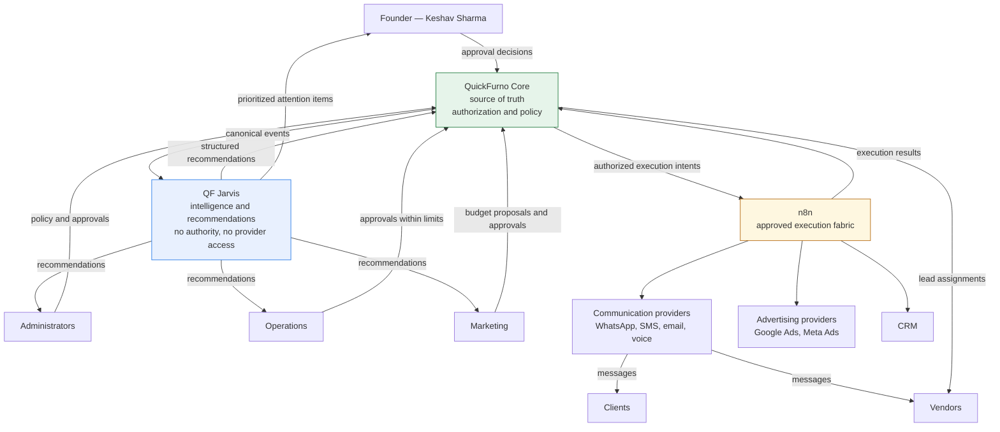
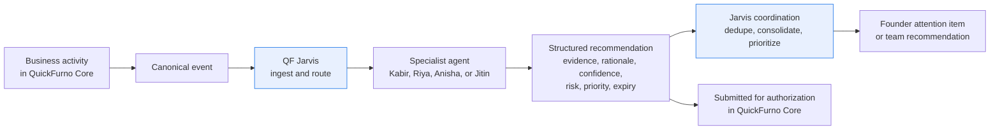
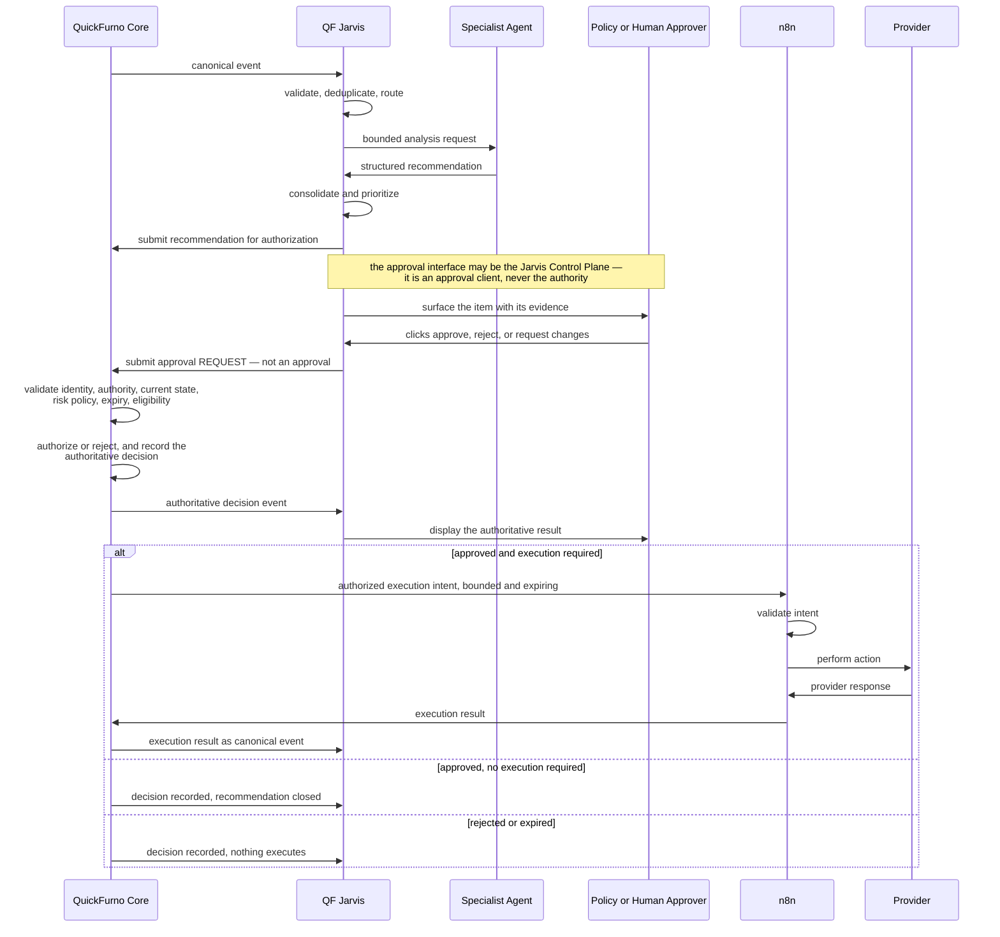

# System Context — QF Jarvis

**Status:** Phase 0 — Approved
**Date:** 2026-07-11

This document describes the systems and actors around QF Jarvis, and how information moves between them. Ownership statements here are summaries; the authoritative source is [system-boundary.md](./system-boundary.md).

---

## Actors and systems

### Systems

| System | Role |
| --- | --- |
| **QuickFurno Core** | Source of truth. Owns business state, authorization, and policy. Emits canonical events. Records approval decisions, execution intents, and execution results. |
| **QF Jarvis** | Intelligence layer. Consumes canonical events, runs specialist agents, produces structured recommendations, prioritizes founder attention. No authority, no provider access. |
| **n8n** | Approved execution fabric. Validates and executes authorized execution intents. Reports results back to QuickFurno Core. |
| **Communication providers** | WhatsApp, SMS, email, voice. Deliver messages. Reached only by n8n. |
| **Advertising providers** | Google Ads, Meta Ads. Deliver campaign and spend changes. Reached only by n8n. |
| **CRM** | External record-keeping integration. Reached only by n8n. |

### Human actors

| Actor | Interaction |
| --- | --- |
| **Founder** (Keshav Sharma) | Reads the prioritized command view and briefings. Approves high-risk and money-related actions. |
| **Administrators** | Configure policy in QuickFurno Core. Approve within delegated limits. |
| **Operations** | Act on lead-quality and verification recommendations. |
| **Marketing** | Act on campaign, channel, and budget recommendations. |
| **Clients** | Subjects of the system. Never users of Jarvis. Receive authorized, executed communications. |
| **Vendors** | Subjects of the system. Never users of Jarvis. Receive authorized, executed communications and, from QuickFurno Core, lead assignments. |

Sales/vendor-acquisition and client-support teams are covered in [stakeholders-and-personas.md](../charter/stakeholders-and-personas.md); they interact with Jarvis exactly as Operations and Marketing do — they receive recommendations and approve within delegated limits.

---

## System context diagram

Read the diagram for what is **absent**: there is no edge from QF Jarvis to any provider, and no edge from QF Jarvis to n8n. Those absences are the architecture.

---

## High-level information flow

Two things worth noting. First, a recommendation may reach a human *without* ever needing execution — "manually verify this lead" is advice to a person, not an action to run. Second, prioritization is a Jarvis responsibility, but authorization never is.

---

## Recommendation and execution flow

The sequence makes the invariant visible: **the only path from a recommendation to a real-world effect runs through QuickFurno Core.** Jarvis cannot short-circuit it, because Jarvis has no edge to n8n and no credentials for any provider.

Note the approval round trip. The approver interacts with **Jarvis**, because that is where the evidence is — but the click produces an **approval request**, and Core is what validates, decides, records, and emits. Jarvis then *displays* an outcome it did not choose, and which may be a rejection. Hosting the button is not holding the authority ([execution-governance.md](./execution-governance.md) §2a, [ADR-0007](../decisions/ADR-0007-founder-approval-interface-and-authority.md)).

---

## What this context deliberately excludes

- **Jarvis → provider.** Does not exist. Jarvis holds no provider credentials.
- **Jarvis → n8n.** Does not exist. Execution intents originate from QuickFurno Core after authorization.
- **Jarvis → Core write path for business state.** Does not exist. Jarvis submits recommendations; it does not mutate leads, clients, vendors, assignments, packages, wallets, or payments.
- **Client/vendor → Jarvis.** Does not exist. They are subjects, not users.
- **Agent → approval.** Does not exist. No agent authorizes anything, including its own output.
- **Jarvis-owned approval decision.** Does not exist. Jarvis may host the approval *interface* and submit an approval *request*; it never records an authoritative decision and never optimistically renders one ([ADR-0007](../decisions/ADR-0007-founder-approval-interface-and-authority.md)).
- **Jarvis → WhatsApp, and Jarvis → telephony.** Do not exist. Jarvis may originate a communication *request*; it holds no provider credential, connects to no WhatsApp API and no telephony provider, and never writes `delivered` or `completed` ([communication-model.md](./communication-model.md), [ADR-0008](../decisions/ADR-0008-controlled-communication-capability.md)).
- **Agent → model provider.** Does not exist. When model reasoning is warranted, an agent calls the **internal model gateway** — a Gemma-first, model-independent runtime introduced in **Phase 4.0** — and never a provider directly. No agent holds a provider SDK, base URL, or key; **no consumer AI subscription is a production model backend** ([model-runtime-and-governance.md](./model-runtime-and-governance.md), [ADR-0028](../decisions/ADR-0028-ai-runtime-foundations-and-roadmap-sequencing.md)). This is **approved architecture, not implemented** — no gateway, model, or agent exists in this repository today.

Any future diagram, design, or implementation that introduces one of these edges is a boundary violation and requires a superseding ADR — not a pull request.
