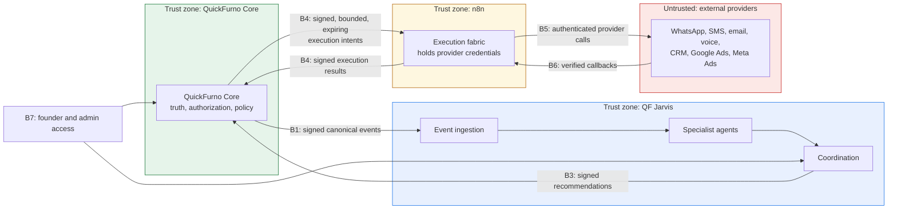

# Trust Boundaries — QF Jarvis

**Status:** Phase 0 — in progress (pending review)
**Date:** 2026-07-11

**No implementation yet.** This document names the boundaries, what crosses them, and what must be true at each crossing. Mechanisms — algorithms, key stores, transport, libraries — are chosen in Phase 1 and Phase 13, not here.

Ownership follows [system-boundary.md](./system-boundary.md), which is authoritative. Principles: [security-principles.md](../governance/security-principles.md).

---

## Boundary map

---

## B1 — QuickFurno Core → QF Jarvis

**What crosses:** canonical events (business facts).

**What must be true:**

- Events are **signed** by Core; Jarvis verifies the signature before processing. An unsigned or badly-signed event is rejected, counted, and alerted — never processed "just in case."
- Events are **versioned**; an unknown version is rejected, not guessed at.
- Ingestion is **idempotent**; the same event delivered twice has the effect of one.
- **Replay protection** applies: events carry a unique identifier and a timestamp; stale or duplicate events are rejected. A legitimate operational replay is a distinct, authorized operation — not an accident of redelivery.
- Events carry **correlation and causation** identifiers.
- Events carry the **minimum personal data** the intelligence layer needs. Core does not push what Jarvis has no reason to hold.

**Threat this defends against:** a forged event stream causing Jarvis to generate malicious recommendations. Note the blast radius even if it succeeds: a bad recommendation still cannot execute, because Jarvis has no execution path. Defense in depth is the point of the boundary design.

---

## B2 — QF Jarvis internal modules

**What crosses:** events between ingestion, coordination, and agents; context into agents; recommendations out.

**What must be true:**

- Agents are **least-privileged**: each receives only the data its domain requires ([data-ownership.md](./data-ownership.md)). Jitin does not get client phone numbers.
- Agents have **no network egress to providers**, and no provider credentials exist inside the Jarvis trust zone to be stolen.
- Agent inputs and outputs are **validated against a contract**. A malformed agent output is a failure, not a value to be coerced.
- **Prompt injection is treated as a live threat.** Lead text, client messages, and vendor profile content are attacker-influencable and enter agent context. A model instructed by hostile content still cannot authorize or execute anything — but it *can* produce a misleading recommendation aimed at a human approver. Therefore: untrusted content is clearly delimited in context, agent outputs are contract-validated, evidence must reference real event identifiers, and approvers see the evidence, not just the conclusion.
- **No chain-of-thought is persisted** anywhere inside this zone.

---

## B3 — QF Jarvis → QuickFurno approval layer

**What crosses:** structured recommendations submitted for authorization, and **approval requests** raised when a human acts in the Jarvis Control Plane.

**What must be true:**

- Submissions and approval requests are **signed** by Jarvis; Core verifies before accepting.
- Core treats both as **untrusted input**, never as instructions. It validates the shape, re-checks the subject against its own truth, and applies its own policy. A recommendation referencing a lead that does not exist, or a vendor in a state Core disagrees with, is rejected by Core.
- **A recommendation is never an authorization**, regardless of how well-formed or how confident it is. Core's acceptance of a submission means "this is now awaiting a decision" — nothing more.
- **An approval request is never an approval.** When a founder clicks approve in Jarvis, Core independently validates **identity, authority, current state, risk policy, expiry, and recommendation eligibility** before deciding. Core may reject a request the founder made — and Jarvis must be able to display that ([execution-governance.md](./execution-governance.md) §2a).
- **Jarvis holds no approved state of its own.** No optimistic rendering: in flight is `pending`, and `approved` appears only on receipt of Core's authoritative decision.
- Submission and approval requests are **idempotent**: resubmitting the same one does not create a second pending decision or a second authorization.

**Threat this defends against:** a compromised Jarvis attempting to manufacture authority — including by *lying to its own user interface*.

This is the reason the approval **authority** sits on the far side of this boundary even though the approval **interface** may sit on the near side. If Jarvis both hosted the button and recorded the decision, a compromised Jarvis could show the founder a fabricated recommendation, record its own approval of it, and present the whole thing as legitimate. Because Core validates independently and records the decision itself, the worst a compromised Jarvis can do is **ask** — and lie to the founder about what happened, which the Core-side audit trail then contradicts ([ADR-0007](../decisions/ADR-0007-founder-approval-interface-and-authority.md)).

---

## B4 — QuickFurno Core → n8n (and results back)

**What crosses:** authorized execution intents outbound; execution results inbound.

**What must be true:**

- Intents are **signed** by Core. n8n verifies authenticity and integrity before executing. **n8n accepts execution intents from QuickFurno Core's authorized dispatch and from nowhere else** — in particular, never from QF Jarvis.
- Intents are **bounded**: exact action, exact subject, exact provider and channel, exact parameters ([execution-governance.md](./execution-governance.md)).
- Intents **expire**. n8n refuses an expired intent.
- Intents carry an **idempotency key**; retries reuse it; N attempts produce one effect. For money-related actions, ambiguity fails rather than repeats.
- **Replay protection**: a previously-executed intent identifier cannot be re-executed.
- Execution results returning to Core are **signed** and **idempotent**.

**Threat this defends against:** an attacker who can talk to n8n causing unauthorized outreach or ad spend. Without a valid Core signature and an unexpired, unreplayed intent, nothing executes.

---

## B5 — n8n and the QF Communications Runtime → providers

**What crosses:** authenticated provider API calls, including the WhatsApp adapter and the QF Voice Runtime.

**What must be true:**

- **Provider credentials live only in n8n's trust zone**, in a secret store, never in source, **never in Jarvis**, never in logs. WhatsApp and telephony credentials are included, and Jarvis has none of them.
- Credentials are **scoped to the minimum** each provider integration needs, and **rotated** on a schedule and immediately on suspicion.
- Calls are made **only** in service of a validated, unexpired execution intent.
- **The runtime re-validates consent, opt-out, do-not-contact, quiet hours, and attempt limits at execution time** — a second line of defence, not a replacement for Core's enforcement. State changes between authorization and execution, and a scheduled communication is exactly the case where it does ([communication-model.md](./communication-model.md)).
- **The recipient is resolved from QuickFurno Core's contact identity**, never from a number an agent supplied. A request naming an unknown or mismatched recipient is refused. This is what makes prompt injection unable to dial an attacker's number.
- **Rate and volume bounds** apply, so that a fault or a compromise cannot turn into a mass-outreach, mass-dial, or mass-spend event before a human notices.
- **Voice fails rather than repeats.** Where idempotency cannot be guaranteed, a call is at-most-once.

---

## B6 — Provider callbacks

**What crosses:** delivery receipts, webhooks, status callbacks.

**Providers are outside the trust perimeter. Callbacks are untrusted input.**

**What must be true:**

- Callbacks are **verified** — signature or shared secret, per provider capability — before being believed.
- Callbacks are **correlated** to a known execution intent. An unsolicited callback referencing nothing is discarded and alerted, not acted upon.
- Callback handling is **idempotent** and **replay-protected**; providers retry, and a duplicated "delivered" must not create a duplicate result.
- A provider's claim becomes truth **only when QuickFurno Core records it** as an execution result.
- A callback may **never** carry an instruction. It reports status. Any callback payload that appears to request an action is a security event.

---

## B7 — Founder and admin access

**What crosses:** human authentication and authorization; approval decisions.

**What must be true:**

- **Strong authentication** for every human with approval authority. Approval authority is the most valuable credential in the system — it is the one thing an agent can never hold.
- **Every approval is attributable** to an individual. No shared accounts for approvers, ever.
- **Least privilege and delegated limits**: an operator's approval authority is bounded by policy; money-related actions escalate ([execution-governance.md](./execution-governance.md)).
- **Sessions expire.** An idle approver session is a standing authorization waiting to be stolen.
- Founder and admin actions are **audited** like everything else.

---

## Secrets

- Secrets live in a **secret store**, never in source, never in configuration committed to the repository, never in an environment dump, never in a log line.
- **QF Jarvis holds no provider credentials** — the most effective secret-management strategy available to it is not having the secret.
- Secrets are **rotated** on schedule and immediately on suspicion of compromise.
- Rotation must be possible **without downtime** and without a code change.
- Signing keys between Core, Jarvis, and n8n are distinct — one compromised key must not grant another system's authority.

---

## Signed events, replay protection, idempotency

These three appear at every boundary above, and they defend different things:

| Mechanism | Answers the question | Prevents |
| --- | --- | --- |
| **Signature** | Did this really come from who it claims? Was it altered? | Forgery, tampering |
| **Replay protection** | Have I seen this exact message before, or is it too old to still be valid? | Replay attacks, stale authorizations |
| **Idempotency** | If I process this twice, does it happen twice? | Double-sends, double-charges, duplicate effects |

A system with signatures but no idempotency will double-charge a vendor on a network retry. A system with idempotency but no signatures will faithfully execute a forgery exactly once. All three are required at every crossing.

---

## Logging restrictions and sensitive fields

- **No secrets in logs.** Not keys, not tokens, not signatures. Not WhatsApp or telephony credentials.
- **No raw personal data in logs.** Redact client and vendor contact details, addresses, and message content. **No phone numbers. No message bodies. No call transcripts.** Log identifiers, not people.
- **No model chain-of-thought in logs.**
- Log **enough to audit**: correlation and causation identifiers, decision points, and outcomes — so that the full chain can be reconstructed without ever having logged a phone number.
- A sensitive-data logging incident is an **incident**, with a target of zero ([success-metrics.md](../charter/success-metrics.md)).

---

## Compromised-provider scenario

Assume a provider — or a provider's credentials inside n8n — is compromised. What holds?

**What the attacker gains:** the ability to send messages or make changes through that provider, within whatever scope the stolen credential permits.

**What limits the damage:**

- Credentials are **scoped narrowly**, so one provider's compromise does not reach another.
- **Rate and volume bounds** cap the blast radius before a human notices.
- **Execution results still flow to Core**, so unexpected activity is visible in the audit trail rather than invisible.
- **QuickFurno Core's authoritative state is not corrupted** — the attacker can cause external effects, but cannot rewrite business truth, because provider callbacks are untrusted input that Core validates.
- **QF Jarvis is unaffected as an attack path**, because it never had the credential in the first place.

**Response:** rotate immediately, revoke at the provider, replay the audit trail to establish exactly what was executed and what was not, and reconcile Core's record against the provider's. The audit trail is what makes this recoverable rather than merely alarming.

**And the converse scenario — a compromised QF Jarvis:** the attacker can produce misleading recommendations. They cannot execute, cannot authorize, cannot move money, cannot message anyone, and cannot alter business truth. The recommendations still land in front of a human or a policy that can decline them, with evidence attached that a reviewer can check against Core's own records. **This is the single strongest argument for the boundary**, and it is why the boundary is not negotiable for convenience.
