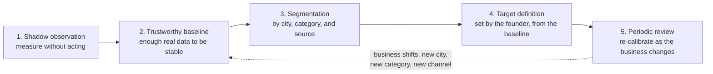

# Success Metrics — QF Jarvis

**Status:** Phase 0 — in progress (pending review)
**Date:** 2026-07-11

---

## Ground rules for this document

1. **No baselines are invented here.** Where a current value would normally appear, this document says *"to be established."* Making up a number and then measuring against it is worse than having no number.
2. **All numerical targets are future calibration items.** They are set only after a real measurement period, and they are set by the founder, not by an agent.
3. **Metrics are computed from QuickFurno Core's authoritative data.** Jarvis may compute, present, and reason about metrics; Core owns the underlying truth.
4. **A metric that nobody would act on is not a metric.** Each one below has an owner who would change something if it moved.

---

## Business metrics

These measure whether QF Jarvis made QuickFurno better. They are the only metrics that ultimately justify the project.

| Metric | Definition | Primary interest | Baseline | Target |
| --- | --- | --- | --- | --- |
| Verified lead rate | Share of created leads that reach verified status | Kabir / Operations | To be established | Future calibration |
| Lead-to-contact rate | Share of qualified leads a vendor actually contacts | Kabir / Riya | To be established | Future calibration |
| Lead-to-site-visit rate | Share of contacted leads reaching a site visit | Riya | To be established | Future calibration |
| Lead-to-quotation rate | Share of leads reaching a quotation | Riya | To be established | Future calibration |
| Lead conversion rate | Share of leads converting to won work | Founder | To be established | Future calibration |
| Client response time | Elapsed time from lead creation to first client contact | Riya / Support | To be established | Future calibration |
| Vendor response time | Elapsed time from assignment to vendor's first action | Kabir / Anisha | To be established | Future calibration |
| Vendor activation rate | Share of onboarded vendors reaching active, assignable state | Anisha / Sales | To be established | Future calibration |
| Vendor package conversion | Share of activated vendors purchasing a package | Anisha | To be established | Future calibration |
| Recharge rate | Share of vendors who recharge when balance runs low | Anisha | To be established | Future calibration |
| Vendor retention | Share of vendors still active after a defined window | Anisha / Founder | To be established | Future calibration |
| Cost per verified lead | Marketing spend divided by verified leads, by city and category | Jitin / Marketing | To be established | Future calibration |
| Campaign conversion quality | Downstream conversion quality of leads by campaign, not just volume | Jitin | To be established | Future calibration |

**Segmentation that matters from day one:** by city (Pune first, Mumbai later) and by category (interior design, carpentry, modular factories, premium interiors, sofa work, painting, civil work). A blended number across cities and categories hides the decision.

---

## System metrics

These measure whether the intelligence layer works. They are necessary but never sufficient — a system with perfect system metrics and no business movement has failed.

| Metric | Definition | Baseline | Target |
| --- | --- | --- | --- |
| Event processing success | Share of canonical events processed without terminal error | To be established | Future calibration |
| Duplicate-event rate | Share of events received more than once (idempotency must absorb these) | To be established | Future calibration |
| Recommendation generation latency | Time from event receipt to recommendation availability | To be established | Future calibration |
| Recommendation acceptance rate | Share of surfaced recommendations approved rather than rejected or expired | To be established | Future calibration |
| Approval turnaround | Time from recommendation surfaced to approval decision recorded | To be established | Future calibration |
| Execution success rate | Share of execution intents that complete successfully at the provider | To be established | Future calibration |
| Retry rate | Share of executions requiring retry | To be established | Future calibration |
| Dead-letter rate | Share of events or intents landing in dead-letter handling | To be established | Future calibration |
| Stale recommendation rate | Share of recommendations that expire without a decision | To be established | Future calibration |
| Audit completeness | Share of executions with an unbroken trace: source events → recommendation → approval → intent → result | To be established | **100%** — this one is not a calibration item |
| System availability | Availability of the Jarvis intelligence layer | To be established | Future calibration |

**Recommendation acceptance rate and stale recommendation rate are the adoption canaries.** A low acceptance rate means the agents are wrong. A high stale rate means the founder has stopped reading. Both are project-threatening; neither is a technical bug.

---

## Safety metrics

These measure whether the boundary held. Unlike the metrics above, several of these have a target *now*, and it is zero.

| Metric | Definition | Target |
| --- | --- | --- |
| Unauthorized action count | Actions reaching a provider without a recorded authorization decision | **0** — any non-zero value is an incident |
| Policy-block count | Actions blocked by policy before execution | Not zero-target; a healthy signal that policy is engaged. Track the trend and the reasons |
| Signature-verification failure count | Rejected messages failing signature verification between systems | Investigate every occurrence |
| Replay attempt count | Duplicate or replayed messages rejected by replay protection | Investigate every occurrence |
| Sensitive-data logging incidents | Occurrences of personal or secret data reaching logs | **0** — any non-zero value is an incident |
| Incorrect automated-action rate | Automatically authorized actions later judged wrong | **0** at Level 0–3 (no automation exists). From Level 4, a threshold is set as a gate condition and breaching it revokes the automation |

A safety metric breach is not a metric movement — it is an incident, and it triggers [change-management.md](../governance/change-management.md) rollback procedures.

---

## How a target gets set — the calibration process

Every value marked *future calibration item* becomes a real number by running this process, and by no other route. **A target is never inferred from fabricated, assumed, or illustrative data.** If the data does not exist yet, the target does not exist yet, and saying so is the correct answer.

**1. Shadow observation.** Measure the metric while the system is at Automation Level 0 or 1 — watching, not acting ([automation-levels.md](../governance/automation-levels.md)). Observation must not itself change the number it is observing.

**2. Trustworthy baseline.** Accumulate enough real data for the value to be stable rather than noisy. "Trustworthy" is a judgment about volume and variance, and it is made explicitly — not assumed because a dashboard has stopped moving. A baseline drawn from too little data is worse than none, because it will be defended.

**3. Segmentation by city, category, and source.** A blended number hides the decision. Verified lead rate for carpentry in Pune from one campaign is actionable; verified lead rate overall is a vanity number. **Every target is defined per segment**, and segments are added as Mumbai and further cities and categories come online.

**4. Target definition.** The founder sets the target, from the segmented baseline, with a stated rationale for why that level is the right ambition. Targets are business decisions, not statistical artifacts, and not an agent's suggestion.

**5. Periodic review.** Targets expire. A new city, a new category, a new channel, or a shift in the market invalidates a baseline, and a target defended past its baseline is just a number someone is now managing to. Re-calibration returns to step 2.

**The only targets set now** are the ones that are not calibration questions at all: **audit completeness = 100%**, **unauthorized action count = 0**, and **sensitive-data logging incidents = 0**. These are correctness properties, not performance goals, and no amount of baseline data would justify a different value.

---

## How metrics gate automation

Automation levels are not promoted on confidence or enthusiasm. They are promoted on evidence ([automation-levels.md](../governance/automation-levels.md)):

- **Level 0 → 1:** event processing and audit completeness are sound.
- **Level 1 → 2:** shadow recommendations are evaluated as accurate often enough to be worth a human's time.
- **Level 2 → 3:** recommendation acceptance rate is healthy and approval turnaround is workable.
- **Level 3 → 4:** for a *specific, narrow, low-risk* recommendation class, acceptance is high, incorrect-action rate is at zero, and the class is fully reversible.
- **Level 4 → 5:** reserved. Not planned in this roadmap.

Each threshold is a future calibration item, set from real data, before the gate is opened.
